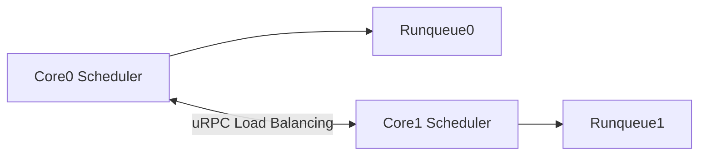
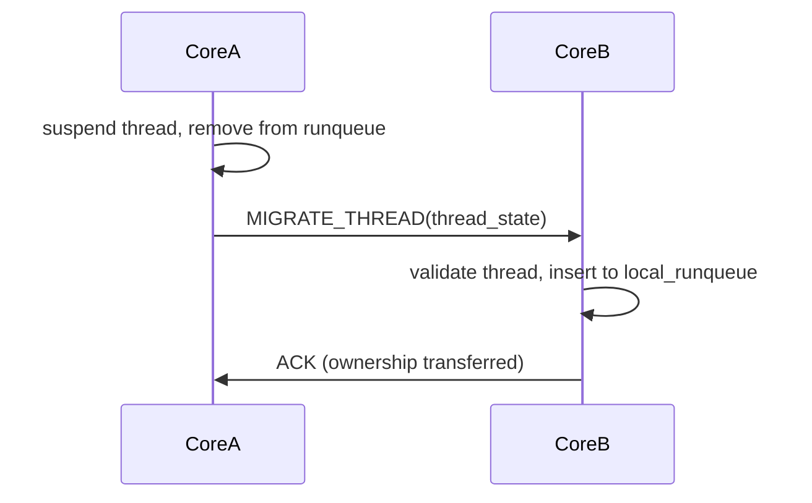

# Scheduler Architecture (Multikernel Model)

**Version:** v2.0 (Proposed - True Multikernel)
**Scope:** Kernel
**Status:** Draft → Implementation Ready

---

## 1. Executive Summary

The scheduler in Bharat-OS operates strictly on a **per-core basis**, aligning with the true multikernel architecture. Schedulers on different cores do not share a global runqueue (`g_threads`), nor do they compete for a global scheduling lock.

The scheduler's job is purely localized:
*   Pick the next thread from the *local* runqueue.
*   Preempt running threads on the *local* core.
*   Enforce local CPU quota/policy.

Load balancing and cross-core thread migration happen entirely through asynchronous **uRPC messages**.

---

## 2. Per-Core State Only



### 2.1 The Core Local State

Each core maintains its own list of active threads.

```c
struct core_local_state {
    runqueue_t local_runqueue;
    thread_table_t local_threads;
    reaper_queue_t local_reaper; // For ZOMBIE cleanup
};
```

**Rule:** `Core A` cannot directly insert a thread into `Core B`'s `local_runqueue`. It must send a `MIGRATE_THREAD` message.

---

## 3. Thread Migration Flow

Thread migration is a critical path for load balancing in a multikernel. It must be lock-free and message-driven.



1.  **Preparation:** Core A stops executing the thread, saves its context, and removes it from `local_runqueue`.
2.  **Handoff:** Core A sends a uRPC message containing the thread's metadata (or a capability to it) to Core B.
3.  **Acceptance:** Core B receives the message, unpacks the thread state, validates it, and inserts it into its own `local_runqueue`.
4.  **Completion:** Core B ACKs the handoff. Core A safely destroys its local metadata reference.

---

## 4. The Reaper: Removing the Global Lock

The current architecture relies on a global `g_reap_lock` to clean up dead threads. This is a severe scalability bottleneck.

### 4.1 The Solution: Local Reapers

When a thread exits (`ZOMBIE` state):
1.  The thread is moved to the core's `local_reaper` queue.
2.  The core's idle task or a dedicated localized worker cleans up the resources independently.
3.  If a parent process on *another* core needs to `wait()` on this thread, the local reaper sends an asynchronous uRPC message (`THREAD_EXITED_EVENT`) to the parent's home core.

There is no global lock required to reap a thread.

---

## 5. Policy Abstraction

The scheduler logic remains personality-blind. It only understands kernel-native policies (REALTIME, INTERACTIVE, BATCH), which are translated by the Personality Runtime (e.g., Linux CFS maps to BATCH).

Because scheduling is local, policy enforcement is local. System-wide AI Governors or load balancers observe core telemetry and send uRPC hints to request thread migrations when specific cores become saturated.