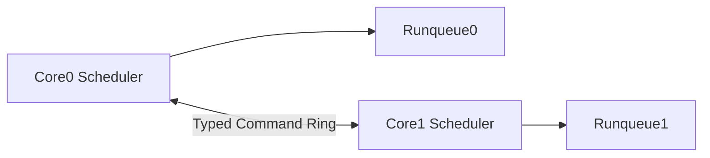
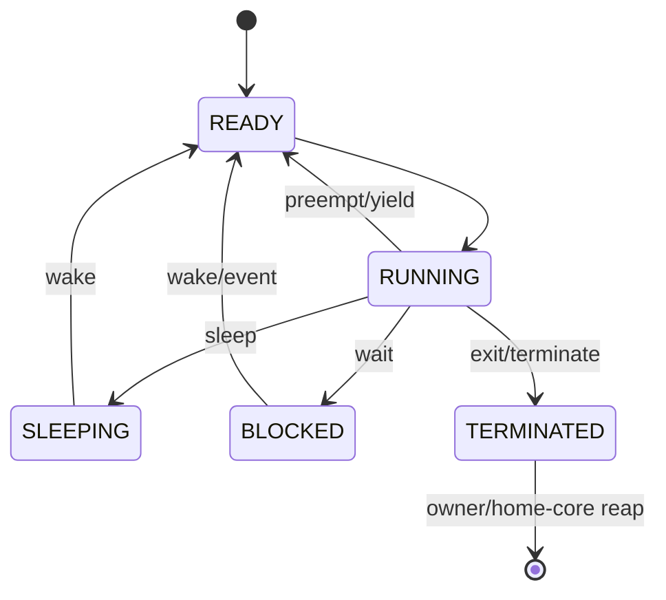
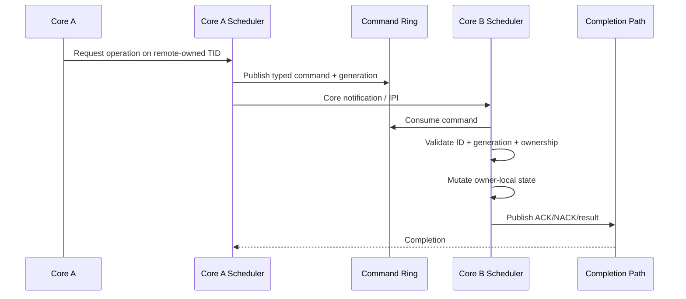

# Scheduler Architecture (Multikernel Model)

**Scope:** Kernel
**Status:** Active

---

## 1. Executive Summary

The scheduler in Bharat-OS operates strictly on a **per-core basis**, aligning with the true multikernel architecture. Schedulers on different cores do not share a global runqueue (`g_threads`), nor do they compete for a global scheduling lock.

### Implementation References
- `core/kernel/src/sched/sched.c`
- `core/kernel/src/sched/sched_core.c`
- `core/kernel/src/sched/sched_thread.c`
- `core/kernel/include/sched/sched.h`
- `core/kernel/include/sched/sched_internal.h`

The scheduler's job is purely localized:
*   Pick the next thread from the *local* runqueue.
*   Preempt running threads on the *local* core.
*   Enforce local CPU quota/policy.

Load balancing and cross-core thread migration happen entirely through asynchronous **uRPC messages**.

### 1.1 Dispatch correctness invariants

The local dispatch path applies these rules on every architecture and memory
protection backend:

* A candidate is removed from its owner-local runqueue before it can be
  dispatched, then must pass owner, CPU-partition class, affinity, and dynamic
  CPU-mask checks. A failed check selects the local idle thread; it must never
  execute the inadmissible candidate or mutate a remote runqueue directly.
* A real switch updates the incoming thread counter and the owner-local
  runqueue counter exactly once. A null target or a switch to the already
  running thread is a no-op and is not counted.
* The dispatch and context-switch hot path does not write unconditional console
  diagnostics. Diagnostics must use an explicitly enabled, bounded tracing
  mechanism outside the timing-critical path.
* CPU partition initialization accepts only `GENERAL_PURPOSE`, `REALTIME`, or
  `MIXED_CRITICAL`. `UNKNOWN` and values outside the execution-mode enum fail
  closed before any partition mapping is published.

These are backend-neutral scheduler mechanisms. They do not depend on an ISA,
MMU, MMU-Lite, or MPU implementation.

---

## 2. Per-Core State Only


```mermaid
graph LR
    A[Core0 Scheduler] --> A1[Runqueue0]
    B[Core1 Scheduler] --> B1[Runqueue1]

    A <-- Typed Command Ring --> B
```

### 2.1 The Core Local State

Each core maintains its own list of active threads, explicitly modeled as thread slots and runqueues.

```c
typedef struct {
    sched_entity_slot_t entities[SCHED_MAX_LOCAL_ENTITIES];
    uint32_t active_count;
    // remote operations ring
    sched_cmd_ring_t remote_cmd_ring;
} sched_rq_t;
```

**Rule:** `Core A` cannot directly insert a thread into `Core B`'s `sched_rq_t`. It must send a remote command via the typed command ring.

---

## 3. Thread Lifecycle and Migration Flow

### 3.1 Thread Lifecycle (IMPLEMENTED)


```mermaid
stateDiagram-v2
    [*] --> READY
    READY --> RUNNING
    RUNNING --> READY: preempt/yield
    RUNNING --> SLEEPING: sleep
    RUNNING --> BLOCKED: wait
    SLEEPING --> READY: wake
    BLOCKED --> READY: wake/event
    RUNNING --> TERMINATED: exit/terminate
    TERMINATED --> [*]: owner/home-core reap
```

### 3.2 Thread Migration Flow (IMPLEMENTED)

Thread migration is a critical path for load balancing in a multikernel. It is lock-free and driven by the typed command ring.


```mermaid
sequenceDiagram
    participant A as Core A
    participant ARQ as Core A Scheduler
    participant CR as Command Ring
    participant B as Core B Scheduler
    participant CP as Completion Path

    A->>ARQ: Request operation on remote-owned TID
    ARQ->>CR: Publish typed command + generation
    ARQ->>B: Core notification / IPI
    B->>CR: Consume command
    B->>B: Validate ID + generation + ownership
    B->>B: Mutate owner-local state
    B->>CP: Publish ACK/NACK/result
    CP-->>ARQ: Completion
```

1.  **Preparation:** Core A stops executing the thread and removes it from its runqueue.
2.  **Handoff:** Core A enqueues a command to Core B's command ring (e.g. `SCHED_CMD_MIGRATE`).
3.  **Acceptance:** Core B receives the IPI, drains the ring, validates the `thread_id` and generation.
4.  **Completion:** Core B publishes an ACK/NACK completion.

---

## 4. Reaping (PARTIAL)

Reaping should happen via per-core reapers. The transition from a global lock (`g_reap_lock`) to a purely local reaping model is ongoing.

### 4.1 The Goal: Local Reapers

When a thread exits (`TERMINATED` state):
1.  The thread is moved to the core's local reaper.
2.  The core's idle task cleans up resources independently.
3.  A completion is published back to the home core.

---

## 5. Policy Abstraction

The scheduler logic remains personality-blind. It only understands kernel-native policies (REALTIME, INTERACTIVE, BATCH), which are translated by the Personality Runtime (e.g., Linux CFS maps to BATCH).

Because scheduling is local, policy enforcement is local. System-wide AI Governors or load balancers observe core telemetry and send uRPC hints to request thread migrations when specific cores become saturated.

### 5.1 Scheduler diagnostics

Scheduler pick and context-switch paths never write to a console. Optional
hot-path evidence uses `BH_DIAG_COUNTER` and `BH_TRACE_SCHED`, backed by bounded
per-core state. `BHARAT_SCHED_DIAG_COMPILE_LEVEL` selects compile-time inclusion
(`0` removes every call, `1` retains counters, and `2` retains trace markers),
while `bh_sched_diag_set_level()` lets each owner core reduce its runtime level.
Remote readers may take an atomic snapshot; they cannot mutate another core's
diagnostic state. Diagnostics do not participate in scheduling decisions and
overflow, collection, or disabled instrumentation cannot affect correctness.
