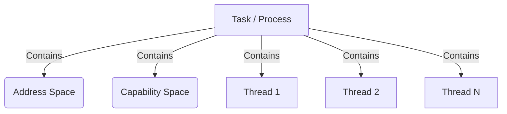

# Bharat-OS Task and Thread Model

## Overview

The `tasks-threads` cluster documents the fundamental execution constructs in the Bharat-OS multikernel design. Here, a "Task" (often synonymous with "Process" in monolithic kernels) provides resource isolation, while a "Thread" is the unit of execution.

## Related Documents
- [Task Model](task-model.md) - Details on Address Space and Capability Space ownership.
- [Thread Model](thread-model.md) - Thread Control Block (TCB) layout, kernel threads vs user threads.
- [Lifecycle](lifecycle.md) - Thread/Task states (Ready, Running, Blocked, Exited).
- [Context Switch](context-switch.md) - Trap gates, ASID swapping, FPU state saving.
- [Kernel Threads](kernel-threads.md) - The purpose of bh_threads in the multikernel context.
- [TLS (Thread Local Storage)](tls.md) - Architecture-specific TLS ABI (e.g., `fs`/`gs` on x86, `tpidr` on arm).
- [Fork and Exec](fork-exec.md) - Process spawning via capabilities (No monolithic `fork()`).
- [Synchronization](synchronization.md) - Fast user-space mutexes (Futex-like) and condition variables.
- [Roadmap](roadmap.md) - Current status and future goals for tasks and threads.
