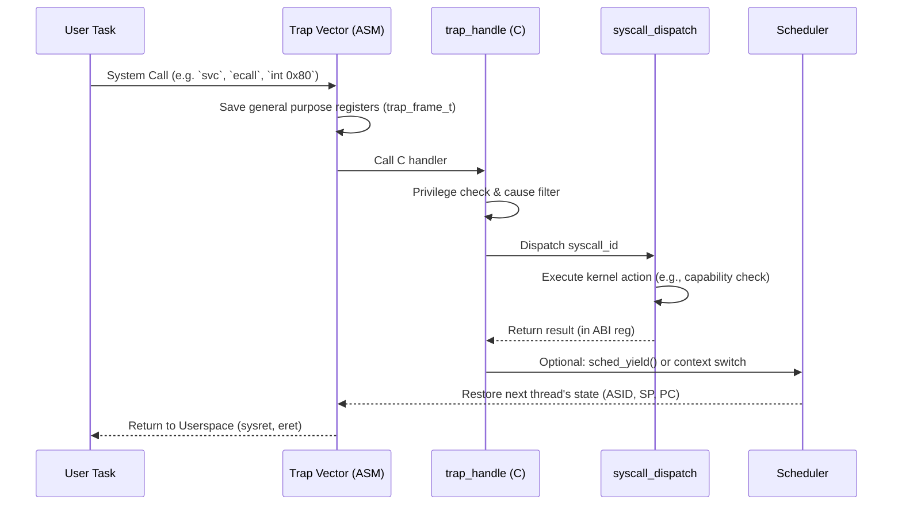

# Context Switch and Syscall/Trap Gates

This document defines the current in-kernel context switch mechanism and syscall/trap gate contract, adapting our architecture to the multikernel Barrelfish/seL4 model.

## Syscall/Trap Gate Baseline

- Central trap frame model (`trap_frame_t`) with register argument ABI slots.
- Syscall number space (`syscall_id_t`) for privileged kernel operations:
  - thread create/destroy,
  - scheduler yield,
  - VMM map/unmap,
  - capability invoke hook,
  - endpoint create/send/receive,
  - capability delegation.
- Dispatcher (`syscall_dispatch`) with per-call parameter validation.
- Trap handler (`trap_handle`) with:
  - cause filtering,
  - user-mode privilege check,
  - return code propagation to ABI return register,
  - architecture-aware PC advance after syscall.
- Boot-time trap gate setup via `trap_init()` from `kernel_main`.

## Security Baseline Checks

- Reject non-user trap-originated syscall attempts.
- Reject unsupported syscall IDs with explicit `-ENOSYS`-style code.
- Validate user pointer range before writing syscall outputs.

## Register Save/Restore & FPU State

During a context switch, the kernel securely isolates task states:
- General purpose registers are saved onto the thread's kernel stack within `trap_frame_t`.
- FPU and SIMD state saving is lazy; only swapped if the thread has used them.
- Address Space IDs (ASIDs) are switched, flushing only non-global TLB entries where ASIDs aren't supported.

## Context Switch Flow

## Deferred for Production

- Assembly entry stubs per architecture (x86_64 IDT/syscall entry, RISC-V `stvec`).
- Fine-grained capability policy enforcement in `cap_invoke` path.
- Full trap delegation verification and interrupt controller integration.
