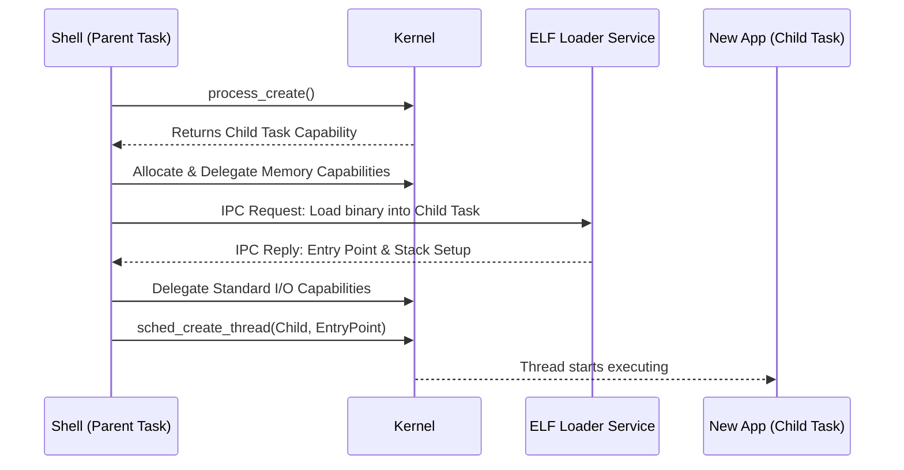

# Fork and Exec

## Overview

Unlike monolithic OSs (such as Linux) that rely on `fork()` to clone an entire process and `exec()` to replace it, Bharat-OS's multikernel architecture constructs tasks explicitly from the ground up using **Capabilities**.

The `fork()` model has significant drawbacks:
- It requires duplicating the entire address space (often using copy-on-write page tables, which is slow and complex).
- It breaks capability-based security by implicitly inheriting all file descriptors and capabilities.
- It is incompatible with environments without an MMU (Memory Management Unit).

## Explicit Task Construction (The Bharat-OS Way)

Instead of `fork()`, a parent process (like a shell or init daemon) creates a new process by explicitly passing capabilities to an empty Task.

### Process Spawning Sequence:

1.  **`process_create()`**: The parent requests the kernel to allocate a new, empty Task object (with an empty Address Space and Capability Space).
2.  **Memory Provisioning**: The parent delegates `Untyped` memory capabilities to the new task to back its page tables, stack, and heap.
3.  **Loading the Binary (`exec`)**: The parent (or a dedicated ELF loader service) reads the executable file, maps the required pages into the new Task's Address Space, and copies the code/data.
4.  **Capability Delegation**: The parent grants specific capabilities to the new Task's CSpace (e.g., access to `stdout`, a connection to the network server, or access to a specific directory). This enforces the Principle of Least Privilege.
5.  **Thread Creation**: The parent calls `sched_create_thread()` on the new Task, setting the initial instruction pointer (`entry_point`) to the loaded binary's entry point and the stack pointer to the allocated stack.
6.  **Scheduling**: The parent makes the new thread Ready, and the scheduler begins executing it.

### Posix Compatibility (`posix_spawn()`)

For compatibility with standard C libraries, a higher-level user-space function (like `posix_spawn()`) acts as a wrapper around this explicit construction process.

