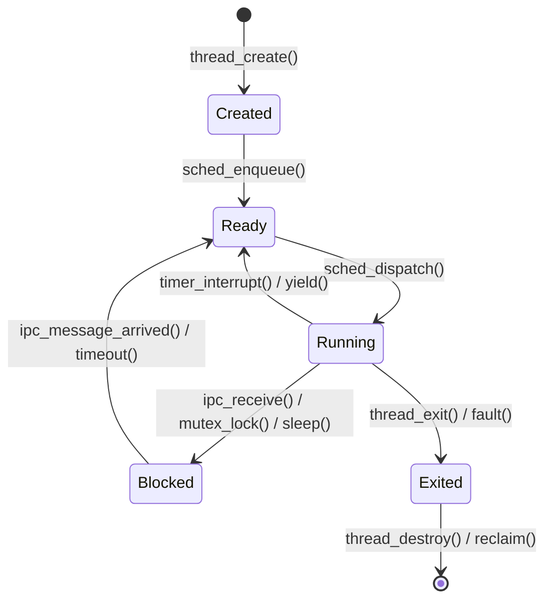

# Thread Lifecycle and State Machine

## Overview
A Bharat-OS Thread transitions through defined states in the kernel scheduler. These states control whether the thread can execute on the CPU or if it is blocked waiting for an event (e.g., an IPC message).

## State Definitions

1.  **Created (Initial):** The thread has been allocated (its TCB exists) and initialized with its parent task's ASpace and CSpace, but it has not yet been placed on the ready queue.
2.  **Ready:** The thread is on the runqueue (`sched_enqueue`) and is eligible to execute, waiting for the scheduler to select it.
3.  **Running:** The thread is currently executing on a CPU core. Its trap frame has been popped onto the hardware registers.
4.  **Blocked (Waiting):** The thread is waiting for an event to occur before it can become Ready again.
    - **IPC Receive:** Blocked on an Endpoint waiting for a message.
    - **IPC Send:** Blocked on an Endpoint waiting for space in a queue.
    - **Mutex/Condvar:** Waiting on synchronization primitives.
    - **Timer:** Sleeping until a specific tick/vruntime.
5.  **Exited (Dead/Zombie):** The thread has completed execution (`thread_exit()`) or been killed by its parent/supervisor. Its resources are pending reclamation by the task or a garbage collector.

## State Machine Transition Diagram

## Scheduling Preemption
A Running thread can be moved to the Ready state involuntarily (preempted) when the scheduler determines another thread with higher priority (or fairness) should run. This usually occurs via the timer interrupt.
A Running thread can voluntarily move itself to the Blocked state when making synchronous IPC calls.