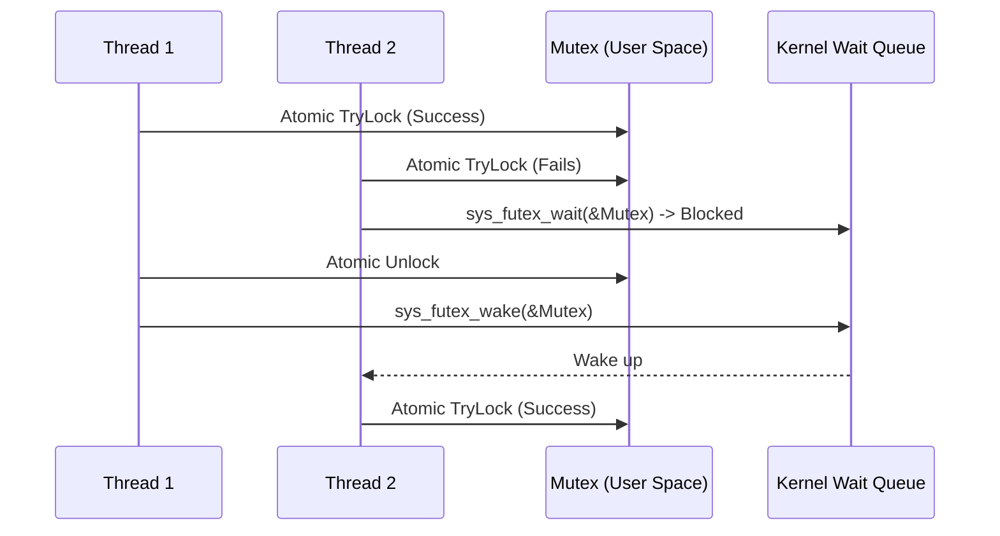

# Synchronization

## Overview
Threads in a multi-threaded application often need to coordinate access to shared resources or wait for events. Bharat-OS relies on fast, user-space synchronization primitives.

## Hardware Support (Atomics)
The foundation of synchronization is hardware-provided atomic operations (`__atomic_` built-ins in C11). These guarantee that operations like incrementing a variable or comparing and swapping a value are performed atomically by a single CPU, preventing data races.

## Fast User-Space Mutexes (Futex-like)
A standard OS kernel-level mutex requires a system call (context switch) for every lock and unlock, which is incredibly slow.

Bharat-OS uses a concept similar to Linux's **Futex** (Fast Userspace Mutex):
1.  **User-Space Fast Path:** The mutex state is held in user-space memory (e.g., an atomic integer). A thread attempts to acquire the lock using an atomic compare-and-swap (e.g., `__atomic_compare_exchange_n`). If successful, the lock is acquired *without* entering the kernel.
2.  **Kernel Slow Path:** If the lock is already held, the thread must wait. It performs a system call (e.g., `sys_futex_wait`) passing the address of the atomic integer. The kernel verifies the value hasn't changed and puts the thread to sleep on a wait queue associated with that memory address.
3.  **Unlock:** The thread holding the lock sets the atomic integer to 0 and performs a system call (e.g., `sys_futex_wake`) to wake up any threads sleeping on that address.

## Condition Variables
Condition variables allow threads to wait until a specific condition becomes true. They are often used in conjunction with a mutex.
-   **Wait:** A thread atomically unlocks the associated mutex and goes to sleep on a wait queue until signaled.
-   **Signal:** Another thread wakes up one thread sleeping on the wait queue.
-   **Broadcast:** Wakes up all threads sleeping on the wait queue.

## Semaphores
Semaphores (counting and binary) can also be implemented using the futex-like slow path. A counting semaphore maintains a value that can be incremented (V operation) and decremented (P operation). If the value drops below zero, the thread blocks.