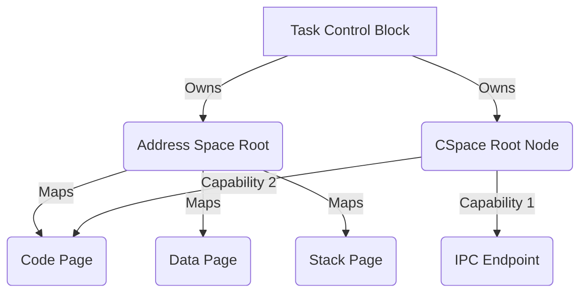

# The Task Model

## Definition
In Bharat-OS, a **Task** (or Process) is a purely static container that groups resources together. A Task *never executes*; it provides the environment for its Threads to execute in.

## Components of a Task
Every Task in the multikernel model contains exactly two foundational structures:

1.  **Address Space (ASpace):** Defines the virtual memory map (the page table roots) accessible by the task.
2.  **Capability Space (CSpace):** A directed graph (CNode tree) defining what the task is allowed to do (e.g., IPC endpoints, memory pages, IRQ handles). The task holds *capabilities* to objects, not file descriptors.

## Creating a Task
Unlike monolithic OSs like Linux with `fork()`, Bharat-OS constructs tasks explicitly.
1.  A parent task (e.g., a process server) creates a new empty Task object via `process_create`.
2.  The parent provisions memory by granting page capabilities into the new Task's CSpace.
3.  The parent provisions communication by granting Endpoint capabilities.
4.  The parent creates an initial Thread inside the Task (`sched_create_thread`) and provides it with an instruction pointer (`entry_point`) and stack pointer.

This clean-slate approach ensures complete isolation and adheres to the Principle of Least Privilege.