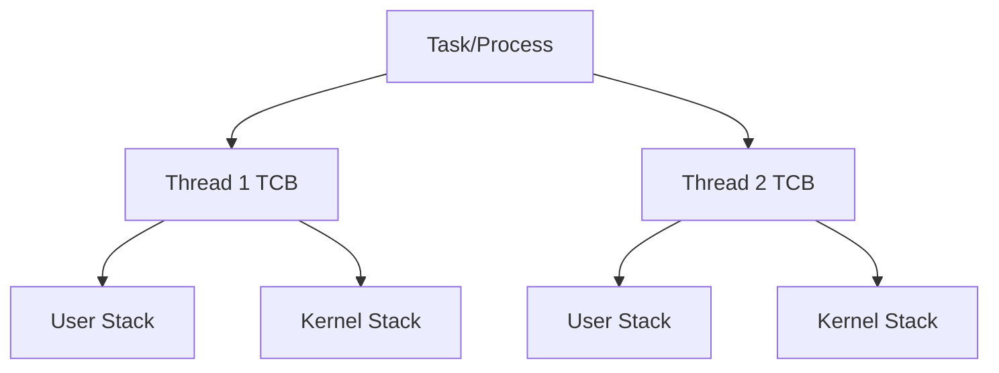

# The Thread Model

## Definition
A **Thread** in Bharat-OS is the fundamental unit of scheduling and execution. It runs inside a Task, inheriting the Task's Address Space (ASpace) and Capability Space (CSpace). Threads are represented by the **Thread Control Block (TCB)**.

## Thread Control Block (TCB) Layout
The `bh_thread_t` (defined in `kernel/src/sched/`) tracks everything the CPU needs to resume a preempted context:

- **State:** Running, Ready, Blocked, Exited.
- **Trap Frame (`trap_frame_t`):** Pointer to the top of the kernel stack where registers are saved when a trap, interrupt, or syscall occurs.
- **Priority:** Fixed or dynamic scheduling priority.
- **VRuntime:** Used by CFS-like schedulers for fair CPU distribution.
- **Capability State:** Specifically tracking which IPC Endpoint it is blocked on (if waiting for a message) or waiting to send to.
- **Parent Task:** Pointer back to the parent `process_t` or `task_t` that owns its memory and capabilities.

## User vs. Kernel Threads
- **User Threads:** Execute in Ring 3 (or equivalent unprivileged mode). They perform system calls (traps) into the kernel to request services (IPC, map memory).
- **Kernel Threads:** Execute entirely in Ring 0 (or equivalent privileged mode). They are rare in a microkernel but exist for early boot, idle loops, or specific low-level hardware interrupt deferrals. (See [kernel-threads.md](kernel-threads.md) for more).

## Context Switching
Switching between threads involves saving the trap frame of the outgoing thread and loading the trap frame of the incoming thread. If the two threads belong to different Tasks, the Address Space (page tables) must also be switched, and TLB entries managed appropriately (e.g., via ASID swapping).

