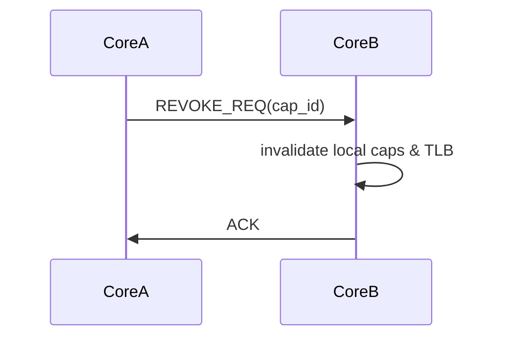
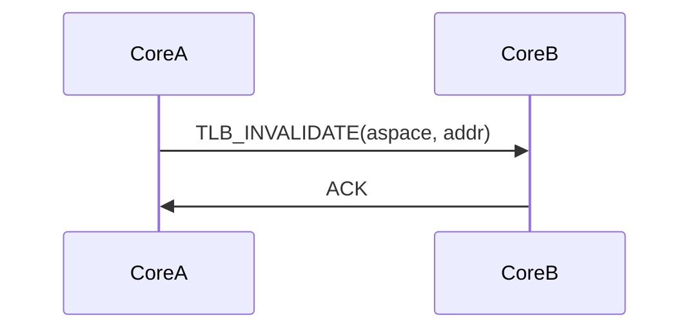

# uRPC Architecture (Multikernel Model)

**Version:** v2.0 (Proposed - True Multikernel)
**Scope:** Kernel
**Status:** Draft → Implementation Ready

---

## 1. Executive Summary

uRPC (Micro-Remote Procedure Call) is the foundation of Bharat-OS's distributed architecture. All cross-core operations—including thread migration, process signaling, load balancing, memory mapping updates (TLB shootdowns), and capability revocation—are executed through uRPC messages.

This eliminates all shared memory mutation across cores, aligning with a pure multikernel philosophy.

---

## 2. The Core Problem: Removing `g_urpc_states`

Currently, Bharat-OS uses global structures (`g_urpc_states`) for IPC. In a true multikernel, global arrays and their associated locks create significant scalability bottlenecks.

### 2.1 The Solution: Per-Core Lock-Free Rings

Each core has a dedicated, local lock-free ring buffer for inbound and outbound communication.

```c
struct urpc_ring {
    message_t buffer[N];
    atomic_uint head;
    atomic_uint tail;
};

struct core_local_state {
    urpc_ring_t inbound_ring;
    urpc_ring_t outbound_ring;
};
```

---

## 3. Communication Model


When `Core0` needs to communicate with `Core1`, it pushes a message onto `Core0`'s `outbound_ring`. A background hardware mechanism (like an Inter-Processor Interrupt, IPI) or a polling loop on `Core1` reads from its peer's outbound ring into its own `inbound_ring`.

**Critically:** There is no single global lock coordinating this transaction.

---

## 4. Backpressure and Reliability

A distributed system requires strong guarantees around message delivery.

1.  **Drop / Retry Policy:** If a core's inbound ring is full, the sender must either queue the message locally, block (if synchronous and explicitly permitted), or drop it and signal backpressure.
2.  **Queue Depth Limits:** Rings have strict fixed sizes (e.g., `N=256`).
3.  **Telemetry:** Cores report their ring saturation levels to the AI Governor for load balancing.

---

## 5. Key Multikernel uRPC Flows

### 5.1 Async Capability Revocation (2-Phase)

Capability delegation and revocation cannot block execution on the initiating core while it waits for a remote core to update its state.



1.  `CoreA` wants to revoke a memory page mapped on `CoreB`.
2.  `CoreA` sends a `REVOKE_REQ` uRPC message to `CoreB`.
3.  `CoreB` receives the message, invalidates its local capability tables, and issues a local TLB shootdown.
4.  `CoreB` sends an `ACK` uRPC message back to `CoreA`.

### 5.2 TLB Shootdowns

Similarly, TLB invalidations across cores must be explicit uRPC messages.



This ensures that the memory subsystem on one core does not have to wait synchronously on a global memory lock while another core updates its page tables.

---

## 6. Implementation Priorities

The immediate architectural goal is to deprecate `g_urpc_states` entirely and implement the lock-free `urpc_ring_t` within the `core_local_state`.