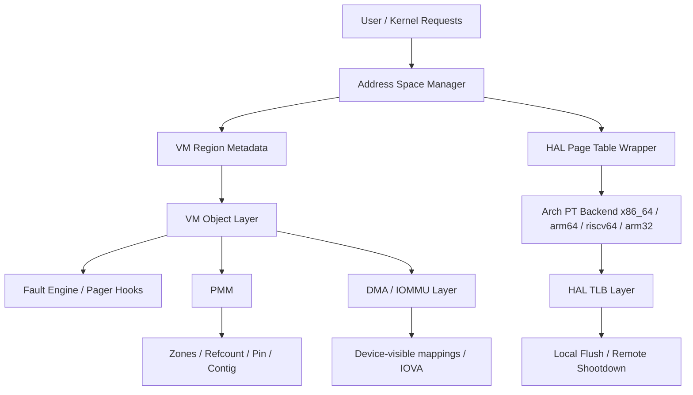
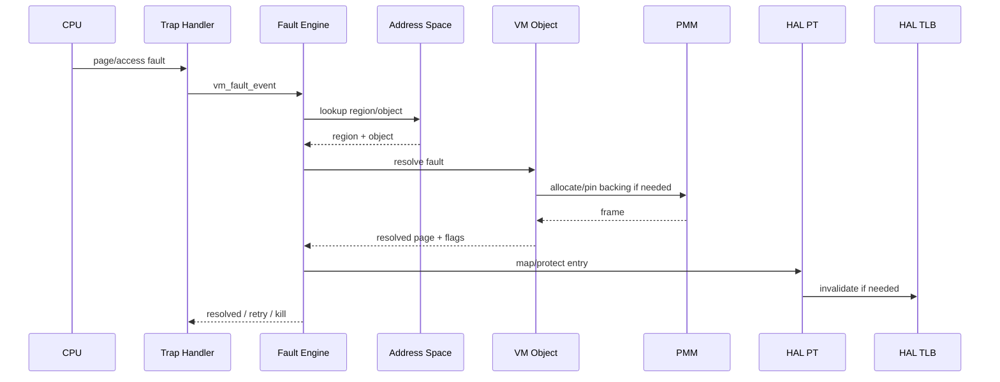
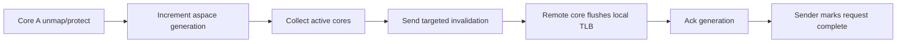

# Bharat-OS Memory Architecture Consolidated Plan

## Purpose

This document consolidates the current Bharat-OS memory architecture work into one authoritative view that covers:

- current implemented baseline
- strict layering and ownership boundaries
- profile behavior across MMU-full, MMU-lite, and MPU-only systems
- architecture portability expectations
- current gaps and production-hardening priorities
- phased roadmap with measurable acceptance criteria

It is intended to replace fragmented planning with one master document, while keeping smaller per-topic documents as appendices or generated matrices.

---

## 1. Executive Summary

Bharat-OS now has a real memory-management foundation, not just a placeholder VMM.

The codebase already includes:

- PMM public interfaces with zones, allocation flags, and refcount APIs
- VM object public interfaces with anon/shared/file/device/dma object kinds
- Address-space structures with region metadata, object attachment, lookup, and clone scaffolding
- HAL page-table and TLB abstraction headers
- A TLB coordinator with local/remote invalidation protocol hooks
- Early tests for address-space overlap, shared-object attach, clone metadata, and teardown reference handling

The system is therefore **past bootstrap stage**, but it is **not yet production-grade end to end**.

The biggest remaining work is not “add one more allocator function.” It is to complete and harden the full chain:

**PMM → VM object → address space → HAL PT/TLB → fault engine → pager/COW → DMA/IOMMU → conformance/testing/observability**

---

## 2. What should change in the docs

The current memory documentation is useful, but split into overlapping planning views.

### Recommended document set

#### Keep one master document

`docs/architecture/memory-architecture-master.md`

This should contain:

- architecture intent
- boundaries
- current state
- profile model
- architecture model
- backlog and roadmap
- definition of done

#### Keep two supporting documents

`docs/architecture/memory-profile-behavior-matrix.md`
- concise behavior matrix only

`docs/architecture/memory-architecture-conformance-checklist.md`
- test and backend parity checklist

#### Merge or retire these into the master doc

- `memory-layering.md`
- `memory-gap-closure-plan.md`
- `memory-production-grade-plan.md`

Those three can be absorbed into the new master document because they currently overlap heavily.

---

## 3. Current memory stack snapshot

| Layer | Current status | Notes |
|---|---|---|
| PMM | Present, partially hardened | Zones and refcount API exist; needs deeper invariants, contiguous lifecycle hardening, and stronger zeroing rules |
| VM Objects | Present, early baseline | Object kinds exist; lifecycle and backend semantics still uneven |
| Address Space | Present, meaningful baseline | Region attach/detach, overlap checks, lookup, clone scaffolding are in place |
| HAL Page Table | Present, but narrow contract | Current interface is page-oriented and needs capability/fallback/range maturity |
| HAL TLB / Shootdown | Present, partial maturity | Coordinator exists, but needs lock removal, timeout telemetry, and stronger SMP stress coverage |
| Fault Engine | API present, implementation incomplete | Contract exists but needs stable semantics and end-to-end behavior |
| Pager / Demand Paging | Partial / deferred | Zero-fill/COW/file-backed flows are not yet production complete |
| DMA / IOMMU | Partial | API direction exists; full lifecycle, domain model, and backend parity still incomplete |
| NUMA / Topology | Early | Good direction, not yet hardened |
| Tests / Conformance | Partial | Host tests exist for aspace/object baseline; architecture conformance is incomplete |

---

## 4. Strict ownership model

This is the most important architectural rule.

### Ownership boundaries

| Layer | Owns | Must not own |
|---|---|---|
| PMM | physical frames, zones, refcounts, contiguous allocation, pinning metadata | VM policy, region placement, page-fault policy |
| VM Objects | backing semantics, object lifetime, object fault behavior | hardware page-table encoding |
| Address Space | VA metadata, region reservation, overlap rules, object attachment | physical allocation policy details |
| HAL PT | translation encoding, page-table page lifecycle, arch-specific attributes | VM object semantics |
| HAL TLB | invalidation and coherency protocol | region lookup, PMM ownership |
| Fault Engine | decode, resolution flow, policy result | physical frame accounting ownership |
| DMA/IOMMU | device-visible mapping lifecycle, IOVA domains, cache sync | general user-space VM semantics |

### Rule

No layer may reach around the layer below or above it “for convenience.”

That means:

- PMM must not know about clone/COW policy
- VM objects must not directly manipulate architecture registers
- Address-space code must not invent fake MPU sparse-page behavior
- DMA/IOMMU must not leak device-specific assumptions back into generic VM code

---

## 5. Layered architecture diagram



---

## 6. Profile model

Bharat-OS memory behavior must remain truthful across profiles.

### Profile table

| Profile | Promise | Non-negotiable limits |
|---|---|---|
| MMU-full | sparse mappings, protect/query, demand-fault hooks, shared mappings, COW readiness | must support real page semantics and per-aspace coherency |
| MMU-lite | isolated mappings with reduced semantics, eager strategies allowed | must report reduced capability explicitly; no pretending full demand-paging exists |
| MPU-only | region-based isolation only | must not emulate fake sparse paged VM semantics |

### Principle

Public APIs may remain stable, but runtime capability reporting must tell the truth.

---

## 7. Profile behavior matrix

| Capability | MMU-full | MMU-lite | MPU-only |
|---|---|---|---|
| page map/unmap | full | backend-dependent / fallback | unsupported as sparse-page op |
| range map/unmap | full | wrapper fallback allowed | region-programming only |
| protect | full | partial | explicit unsupported for page semantics |
| query | full | partial | explicit unsupported for sparse queries |
| demand faults | yes | limited or eager | no |
| COW | yes, software-managed | limited | no |
| huge pages | capability-driven | often disabled | n/a |
| ASID/PCID | capability-driven | often absent | n/a |
| device mappings | yes | attribute-dependent | region attribute only |
| fault recovery | fine-grained | degraded path | region violation handling |

---

## 8. Architecture model

| Architecture | Target level | Notes |
|---|---|---|
| x86_64 | MMU-full first-class | 4-level required, 5-level ready abstraction, NX/U/S/W/Global/PAT, PCID-aware direction |
| arm64 | MMU-full first-class | MAIR, shareability, ASID, break-before-make |
| riscv64 | MMU-full first-class | Sv39 required, Sv48-ready abstraction, satp + sfence.vma discipline |
| arm32 | MPU-only or MMU-lite | explicit region constraints, no fake sparse VM |
| riscv32 | reduced capability path | explicit unsupported returns required where semantics are absent |

---

## 9. Current code-aligned baseline

### What is clearly present

| Area | Evidence in codebase | Interpretation |
|---|---|---|
| PMM public API | `pmm.h` exposes zones, alloc flags, and refcount APIs | PMM contract exists and is no longer only internal |
| VM object API | `vm_object.h` defines anon/shared/file/device/dma kinds | object model exists and can be used as the semantic anchor |
| Address spaces | `aspace.h` defines regions, lookups, attach/detach, clone | VA metadata model exists |
| PT abstraction | `hal_pt.h` defines create/destroy/map/unmap/protect/query page ops | HAL direction is correct, but still page-centric |
| TLB abstraction | `hal_tlb.h` exposes capability struct and local/remote invalidation contracts | runtime capability-driven design has started |
| TLB coordinator | coordinator file uses aspace generation and active-mask ideas | SMP invalidation direction is real, but implementation still needs cleanup |
| Host tests | `tests/test_vmm_aspace.c` exercises overlap/shared/clone/teardown/lookup | baseline correctness testing exists |

### What is still weak or incomplete

| Area | Main weakness |
|---|---|
| VM object impl | object constructors exist, but backend fault/release semantics are still shallow |
| fault path | contract exists, but full deterministic implementation is not yet mature |
| PT wrappers | page-by-page-only interface makes partial backends awkward and increases portability pain |
| TLB coordinator | global pending-request lock remains a scalability bottleneck |
| DMA/IOMMU | end-to-end lifecycle and backend parity are incomplete |
| cross-arch parity | x86_64 / arm64 / riscv64 parity is not yet demonstrably uniform |

---

## 10. Key design debts to fix next

### 10.1 HAL PT contract is too narrow

The current PT API is page-oriented. That is fine for bootstrap, but not enough for:

- efficient range operations
- fallback handling for MMU-lite/partial backends
- explicit capability reporting
- large-page dispatch and split/merge policies

### 10.2 Fault contract and implementation are drifting

The public fault contract must define:

- fault type
- access type
- source privilege
- result enum
- retry rules
- kill/escalation behavior by profile

without depending on ad hoc architecture-specific side channels.

### 10.3 TLB shootdown is correct in direction, not yet ideal in discipline

The system is already moving toward:

- per-aspace generation
- remote invalidation
- targeted active-mask behavior

But it still needs:

- lock-free or per-core pending tracking
- timeout counters instead of panic-only visibility
- stress tests for missing ack / duplicate ack / stale generation cases

### 10.4 VM objects need lifecycle hardening

The constructors are present, but production-grade ownership means:

- every object kind has constructor validation
- every object kind has deterministic release semantics
- unmap never bypasses object ownership rules
- object-backed faults are standardized

---

## 11. Consolidated roadmap

### Phase A — Contract hardening

| Task | Why | Acceptance |
|---|---|---|
| Normalize master memory doc | remove doc drift | one authoritative master doc merged |
| Add capability structs for PT behavior expansion | support profile/runtime truthfulness | generic code reads caps, not arch assumptions |
| Unify fault API contract | stop implementation drift | stable enums and signature used everywhere |
| Add observability baseline | make failures diagnosable | counters for map/unmap/fault/shootdown |

### Phase B — PT/TLB production path

| Task | Why | Acceptance |
|---|---|---|
| Add generic page-by-page fallback for range wrappers | portability and partial-backend safety | range map/unmap/protect/query work even when backend only provides page ops |
| Remove global TLB pending lock | SMP scalability | per-core or lock-free tracking path merged |
| Add timeout/ack observability | operational safety | counters and diagnostics exposed |
| Add deterministic teardown tests | prevent leaks | repeated create/map/unmap/destroy passes stay leak-free |

### Phase C — VM/fault maturity

| Task | Why | Acceptance |
|---|---|---|
| Harden VM object lifecycle | ownership correctness | heap-safe deterministic object teardown |
| Demand-zero path completion | minimum useful fault path | anonymous not-present fault resolved end to end |
| COW-prep scaffolding | future clone/fork correctness | metadata and fault contract aligned |
| Profile-specific fault policy | truthful semantics | MMU-full, MMU-lite, MPU-only behavior explicitly tested |

### Phase D — DMA/IOMMU and topology

| Task | Why | Acceptance |
|---|---|---|
| dma_buffer_object lifecycle | device memory correctness | pin/unpin/accounting path implemented |
| coherent vs streaming DMA API | real device support | explicit sync model available |
| IOVA/domain abstraction completion | scalable device isolation | per-device domain model operational |
| NUMA/topology metrics | future scalability | locality metrics exported |

### Phase E — Architecture conformance

| Task | Why | Acceptance |
|---|---|---|
| x86_64 conformance suite | first mature backend | permissions/faults/teardown green |
| arm64 conformance suite | parity | MAIR/BBM/ASID semantics validated |
| riscv64 conformance suite | parity | Sv39/query/fence behavior validated |
| reduced-profile suite | honesty | unsupported semantics fail explicitly and correctly |

---

## 12. Definition of done

A memory milestone is done only when all are true:

- architecture doc updated
- code merged with tests
- no refcount or mapping leaks under stress
- profile behavior is explicit and truthful
- unsupported semantics return explicit errors
- observability exists for failures and slow paths
- at least one architecture/backend conformance suite passes

---

## 13. Recommended repo structure

```text
docs/architecture/
  memory-architecture-master.md
  memory-profile-behavior-matrix.md
  memory-architecture-conformance-checklist.md
```

Optional implementation-facing companion docs:

```text
docs/architecture/arch/
  x86_64-memory-notes.md
  arm64-memory-notes.md
  riscv64-memory-notes.md
  arm32-mpu-memory-notes.md
```

---

## 14. Conformance checklist table

| Check | x86_64 | arm64 | riscv64 | arm32 MPU |
|---|---|---|---|---|
| create/destroy aspace root | ☐ | ☐ | ☐ | ☐ |
| map/unmap page | ☐ | ☐ | ☐ | n/a |
| map/unmap range | ☐ | ☐ | ☐ | region-only |
| protect/query | ☐ | ☐ | ☐ | explicit unsupported |
| user/kernel split invariants | ☐ | ☐ | ☐ | ☐ |
| local TLB invalidate | ☐ | ☐ | ☐ | n/a |
| remote TLB invalidate | ☐ | ☐ | ☐ | n/a |
| teardown leak-free | ☐ | ☐ | ☐ | ☐ |
| fault policy profile-correct | ☐ | ☐ | ☐ | ☐ |

---

## 15. Suggested diagrams to include in final doc set

### Diagram A: Layer ownership map
Use a stacked block diagram showing PMM, VM Object, Address Space, HAL PT, HAL TLB, Fault Engine, DMA/IOMMU.

### Diagram B: Fault resolution sequence


### Diagram C: TLB shootdown flow


### Diagram D: Profile behavior truth table
A matrix view for MMU-full / MMU-lite / MPU-only.

---

## 16. Strong recommendation

Do not keep four overlapping memory planning documents alive.

Use one master architecture document and keep the rest as:

- compact matrices
- architecture notes
- generated conformance checklists

That gives Bharat-OS a memory architecture story that is:

- easier to review
- closer to the real code
- honest about what exists now
- actionable for the next implementation wave

---

## 17. Immediate next actions

1. Create `memory-architecture-master.md` by merging the best parts of the current docs.
2. Rewrite the profile matrix into a clean compact table.
3. Add the three Mermaid diagrams above.
4. Update the roadmap to reflect the code that already exists.
5. Convert future work into issue-sized tickets in PT/TLB, fault, VM object lifecycle, and DMA/IOMMU.

