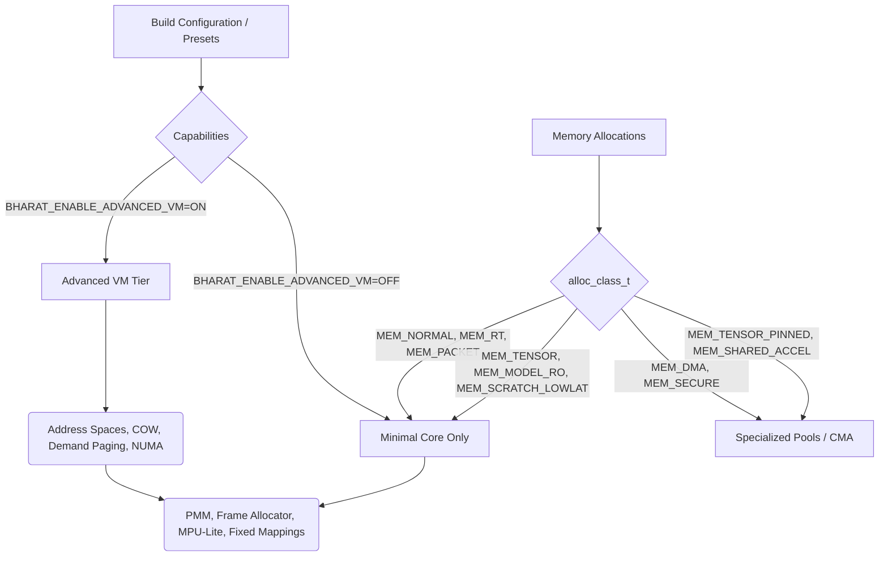
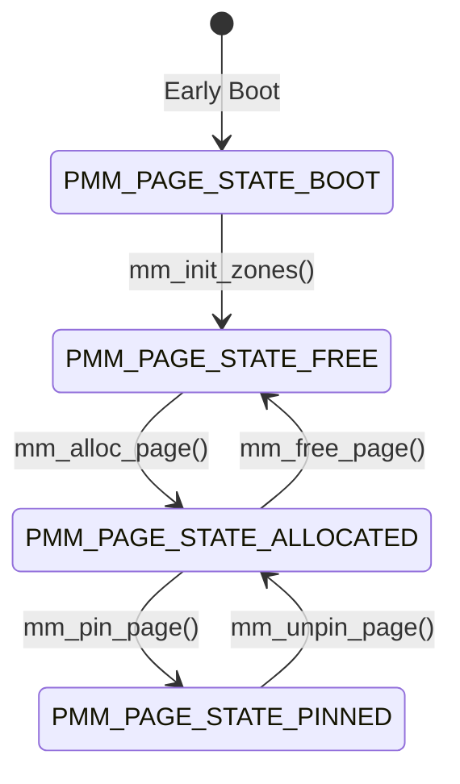
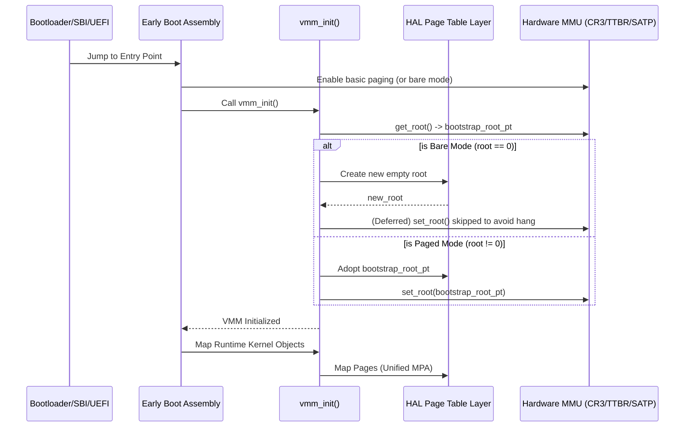
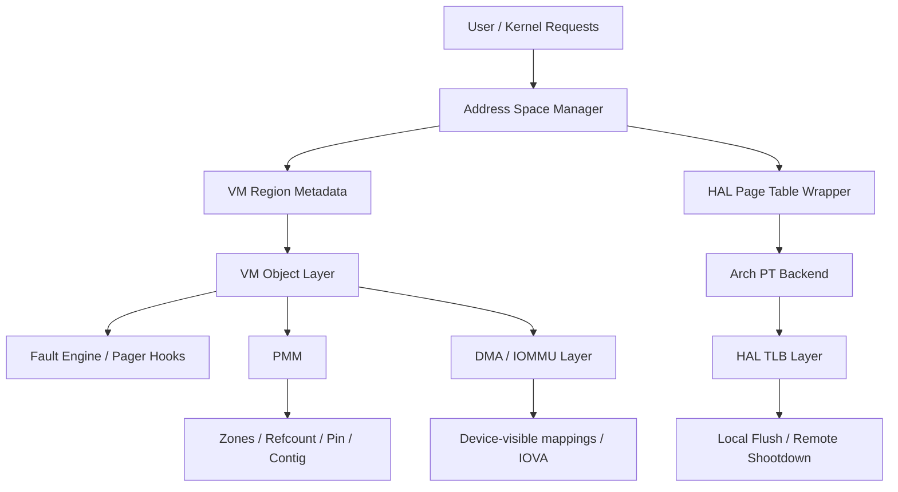
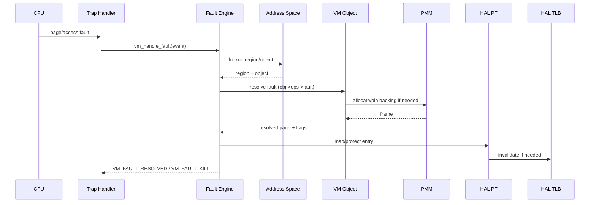
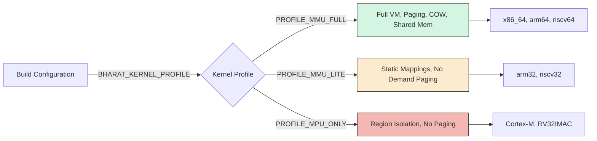
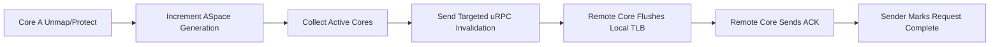
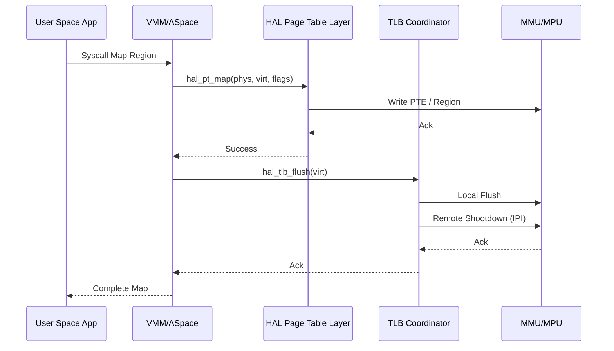

# Bharat-OS Comprehensive Memory Architecture

## 1. Executive Summary

**Related Contracts:**
* [VM Authority Path Contract](./vm-authority-path.md)
* [AI-Adjacent Memory & Accelerator Primitive Roadmap](./ai-adjacent-memory-accel-roadmap.md)

Bharat-OS implements a capability-gated multikernel memory architecture that enforces strict separation between mechanisms (physical memory allocation, hardware translation) and policies (virtual memory semantics, demand paging). The memory subsystem provides a robust foundation encompassing physical memory management (PMM), virtual memory objects, address spaces, and hardware translation through a capability-aware HAL.

The primary design principle is **strict ownership**: no layer may reach around its adjacent layer. This prevents architecture leakage, ensures profile truthfulness (e.g., distinguishing between MMU and MPU contexts), and guarantees determinism.

## 2. Core Principles & Memory Model

The monolithic memory stack is split into a **Minimal Memory Core** (always included: PMM, MPU-lite, early alloc) and an **Advanced VM** tier (conditionally included: address spaces, demand paging, COW, NUMA). This ensures embedded builds do not link or initialize complex VMM structures.



### 2.1 PMM Invariants

The Physical Memory Manager (PMM) operates under strict state invariants.



- **Boot State**: Pages are tracked but not available.
- **Free State**: Pages are in buddy lists.
- **Allocated State**: Active use. Reference counts handle multiple references.
- **Pinned State**: Locked physically (e.g., for DMA), eviction is prevented.

## 3. Early Boot & Per-Core Memory Setup

During the early kernel boot sequence (`vmm_init`), a safe handoff policy is enforced to transition from bootloader/firmware-provided page tables to the OS-managed page tables.

Bharat-OS supports a multikernel-inspired per-core memory setup, meaning each CPU core can operate with its own isolated kernel root page table (CR3/TTBR/SATP) while sharing physical memory domains.

### 3.1 Boot-Safe Root Handoff Policy
To avoid breaking the identity mapping or high-half mappings required for execution, `vmm_init` avoids creating an empty page table root from scratch. Instead, it explicitly adopts the bootstrap root.

1. **Capture Bootstrap Root:** Before any context switches, the hardware root (`get_root()`) is saved as `bootstrap_root_pt`.
2. **Adopt or Clone:** The kernel space adopts this authoritative root, ensuring safe continuation of the boot sequence across all architectures (x86_64, arm64, riscv64).
3. **Bare-Mode Resilience:** On RISC-V, where the system might start in "bare mode" (SATP=0), setting a new, empty SATP is deferred until valid mappings are fully populated.

### Boot Handoff Sequence Diagram



## 4. Layered Architecture and Ownership Boundaries

The memory stack is divided into explicit layers, each with strict responsibilities:

| Layer | Responsibility | Must Not Know About |
|---|---|---|
| **PMM** (`core/kernel/src/mm/pmm/`) | Physical frames, buddy allocation, contiguous alloc | Virtual memory policies, demand faults |
| **VM Object** (`core/kernel/src/mm/vm/objects/`) | Backing semantics, lifecycle, page fault resolution | Hardware translation formats |
| **Address Space** (`core/kernel/src/mm/vm/aspace/`) | Region reservations, overlap rules | Physical allocation policies |
| **HAL PT** (`core/kernel/include/core/hal/hal_pt.h`) | Hardware page table programming | VM object semantics |
| **HAL TLB** (`core/kernel/src/mm/tlb/`) | Invalidation coordination | PMM frame ownership |
| **Fault Engine** (`core/kernel/src/mm/vm/fault/`) | Decoding traps, orchestrating lookup | PMM internal structures |
| **DMA/IOMMU** (`core/kernel/src/mm/dma/`) | Device-visible mappings, IOVA domains | General user-space semantics |

### Layer Ownership Map



## 5. Fault Resolution Sequence

The unified fault engine provides a deterministic state machine for handling memory faults.



## 6. Profile Behavior Model

Bharat-OS operates across different device classes:

| Capability | MMU-Full (Datacenter) | MMU-Lite (Edge) | MPU-Only (RTOS) |
|---|---|---|---|
| **Page Mapping** | Full capability | Backend-dependent | Unsupported |
| **Protection** | Full granularity | Partial/Eager | Explicitly unsupported |
| **Demand Faults**| Fully supported | Limited / Eagerly resolved | Not supported |
| **COW** | Software-managed | Limited | Not supported |



## 7. Hardware Abstraction and Interfaces

The OS communicates with the physical architecture using a capability-aware HAL. It handles page tables (`hal_pt_map`, `hal_pt_unmap`), TLB invalidations, IOMMU translations, and MMIO mappings.

### 7.1 Memory Profile Behavior Matrix

This matrix is the executable contract for memory behavior across Bharat-OS memory profiles.

| Capability | MMU-full | MMU-lite | MPU-only |
| :--- | :--- | :--- | :--- |
| map/unmap page | Supported | Backend-dependent, fallback-heavy | Not supported (page-granular) |
| map/unmap range | Supported; wrapper falls back to page ops if needed | Supported when backend provides page ops; wrapper fallback allowed | Backend-specific region programming only |
| protect | Supported | Partial / backend-dependent | Explicit unsupported for page semantics |
| query | Supported | Partial / backend-dependent | Explicit unsupported for sparse page queries |
| demand faults | Supported | Reduced/eager strategy | Not supported as sparse VM |
| COW | Software contract allowed | Limited | Unsupported |
| huge pages (2M/1G) | Capability-driven | Usually disabled | N/A |
| ASID/PCID | Capability-driven by backend | Usually unavailable | N/A |
| device mappings | Supported via normalized memtype flags | Supported where backend can express attributes | Region attribute only |
| fault recovery | Fine-grained | Degraded path | Region/access violation handling |
| coherent DMA | Full hardware coherency | Software managed (flush/invalidate) via HAL | Explicit software sync |
| pinned shared buffers | Fully supported | Supported via contiguous allocation | Region-based |
| imported/exported accelerator buffers | Supported via file descriptors/handles | Supported (handle mapping) | Unsupported (direct pointers only) |
| secure buffer isolation | Supported via IOMMU | Supported via MPU isolation | Basic MPU regions |
| accelerator fault containment | Process teardown, memory revocation | Memory teardown, task fault | Global device reset |
| queue/fence support | Fully supported, event-based | Event/IRQ-driven | Polling/basic IRQ |

#### Notes
*   MPU-only must not emulate full sparse-MMU semantics.
*   Generic HAL PT wrappers use range ops when available and page-by-page fallbacks otherwise.
*   Capability getters (`hal_pt_caps()`, `hal_tlb_caps()`) are the source of truth for runtime behavior decisions.

### 7.2 Profile Selection Diagram

```mermaid
flowchart TD
    Start[Initialization] --> Query{Query Hardware Capabilities<br/>`hal_pt_caps()`, `hal_tlb_caps()`}

    Query -->|Full Sparse-MMU<br/>Fine-grained Page Ops| MMUFull[Select: MMU-full Profile]
    Query -->|Partial MMU<br/>Fallback-heavy Page Ops| MMULite[Select: MMU-lite Profile]
    Query -->|No Sparse-MMU<br/>Region-based Only| MPUOnly[Select: MPU-only Profile]

    MMUFull --> A[Enable: Demand Paging, COW, Huge Pages, Coherent DMA]
    MMULite --> B[Enable: Eager Strategy, Software Coherent DMA]
    MPUOnly --> C[Enable: Region Programming, Explicit Software Sync]
```

### 7.3 TLB SMP Shootdown Coordination



### 7.4 Monitor VM Channel Coordination

The distributed VM implementation relies on the Monitor VM Channel for inter-core memory coordination. The monitor (`core/kernel/src/monitor/mon_vm_service.c` and `mon_vm_dispatch.c`) is strictly a mechanism layer, providing bounded-completion URPC/IPC capabilities to the advanced VM and TLB controllers.

**Design Guarantees:**
1. **Bounded Wait:** Operations are dispatched with strict limits on wait times (e.g., `mon_vm_wait_for_acks` terminates on timeout or terminal error rather than indefinite blocking).
2. **Contract Discipline:** Dispatching map/unmap/protect requests validates message envelopes, alignments, and flags before taking action. Malformed requests are explicitly nacked (`MON_VM_STATUS_MALFORMED`).
3. **Observability:** Telemetry metrics (`stat_requests_sent`, `stat_acks_received`, `stat_timeouts`, etc.) track cross-core coordination health, surfacing channel issues quickly.

## 8. Memory Operations Layering

Memory copying, zeroing, and moving follows strict layering:

```mermaid
flowchart TD
    A[High-level `memcpy`/`memset`] --> B{Address Space Check}
    B -->|User| C[User-space copy logic (`copy_to_user`)]
    B -->|Kernel| D[Kernel memory routines]

    C --> E[Fault-safe memory operation]
    D --> F[Generic memory operation]

    E --> G[Hardware specific intrinsics (e.g. rep movsb)]
    F --> G
```

### 8.1 Syscall Map Region Example

For contrast, mapping a region follows a different path involving the HAL PT and TLB layers:



## 9. Debugging & Benchmarking Strategy

Memory correctness is verified using:
1. **Valgrind/Memcheck** on host tests.
2. **KASAN / UBSAN** inside the kernel.
3. **Lockdep** for multithreaded debugging.

Benchmark metrics cover VM allocations, DMA throughput, and HAL latencies across architectures.

## 10. Multi-Architecture Verification via QEMU

To verify the memory model enforcement and AI-adjacent primitives across different architecture profiles, use the following headless build and execution strategy:

### 10.1 Headless Build Matrix
Run the standard build tool for each profile:
```bash
# Build x86_64 Desktop (MMU-full)
./build.sh build --target-yaml tools/targets/qemu/x86_64_desktop_headless.yaml

# Build ARM64 Desktop (MMU-full)
./build.sh build --target-yaml tools/targets/qemu/arm64_desktop_headless.yaml

# Build ARM32 MMU-lite (MMU-lite)
./build.sh build --target-yaml tools/targets/qemu/arm32_mmu_lite_headless.yaml

# Build RISC-V64 Desktop (MMU-full)
./build.sh build --target-yaml tools/targets/qemu/riscv64_desktop_headless.yaml
```

### 10.2 Host Conformance Tests
For fast iterative verification of admission logic and capability matrices, execute the host test suite:
```bash
mkdir -p build/host && cd build/host
cmake ../../ -DBHARAT_BUILD_HOST_TESTS=ON
make test_mem_model_ai
./quality/tests/host/test_mem_model_ai
```
