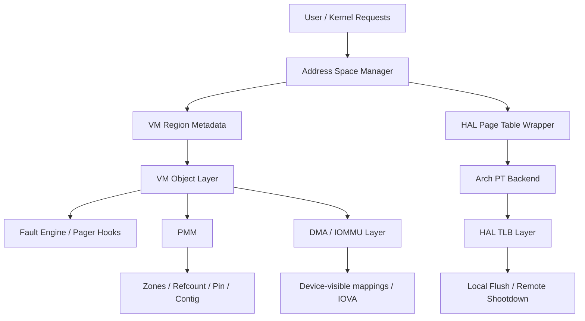
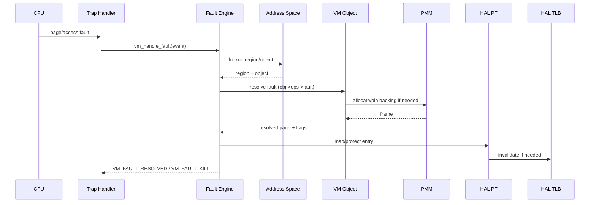
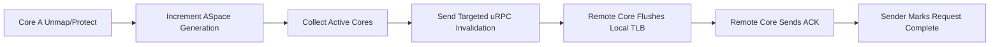

# Bharat-OS Memory Architecture

## 1. Executive Summary

Bharat-OS implements a capability-gated multikernel memory architecture that enforces strict separation between mechanisms (physical memory allocation, hardware translation) and policies (virtual memory semantics, demand paging). The memory subsystem has matured beyond the bootstrap phase and provides a robust foundation encompassing physical memory management (PMM), virtual memory objects, address spaces, and hardware translation through a capability-aware HAL.

The primary design principle is **strict ownership**: no layer may reach around its adjacent layer. This prevents architecture leakage, ensures profile truthfulness (e.g., distinguishing between MMU and MPU contexts), and guarantees determinism.

---

## 2. Layered Architecture and Ownership Boundaries

The memory stack is divided into explicit layers, each with strict responsibilities:

| Layer | Responsibility | Must Not Know About |
|---|---|---|
| **PMM** (`kernel/src/mm/pmm/`) | Physical frames, zones, buddy allocation, contiguous alloc, refcounts | Virtual memory policies, address spaces, demand faults |
| **VM Object** (`kernel/src/mm/vm/objects/`) | Backing semantics (anon, file, shared, device), lifecycle, page fault resolution | Hardware translation formats, page tables |
| **Address Space** (`kernel/src/mm/vm/aspace/`) | Virtual memory region reservations, overlap rules, object attachment | Physical allocation policies |
| **HAL PT** (`kernel/include/hal/hal_pt.h`) | Hardware page table programming, architecture attributes | VM object semantics |
| **HAL TLB** (`kernel/src/mm/tlb/`) | Invalidation coordination (local/remote SMP shootdown) | PMM frame ownership, aspace lookup |
| **Fault Engine** (`kernel/src/mm/vm/fault/`) | Decoding traps, orchestrating lookup, invoking object faults, repairing backend | PMM internal structures |
| **DMA/IOMMU** (`kernel/src/mm/dma/`) | Device-visible mappings, IOVA domains, cache maintenance | General user-space memory semantics |

### Layer Ownership Map

---

## 3. Fault Resolution Sequence

The unified fault engine provides a deterministic state machine for handling memory faults across all architectures.

---

## 4. Profile Behavior Model

Bharat-OS operates across different device classes and enforces memory behavior guarantees natively without emulating unsupported capabilities.

| Capability | Profile: MMU-Full (e.g. Datacenter, Desktop) | Profile: MMU-Lite (e.g. Edge, Drone) | Profile: MPU-Only (e.g. Embedded RTOS) |
|---|---|---|---|
| **Page Mapping** | Full capability | Backend-dependent (fallback allowed) | Unsupported (sparse-page operation) |
| **Range Mapping** | Full capability | Wrapper fallback allowed | Region-programming only |
| **Protection** | Full granularity | Partial/Eager | Explicitly unsupported for page semantics |
| **Demand Faults**| Fully supported | Limited / Eagerly resolved | Not supported |
| **COW** | Software-managed | Limited | Not supported |
| **Huge Pages** | Capability-driven | Often disabled | N/A |
| **Device Maps** | Yes | Attribute-dependent | Region attribute only |
| **Recovery** | Fine-grained | Degraded path | Region violation (KILL) |

---

## 5. TLB SMP Shootdown Coordination

The multikernel architecture utilizes a synchronous/asynchronous invalidation loop depending on target requirements, leveraging uRPC for inter-core communication to maintain TLB coherency without introducing global locking bottlenecks.

---

## 6. Implementation Checklist & Conformance

Every architecture backend (`x86_64`, `arm64`, `riscv64`, `arm32`, `riscv32`) must satisfy the following memory guarantees:

| Check | x86_64 | arm64 | riscv64 | arm32 / riscv32 MPU |
|---|---|---|---|---|
| create/destroy aspace root | ☐ | ☐ | ☐ | ☐ |
| map/unmap page | ☐ | ☐ | ☐ | n/a |
| map/unmap range | ☐ | ☐ | ☐ | region-only |
| protect/query | ☐ | ☐ | ☐ | explicitly unsupported |
| user/kernel split invariants | ☐ | ☐ | ☐ | ☐ |
| local TLB invalidate | ☐ | ☐ | ☐ | n/a |
| remote TLB invalidate | ☐ | ☐ | ☐ | n/a |
| teardown leak-free | ☐ | ☐ | ☐ | ☐ |
| fault policy profile-correct | ☐ | ☐ | ☐ | ☐ |

---

## 7. Heterogeneous Compute Memory and Accelerator Domains

To support AI/ML and accelerator workloads without compromising the multikernel memory boundary, Bharat-OS extends its memory architecture with native heterogeneous compute memory domains. This establishes strict ownership for pinned buffers, DMA/IOMMU mappings, and secure memory, ensuring zero leakage between the kernel mechanism and user-space policy.

### 7.1 Memory Roles and Buffer Domains

The virtual memory subsystem (`kernel/src/mm/vm/`) and DMA layer (`kernel/src/mm/dma/`) recognize distinct roles for accelerator-bound memory:

*   **Host-Private Model Memory**: Standard, secure memory regions accessible only by the CPU for compiling or staging.
*   **Shared Tensor Buffers**: Coherent or explicitly managed shared memory regions accessible by both CPU and accelerators.
*   **Pinned DMA Buffers**: Pages locked in physical memory to prevent eviction during long-running accelerator jobs.
*   **Coherent Buffers**: Hardware-coherent memory automatically synchronized between CPU caches and accelerator domains.
*   **Streaming Buffers**: Non-coherent memory requiring explicit software cache maintenance (flush/invalidate) before and after device execution.
*   **Secure / Isolated Buffers**: Memory isolated via IOMMU or trusted execution environments, explicitly restricted from unauthorized access.
*   **Imported / Exported Buffers**: Reference-counted external buffer handles shared across processes or capability domains.

### 7.2 Kernel Memory Tags

To represent these domains, the system utilizes new memory capability tags (e.g., in `vm_types.h` or `accel_types.h`):

*   `MEM_ACCEL_SHARED`
*   `MEM_ACCEL_PINNED`
*   `MEM_ACCEL_COHERENT`
*   `MEM_ACCEL_STREAMING`
*   `MEM_ACCEL_SECURE`
*   `MEM_MODEL_RO`
*   `MEM_TENSOR_RW`

### 7.3 Mechanisms and Lifecycles

The memory stack enforces:

*   **Pin/Unpin Lifecycle**: Deterministic locking of physical frames backing active accelerator jobs.
*   **Scatter-Gather Generation**: Translating contiguous virtual allocations into scatter-gather lists for DMA programming.
*   **IOVA Lifecycle**: Binding/unbinding IO Virtual Addresses into device-specific IOMMU domains before job execution.
*   **Cache Maintenance**: Architecture-agnostic hooks (`hal_dma`) to flush or invalidate caches for `MEM_ACCEL_STREAMING` buffers, specially on edge profiles (e.g., ARM32/RISCV32).
*   **Teardown and Fault Cleanup**: Deterministic revocation of memory and IOMMU mappings when an accelerator driver encounters a fault, or when a job is cancelled, preventing page leaks.

---

## 8. Current State and Open Backlog

- **PMM**: Core zoned allocator, early allocator, and contiguous allocators exist. Needs deeper NUMA domain hardening.
- **VM Objects**: Anonymous, Shared, File, Device, and DMA kinds are structurally implemented with rigorous lifecycle validation.
- **ASpace**: Interval trees and base APIs are mature.
- **Fault Contract**: Unified `vm_handle_fault` contract implemented and host-tested (including OOM, segmentation, permissions, and backing resolution stages).
- **HAL Translation**: Interfaces (`hal_pt`) exist but need full translation across all architectures (specifically 32-bit backends).
- **DMA/IOMMU**: Scaffolding is complete but real SMMU/VT-d integration and lifecycle caching remain open.
## 8. Stack Bounds and Revocation Memory Safety

The Bharat-OS kernel operates with bounded stack sizes, especially during early boot. On architectures like ARM64, stack sizes are strictly enforced, and deep recursion or large stack allocations can lead to unhandled data aborts.

To maintain memory safety and prevent stack overflow panics:
* **Capability Revocation:** Recursive tree traversals for capability revocation must not rely on deep stack allocations. The `cap_table_revoke` implementation utilizes heap-allocated memory (`kmalloc`) for its traversal stack, falling back to a bounded static buffer only when the heap is unavailable (e.g., early boot).
* **Bounded Maximums:** The maximum depth of capability revocation (`BHARAT_CONFIG_CAP_REVOKE_MAX`) is governed by the system profile to scale with available resources, preventing arbitrary stack bloat.
* **Iterative Traversal:** Tree traversals and graph iterations must always use an iterative approach with explicit queue or stack structures on the heap, avoiding standard C function recursion which risks overflowing the architecture's execution stack.
