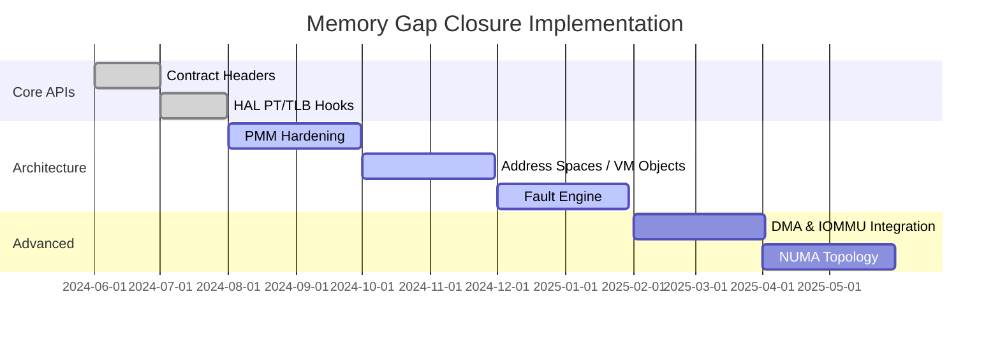

# Memory Gap Closure Plan (PMM → VM → MMU → Pager → DMA)

This document converts the current memory-management gap assessment into an implementation backlog that can be executed incrementally.

## 1) Current-state rewrite (authoritative)

## Implementation progress snapshot

- ✅ Phase 0 (API surface bootstrap) started: memory and HAL contract headers landed under `kernel/include/mm/` and `kernel/include/hal/` to provide stable interfaces for PMM/VM object/aspace/fault/DMA and page-table/TLB/IOMMU work.
- ✅ VM/aspace scaffolding exists in-tree (`kernel/src/mm/vm/aspace`, `kernel/src/mm/vm/objects`, `kernel/src/mm/vm/fault`) with host tests for overlap, clone, lookup and refcount behavior (`tests/test_vmm_aspace.c`).
- ✅ HAL page-table and TLB abstraction entry points are wired (`kernel/src/hal/hal_pt.c`, `kernel/src/mm/tlb/tlb_coordinator.c`) with basic range/map/query wrappers and shootdown coordinator plumbing.
- ✅ HAL PT/TLB capability contracts now exist (`hal_pt_caps_t`, `hal_tlb_caps_t`) with backend-populated declarations and runtime getters (`hal_pt_caps()`, `hal_tlb_caps()`).
- ✅ Generic `hal_pt_*` range wrappers now include page-by-page fallback paths when backend range ops are unavailable.
- ✅ Architecture backends now advertise conservative PT/TLB capabilities via file-static cap objects (x86_64/arm64/riscv64/arm32/riscv32/mpu), and generic policy layers consume those caps in obvious decision points.
- ⚠️ Several areas are still prototype-grade (limited backend implementations, incomplete pager integration, partial object kinds, and incomplete conformance coverage across all architectures).

Bharat-OS has a credible baseline for physical memory management (PMM/buddy allocator) and software-visible mapping bookkeeping (VMM registry). However, a production-grade, architecture-complete virtual memory stack is still in progress:

- hardware page-table lifecycle and permission correctness are not fully mature across all targets,
- SMP-safe TLB invalidation discipline is incomplete,
- demand paging, COW, and pager integration are partial/deferred,
- NUMA/topology policy is early,
- DMA/IOMMU-aware mapping lifecycle is not yet end-to-end.

## 2) Layered target architecture (must keep boundaries strict)

To avoid coupling and architecture leakage, implement and enforce these layers.
The **logical layers** remain the same, but paths below reflect the **current repository layout**:

1. **PMM layer** (`kernel/src/mm/pmm/`): frame discovery, zones, buddy/contiguous alloc, refcounts, pinned/reserved classes.
2. **VM Object layer** (`kernel/src/mm/vm/objects/`): anonymous/file/shared/device/DMA objects + COW semantics.
3. **Address-space layer** (`kernel/src/mm/vm/aspace/`): region reservations, overlap checks, attach/detach object mappings.
4. **Hardware translation layer** (HAL PT/TLB + backend MMU/MPU code):
   - generic HAL contracts/wrappers: `kernel/include/hal/`, `hal/hal_pt.c`
   - architecture backends: `hal/x86_64/`, `hal/arm64/`, `hal/riscv64/`, `hal/arm32/`, `hal/riscv32/`
   - profile/backbone backends: `hal/common/`, `hal/mmu/`, `hal/mmu_lite/`, `hal/mpu/`
   - board/platform-specific bring-up pieces stay in their board/arch folders (for example `hal/*/boot_*.c`, platform discovery/topology files under `hal/*/`).
5. **Fault/Pager layer** (`kernel/src/mm/vm/fault/`): lazy allocation, COW break, stack growth, page-in/out policy.
6. **DMA/IOMMU layer** (`kernel/src/mm/dma/`, `kernel/src/mm/iommu/` + HAL contracts in `kernel/include/hal/hal_dma.h` and `kernel/include/hal/hal_iommu.h`): pinning, IOVA domains, cache sync, device-visible mappings.

### Layout rule for this repository

- Keep **HAL-generic** code in generic HAL locations (`kernel/include/hal/`, `hal/common/`, `hal/hal_pt.c`).
- Keep **architecture-specific HAL** code in architecture folders under `hal/` (for example `hal/arm64/`, `hal/riscv64/`, `hal/x86_64/`).
- Keep **board/platform-specific** details in their respective board/platform files within the relevant arch folder; do not collapse board logic into generic memory layers.

## 3) Profile guarantees (explicit, non-negotiable)

Define and enforce profile-specific guarantees in build/config and docs:

- `PROFILE_MMU_FULL`: full VM + demand paging + COW + shared memory + pager hooks.
- `PROFILE_MMU_LITE`: static/eager mappings with limited isolation and no mandatory demand paging.
- `PROFILE_MPU_ONLY`: region isolation semantics only; no sparse paged VM promises.

> Rule: MPU-only and MMU paths must not share fake "compatibility" semantics.

## 4) Cross-architecture acceptance criteria

Every architecture backend (`x86_64`, `arm64`, `riscv64`) must satisfy:

- create/destroy address-space root,
- map/unmap/protect/query range,
- encode permissions and cache attributes correctly,
- local + remote TLB invalidation contract,
- kernel/user split invariants,
- page-table teardown with no leaks.

### x86_64 specifics

- 4-level required, 5-level abstraction-ready.
- 4 KiB + 2 MiB mappings required, 1 GiB optional.
- NX/U/S/W/Global/PAT handling and PCID-aware switching.

### arm64 specifics

- stage-1 descriptor correctness for configured VA/granule.
- MAIR + shareability + device memory attributes.
- break-before-make remap path.
- ASID-aware context switching.

### riscv64 specifics

- Sv39 required, Sv48 abstraction-ready.
- V/R/W/X/U/G/A/D handling with hardware capability checks.
- `satp` switching + `sfence.vma` local/remote discipline.

## 5) Implementation backlog (execute in order)

## Phase 0 — Contract and layout cleanup

- [ ] Create/normalize directory boundaries: `pmm/`, `vm/objects/`, `vm/aspace/`, `vm/fault/`, `dma/`, `iommu/`, `hal/mmu/`.
- [x] Add public headers:
  - [ ] `include/mm/pmm.h`
  - [ ] `include/mm/vm_object.h`
  - [ ] `include/mm/aspace.h`
  - [ ] `include/mm/fault.h`
  - [ ] `include/mm/dma.h`
  - [ ] `include/hal/hal_pt.h`
  - [ ] `include/hal/hal_tlb.h`
  - [ ] `include/hal/hal_iommu.h`
- [ ] Define stable API contracts and ownership rules between layers.

## Phase 1 — PMM hardening

- [ ] Normalize firmware/bootloader memory map ingestion.
- [ ] Add page metadata (`page_frame_t`) with refcount, flags, owner class.
- [ ] Add DMA-capable zones and low-memory constraints.
- [ ] Add contiguous allocation + pin/unpin hooks.
- [ ] Add optional NUMA node tagging in metadata.
- [ ] Add PMM invariants tests (allocation/free/refcount/leak checks).

## Phase 2 — Hardware page-table manager completion

- [ ] Implement architecture-neutral page-table API (`hal_pt_*`).
- [ ] Complete runtime map/unmap/protect/query flows for each arch.
- [ ] Implement split/merge support for large pages.
- [ ] Implement local + remote TLB shootdown APIs (`hal_tlb_*`).
- [ ] Implement safe teardown path with accounting.
- [ ] Add arch MMU conformance tests (permissions, faults, teardown).

## Phase 3 — Address spaces and VM objects

- [ ] Introduce `address_space_t` per process/container.
- [ ] Implement region tree/interval map with overlap protection.
- [ ] Introduce `vm_object_t` kinds: anon/shared/file/device/dma.
- [ ] Add region attach/detach and inheritance semantics.
- [ ] Wire authoritative VA→region→object lookup path.
- [ ] Add clone/fork scaffolding for later COW.

## Phase 4 — Fault engine and demand paging

- [ ] Implement fault decoder: not-present vs permission vs access type.
- [ ] Implement zero-fill-on-demand for anonymous objects.
- [ ] Implement COW break path and write-fault handling.
- [ ] Implement bounded stack growth policy.
- [ ] Add pager callback contract for file/pager-backed objects.
- [ ] Define recover/kill/escalation policy per profile.

## Phase 5 — NUMA and topology policies (Tier B/C)

- [ ] Add node/domain abstraction and topology discovery hooks.
- [ ] Add allocation policies: local-preferred/interleave/bind/fallback.
- [ ] Add scheduler↔memory affinity hints.
- [ ] Add migration hooks and huge-page node policy.
- [ ] Add observability metrics for locality and remote-access cost.

## Phase 6 — DMA/IOMMU memory lifecycle

- [ ] Implement `dma_buffer_object` + pin budget accounting.
- [ ] Add coherent vs streaming DMA APIs.
- [ ] Add IOVA allocator and per-device domain model.
- [ ] Add cache maintenance/sync primitives.
- [ ] Add backend stubs/contracts for VT-d, SMMU, RISC-V platform variants.
- [ ] Add bounce-buffer fallback for low-end/non-IOMMU profiles.

## 6) Task slicing (recommended issue sequence)

Use this sequence so each item is independently reviewable and testable:

1. **MM contracts and header skeletons**
2. **PMM metadata + refcounting**
3. **PMM DMA zones + contiguous alloc**
4. **Common `hal_pt` interface + x86_64 mapping parity**
5. **arm64 descriptor/attribute parity + BBM flow**
6. **riscv64 Sv39 parity + `sfence.vma` discipline**
7. **`address_space_t` and region tree**
8. **`vm_object_t` (anon/shared/file/device/dma) base ops**
9. **Fault decode + demand-zero**
10. **COW and fork cloning**
11. **Pager/file-backed object path**
12. **TLB shootdown SMP stress tests**
13. **NUMA policy framework + metrics**
14. **DMA buffer lifecycle + IOMMU domain abstraction**

## 7) Definition of done (DoD)

A memory subsystem milestone is complete only if all are true:

- [ ] API contract documented and merged.
- [ ] Unit/integration tests added and green in CI for applicable targets.
- [ ] No mapping/refcount leaks under stress tests.
- [ ] Fault behavior is deterministic and profile-compliant.
- [ ] Architecture notes updated (`x86_64`, `arm64`, `riscv64`, `mpu-only`).
- [ ] Observability added (counters/traces for map/unmap/fault/TLB shootdown).

## 8) Immediate next 3 tasks (start now)

1. Land memory-layer public headers + ownership contracts.
2. Land PMM page metadata with refcount + DMA zone tagging.
3. Land architecture-neutral `hal_pt` interface and x86_64 conformance first.

These three unblock all later VM-object, fault, and pager work.

## 9) Status review (implemented vs not implemented, March 2026)

### Implemented (baseline present)

- Public memory/HAL interface headers from Phase 0 are present (`pmm.h`, `vm_object.h`, `aspace.h`, `fault.h`, `dma.h`, `hal_pt.h`, `hal_tlb.h`, `hal_iommu.h`).
- PMM has page metadata, owner classes, refcount/pin operations, and multiple zones in the API and implementation baseline.
- `address_space_t` lifecycle + region interval-tree lookup/attach/detach + clone scaffolding are implemented.
- `vm_object_t` base structure and object refcount lifecycle are implemented with anon/shared/file/device/dma constructor hooks.
- TLB coordinator has local and remote shootdown protocol hooks with generation tracking and ack tracking.

### Not implemented / partial

- Full pager path (file-backed demand paging, swap/page-out policy, recover/kill/escalation policy matrix) remains incomplete.
- COW break path and full write-fault lifecycle are not fully implemented end-to-end.
- Cross-arch MMU conformance parity (x86_64/arm64/riscv64) is still uneven and needs deterministic teardown/fault suites.
- NUMA policy/migration/observability remains Tier B/C and not production hardened.
- DMA/IOMMU lifecycle is still partial (domain model exists, backend parity + full cache-sync contracts still need completion).

## 10) Near-production hardening tasks we can implement next (recommended order)

1. **VM object lifecycle hardening (immediate)**  
   Remove static pools for VM objects, enforce constructor validation, and ensure refcount teardown is heap-safe and deterministic.
2. **Fault API contract unification**  
   Align `mm/fault.h` and implementation signatures, define stable return codes, and add host tests for invalid-access and permission faults.
3. **TLB shootdown safety checks**  
   Add argument validation/alignment checks and timeout observability counters (not just panic path), with stress tests for multi-core ack loss.
4. **hal_pt wrapper fallback behavior**  
   Add generic page-by-page fallback when backend range ops are absent to improve portability and correctness on partially implemented targets.
5. **Cross-arch MMU conformance tests**  
   Expand `tests/mm/*` to include map/unmap/protect/query/teardown determinism suites per architecture profile.
