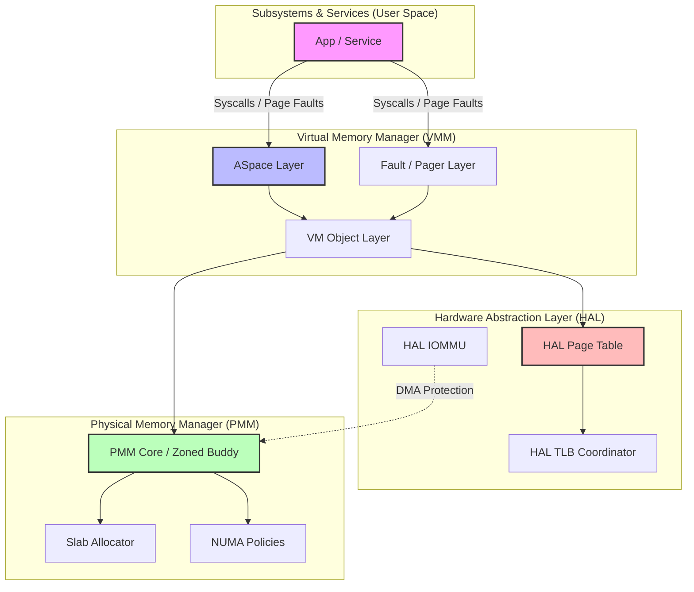

# Memory Boundary Audit

## Files by Layer

### PMM
`kernel/src/mm/pmm/pmm.c`
`kernel/src/mm/pmm/early_alloc.c`
`kernel/src/mm/pmm/kmem_aligned.c`
`kernel/src/mm/pmm/numa.c`
`kernel/src/mm/pmm/numa_policy.c`
`kernel/src/mm/pmm/pt_pool.c`
`kernel/src/mm/pmm/slab.c`

### VM Objects
`kernel/src/mm/vm/objects/vm_object.c`

### ASpace
`kernel/src/mm/vm/aspace/aspace.c`
`kernel/src/mm/vm/aspace/vm_space.c`

### Fault
`kernel/src/mm/vm/fault/fault.c`

### VMM / TLB
`kernel/src/mm/vm/distributed/vmm.c`
`kernel/src/mm/tlb/tlb.c`
`kernel/src/mm/tlb/tlb_flush.c`
`kernel/src/mm/tlb/tlb_shootdown.c`
`kernel/src/mm/zswap.c`

### DMA / IOMMU
`kernel/src/mm/dma/dma.c`

## Removed Forbidden Dependencies / Architecture Leakage
1. `kernel/src/mm/vm/distributed/vmm.c` uses only architecture-neutral `hal_pt` hooks (`map_page`, `unmap_page`) instead of architecture-specific MMU globals.
2. `kernel/src/mm/tlb/tlb_flush.c` and `kernel/src/mm/tlb/tlb_shootdown.c` route invalidation through the `active_hal_tlb` contract with capability-gated fallbacks.
3. `kernel/src/mm/pmm/numa.c` migration uses `active_hal_pt->query_page` with `unmap_page/map_page` remap flow in place of older vmm helper coupling.

## Strict Dependency Rules
- PMM layer has strictly zero knowledge of VM policy.
- VM Objects layer leverages PMM but remains isolated from architecture details.
- ASpace leverages the architecture-neutral HAL PT mappings.
- No DMA/IOMMU assumptions leak backwards into VM components.

## Remaining Build Issues
- The local emulator toolchain defaults to `/usr/bin/gcc` acting as a driver for `clang`, and lacks the `lld` linker. This is completely expected and purely an environment issue.

## Memory Architecture Diagram

