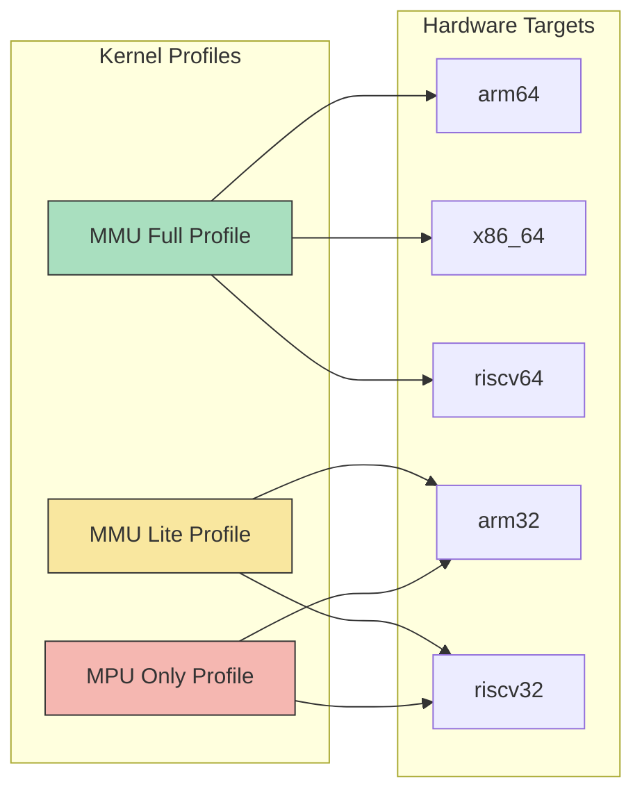

# Memory Production-Grade Plan (Profiles + Architecture Matrix)

This document defines the implementation plan to harden Bharat-OS memory management from prototype-grade behavior to production-grade behavior while preserving strict subsystem ownership boundaries.

## 1) Scope and objective

The plan covers:

- PMM (physical allocator and frame lifecycle)
- VM objects and object-backed mapping lifecycle
- Address-space metadata and placement
- HAL page-table and TLB abstraction layers
- Architecture MMU/MPU backends
- Fault engine semantics
- TLB shootdown protocol

Primary objective: make the memory stack **correct, profile-aware, architecture-portable, hardware-accelerated where available, testable, and truthfully documented**.

## 2) Non-negotiable ownership boundaries

The implementation must preserve these ownership boundaries in code (not only documentation):

- **PMM owns physical frames** (allocation classes, refcount, pin, release rules)
- **VM objects own backing semantics** (anon/file/shared/device/dma behavior)
- **Address spaces own VA metadata** (regions, placement, constraints)
- **PT backends own translation encoding** (PTE format, page-table lifecycle)
- **TLB layer owns coherency** (local + remote invalidation policy)
- **Fault engine owns resolution flow** (decode + policy + result contract)

## 3) Profile model (required)

### MMU-full

Guarantees sparse mappings, demand-fault hooks, shared mappings, COW readiness, range protect/unmap/query, and per-aspace TLB semantics.

### MMU-lite

Guarantees isolated mappings with reduced paging semantics. Public APIs remain stable, but capability reporting may explicitly indicate reduced backend features.

### MPU-only

Guarantees region-based isolation only. No fake sparse-page behavior is allowed. Mapping APIs must degrade explicitly when a feature is unsupported.

## 4) Architecture support model

- **arm32**: MPU-only or MMU-lite first-class support; region constraints must be explicit.
- **arm64**: MMU-full path with ASID + MAIR + break-before-make semantics.
- **riscv32**: reduced MMU capability path; robust fallback behavior required.
- **riscv64**: MMU-full path (Sv39 now, Sv48-ready abstraction) with `sfence.vma` discipline.

## 5) Workstreams

### A. Backend capability contracts

Introduce explicit `hal_pt_caps_t` and `hal_tlb_caps_t` capability reporting and require generic layers to consume capabilities instead of architecture assumptions.

### B. PMM hardening

Implement native zone-aware allocation search, safe physical-memory zeroing helpers (no direct phys pointer dereference), robust contiguous allocation path, strict ref/pin lifecycle, and PMM invariants tests.

### C. VM object ownership and VMM lifecycle

Remove generic unmap-time direct free behavior; use object-aware unmap/release contracts so shared/file/device/dma mappings retain correct ownership semantics.

### D. Address-space manager strengthening

Add hole-finding placement for unspecified hints, profile-aware region constraints, mapping granularity intent tracking, and runtime observability counters.

### E. Generic `hal_pt` wrapper hardening

Implement page-by-page fallback for map/unmap/protect/query range APIs when backend range operations are absent, and add capability-aware large-page dispatch and memtype normalization.

### F. Backend maturity by architecture

Complete backend parity for x86_64, arm64, riscv64, then arm32/riscv32, with explicit unsupported returns where hardware semantics cannot provide a feature.

### G. Fault engine redesign

Add stable fault result enum, fault-type decoding, profile-specific policy behavior, stack growth/guard handling, and COW-ready fault preparation.

### H. TLB protocol redesign

Move from fragile synchronous timeout-centric flow to queue/batch/generation-driven shootdown behavior with observability and failure recovery paths.

## 6) Phased execution order

1. Contracts and fallback hardening (A + E)
2. PMM correctness (B)
3. Ownership cleanup + aspace constraints (C + D)
4. Backend parity (F)
5. Fault + TLB robustness (G + H)

Each phase must include: code changes, tests, and documentation updates.

## 7) First sprint (recommended)

Prioritize the following before broad backend work:

1. backend capability structs and getters (`hal_pt_caps`, `hal_tlb_caps`)
2. generic `hal_pt` page-by-page fallback path
3. PMM zeroing fix + native zone enforcement
4. removal of direct free-from-unmap behavior in generic VMM path

This delivers the highest near-term correctness gains and reduces follow-on rework across arm32/arm64/riscv32/riscv64.

## 8) Acceptance matrix

### By profile

- **MMU-full**: aspace lifecycle, map/unmap/protect/query, object-backed faults, TLB invalidation, device memory mapping, huge-page candidate behavior
- **MMU-lite**: eager/static mapping path, protect/unmap/query, reduced but deterministic fault behavior
- **MPU-only**: region reserve/place/protect semantics, explicit unsupported responses for impossible sparse-page features

### By architecture

- **arm32**: MPU-only/MMU-lite profile tests pass
- **arm64**: full mapping + permission/TLB behavior pass
- **riscv32**: reduced capability matrix pass
- **riscv64**: full mapping + fault/TLB behavior pass

## 9) Documentation truth policy

Do not claim feature support unless covered by tests for the relevant profile/architecture matrix.

When behavior is partial, document it as partial with explicit limitations and next milestones.

## Memory Components and Interactions

