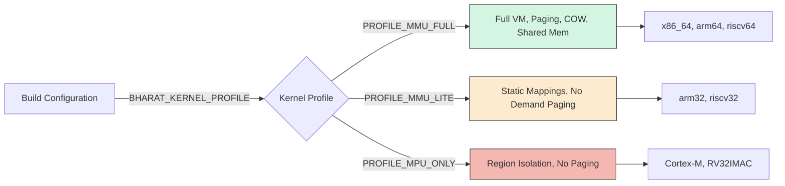

# Memory Profile Behavior Matrix

This matrix is the executable contract for memory behavior across Bharat-OS memory profiles.

| Capability | MMU-full | MMU-lite | MPU-only |
|---|---|---|---|
| map/unmap page | Supported | Backend-dependent, fallback-heavy | Not supported (page-granular) |
| map/unmap range | Supported; wrapper falls back to page ops if needed | Supported when backend provides page ops; wrapper fallback allowed | Backend-specific region programming only |
| protect | Supported | Partial / backend-dependent | Explicit unsupported for page semantics |
| query | Supported | Partial / backend-dependent | Explicit unsupported for sparse page queries |
| demand faults | Supported | Reduced/eager strategy | Not supported as sparse VM |
| COW | Software contract allowed | Limited | Unsupported |
| huge pages (2M/1G) | Capability-driven | Usually disabled | N/A |
| ASID/PCID | Capability-driven by backend | Usually unavailable | N/A |
| device mappings | Supported via normalized memtype flags | Supported where backend can express attributes | Region attribute only |
| fault recovery | Fine-grained | Degraded path | Region/access violation handling |
| coherent DMA | Full hardware coherency | Software managed (flush/invalidate) via HAL | Explicit software sync |
| pinned shared buffers | Fully supported | Supported via contiguous allocation | Region-based |
| imported/exported accelerator buffers | Supported via file descriptors/handles | Supported (handle mapping) | Unsupported (direct pointers only) |
| secure buffer isolation | Supported via IOMMU | Supported via MPU isolation | Basic MPU regions |
| accelerator fault containment | Process teardown, memory revocation | Memory teardown, task fault | Global device reset |
| queue/fence support | Fully supported, event-based | Event/IRQ-driven | Polling/basic IRQ |

## Notes

- MPU-only must not emulate full sparse-MMU semantics.
- Generic HAL PT wrappers use range ops when available and page-by-page fallbacks otherwise.
- Capability getters (`hal_pt_caps()`, `hal_tlb_caps()`) are the source of truth for runtime behavior decisions.

## Profile Selection Diagram

