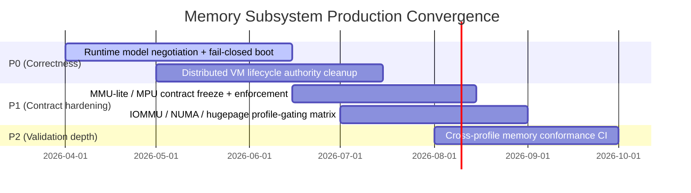

# Memory Architecture Roadmap & State

This roadmap tracks the convergence of the memory management subsystem in Bharat-OS toward a production-grade multikernel architecture.

## 1. Executive Summary & Current Reality

The memory stack is split into a **Minimal Memory Core** (PMM, MMU-lite/MPU pathways, early alloc) and an **Advanced VM** tier (ASpace, sparse mappings, demand faults).

### Current strengths (implemented baseline)
- **Explicit memory model API exists** with capability signaling for MMU-full / MMU-lite / MPU-style operation.
- **Architecture capability reporting exists** for major targets (`x86_64`, `arm64`, `riscv64`, `arm32`, `riscv32`) and already reflects protection-model diversity.
- **VM space objects expose timing-class controls** (`prefault`, lazy realize, runtime page-table allocation gating).

### Gaps to close for production
1. **Memory model selection is still build-time centric**
   - `mem_model_get_current()` behavior is macro/profile-driven.
   - Required next step: boot-time runtime negotiation and fail-closed validation against hardware capabilities.
2. **Distributed VM lifecycle still has non-authoritative pathways**
   - Destroy path still contains TODO-level remote realization cleanup semantics.
   - Realize path still includes deprecated/quarantined walk patterns.
   - Required next step: monitor-confirmed map/unmap/realize/destroy completion with rollback invariants.
3. **MMU-lite / MPU contract surface needs stricter declarations**
   - Service-level feature availability needs to be explicit and test-validated.
   - Required next step: hard deny unsupported semantics (no implied demand paging, no fake fine-grain `mprotect`, explicit sharing limits).
4. **IOMMU / NUMA / hugepage plumbing is uneven**
   - Some profile paths still contain placeholders/stubs.
   - Required next step: per-profile capability matrix that disables unsupported paths and verifies no accidental runtime dependency.

## 2. Capability-Gated Build Features

Bharat-OS exposes build flags but production correctness now requires runtime verification in addition to compile-time selection:

- `BHARAT_ENABLE_ADVANCED_VM`
- `BHARAT_ENABLE_MMU`
- `BHARAT_ENABLE_MPU`
- `BHARAT_ENABLE_IOMMU`
- `BHARAT_ENABLE_DMA_MAP`
- `BHARAT_ENABLE_NUMA`
- `BHARAT_ENABLE_HUGEPAGE`

> Build flags are intent, not proof. Boot-time hardware validation is the authoritative gate.

## 3. Production Memory Validation Matrix (new requirement)

At boot, the kernel must validate:

- **Detected architecture capabilities** (`arch_caps`, HAL translation/cache/IOMMU traits)
- **Requested profile contract** (MMU-full vs MMU-lite vs MPU-only)
- **Required memory guarantees** (faultability, protection granularity, sharing semantics, DMA isolation behavior)

If any required guarantee is not supported, boot must **fail closed** (or explicitly enter a documented degraded mode only if policy allows).

## 4. Contract surface by profile (must be explicit)

| Contract Item | MMU-full | MMU-lite | MPU-only |
|---|---|---|---|
| Demand paging | Required | Not guaranteed (typically disabled) | Unsupported |
| Sparse per-page protection transitions | Required | Limited/profile-defined | Unsupported (region granularity only) |
| Shared memory semantics | Full VM contract | Limited/explicit profile contract | Region-based only |
| Runtime page fault handling | Required | Optional/limited | Unsupported |
| DMA isolation via IOMMU | Preferred/required by profile | Optional | Optional (software + region controls when absent) |
| NUMA placement hints | Optional+supported on server targets | Optional/no-op on small targets | Usually no-op |
| Hugepage promotion | Optional | Optional/typically disabled | Unsupported |

## 5. Authoritative VM ownership flow (must converge)

Target authoritative flow:

1. **Request admission** (capability + profile-contract validation)
2. **Ownership transfer/lock** for mapping intent
3. **Monitor-mediated execution** for distributed updates
4. **Completion confirmation** from target ownership domain
5. **Commit or fault-safe rollback** (no partial-visible state)
6. **Lifecycle closure** on destroy/unmap with remote realization cleanup guarantees

## 6. Roadmap phases (updated)

### Phase A — Runtime model truthfulness (P0)
- Replace compile-time-only model assumptions with runtime capability negotiation.
- Add boot validation matrix and fail-closed behavior.
- Add CI checks that profile declarations match runtime capability probes.

### Phase B — Distributed VM lifecycle authority (P0)
- Remove deprecated realization walk paths.
- Close TODOs in remote realization teardown on destroy.
- Add monitor-confirmed completion and rollback checks.

### Phase C — MMU-lite/MPU contract hardening (P1)
- Publish profile-level unsupported feature list as machine-readable policy.
- Enforce unsupported-return behavior for paging/fine-grain-protect APIs.
- Add conformance tests per translation model.

### Phase D — IOMMU/NUMA/hugepage profile gating (P1)
- Eliminate stubs from active call paths or hard-disable via profile matrix.
- Verify no accidental dependence in constrained profiles.
- Add profile-aware test matrix coverage.

## 7. Execution Plan Summary

1. Implement boot-time `arch_caps × profile × guarantees` validator.
2. Wire validator output into early memory init; fail closed on mismatch.
3. Finalize authoritative distributed VM lifecycle state machine with rollback.
4. Freeze MMU-lite/MPU service contracts and enforce at syscall/service boundary.
5. Gate IOMMU/NUMA/hugepage functionality through explicit profile capability matrix + CI.

## 8. Mermaid timeline (planning artifact)

