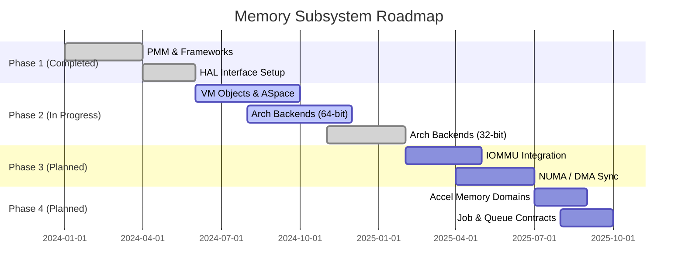

# Memory Architecture Roadmap & State

This roadmap tracks the convergence of the memory management subsystem in Bharat-OS toward a production-grade multikernel architecture.

## 1. Executive Summary & Code State

The memory stack is split into a **Minimal Memory Core** (PMM, MPU-lite, early alloc) and an **Advanced VM** tier (ASpace, paging).

### Current Code State
- **PMM (`kernel/src/mm/pmm/`)**: Core zoned buddy allocator and contiguous APIs are complete.
- **VM Base Objects (`kernel/src/mm/vm/objects/`)**: Base structures for anonymous and device objects are implemented, including lifecycle reference counting.
- **ASpace (`kernel/src/mm/vm/aspace/`)**: Interval trees and base APIs are mature.
- **Fault Handling (`kernel/src/mm/vm/fault/`)**: Handlers are present but demand paging and COW require alignment with hardware COW breaks.
- **HAL Common (`hal/hal_pt.c`)**: Neutral architecture capability contracts (`hal_pt_caps`) are in place.

## 2. Capability-Gated Build Features

We are replacing reliance on monolithic profiles with explicit capability flags in CMake:
*   `BHARAT_ENABLE_ADVANCED_VM`
*   `BHARAT_ENABLE_MMU`
*   `BHARAT_ENABLE_MPU`
*   `BHARAT_ENABLE_IOMMU`
*   `BHARAT_ENABLE_DMA_MAP`

## 3. Architecture Backends Progress

| Architecture | MMU Status | TLB Shootdowns | Cache Mgmt | Hardware Huge Pages |
|---|---|---|---|---|
| **x86_64** | 🚧 Active (4-level) | 🚧 Local/Remote IPI | ✅ Supported | 🔜 Planned |
| **arm64** | 🚧 Active | 🚧 IPI/Shootdowns | 🚧 MAIR setup | 🔜 Planned |
| **riscv64** | 🚧 Active (Sv39/48) | 🚧 `sfence.vma` | ✅ Supported | 🔜 Planned (Svpbmt) |
| **arm32/riscv32** | ✅ Done (MMU-lite) | ❌ N/A | ❌ N/A | 🔜 Planned (LPAE) |
| **cortex-m / RV32IMAC** | ✅ Done (MPU-only) | ❌ N/A | ❌ N/A | ❌ N/A |

## 4. Algorithmic Efficiency & Bottlenecks

### Current State
- **PMM**: Uses buddy allocator with NUMA zones and per-core node caches (`pmm_pcache`).
- **TLB Shootdown**: Synchronous loop blocks CPU completely.
- **Page Table Pool**: Utilizes single spinlock.

### Planned Improvements
- **PMM Lock Contention**: Migrate to lock-free localized zone structures or fine-grained locking.
- **Page Table Allocator**: Introduce per-core PT slab caches to improve concurrent faults.
- **TLB Latency**: Optimize uRPC polling and introduce asynchronous lazy-invalidation where valid.

## 5. Next Phases

### Phase 3: Hardware Specialization and IOMMU
- **IOMMU Domains**: Full device domain lifecycle management (currently `null`).
- **Non-Coherent DMA**: APIs for cache flushing/invalidation around DMA boundaries for Edge profiles.
- **NUMA Awareness**: Scheduler memory affinity hints.
- **32-Bit Context Isolation**: Safe execution separation on MPU-only devices.

### Phase 4: Heterogeneous Compute + Accelerator Memory
- **Accelerator Memory Contracts**: `MEM_ACCEL_SHARED`, `MEM_ACCEL_PINNED`.
- **Queueing/Fence Primitives**: Command submission and synchronization.
- **Virtual Mock Backend**: Virtual accelerator driver to validate isolation end-to-end.

## 6. Execution Plan Summary
1. **Refactor `prot_domain.c`**: Remove architecture `#ifdefs` and rely strictly on HAL caps.
2. **Optimize PMM/PT Locks**: Introduce lockless/per-core primitives.
3. **Implement THP Skeleton**: Activate `mm_promote_hugepage` logic.
4. **Advance HAL Support**: Plumb `PCID`, `Svpbmt`, and ARM32 `LPAE` capabilities through unified MPA.

## Memory Architecture Diagram

