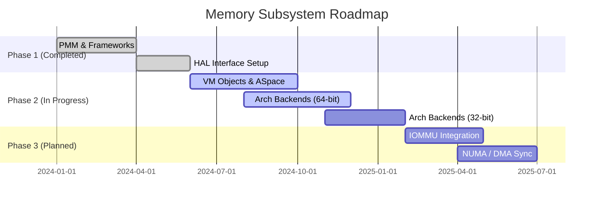

# Memory Architecture Roadmap

This roadmap tracks the convergence of the memory management subsystem in Bharat-OS toward a production-grade multikernel architecture. The focus is to evolve from basic physical memory allocation and scaffolding to full virtual memory management, hardware isolation, and DMA coherency.

## Phase 1: Core Physical Memory and Interfaces (Completed)

| Item | Status | Description |
| --- | --- | --- |
| **PMM Allocator** | ✅ Done | Core buddy allocator with zoned memory, refcounts, and contiguous memory APIs (`kernel/src/mm/pmm/`). |
| **HAL Contracts** | ✅ Done | Neutral architecture capability contracts (`hal_pt_caps`, `hal_tlb_caps`) for PT, TLB, and IOMMU (`kernel/include/hal/`). |
| **VM Base Objects** | ✅ Done | Base structure for anonymous and device objects, including lifecycle reference counting (`kernel/src/mm/vm/objects/`). |
| **ASpace Framework** | ✅ Done | Address space interval trees, lookup semantics, and region boundaries (`kernel/src/mm/vm/aspace/`). |
| **Common HAL PT** | ✅ Done | Architecture-neutral wrappers with page-by-page fallback logic (`hal/hal_pt.c`). |

## Phase 2: Architecture Backends and Paging (In Progress)

| Item | Status | Description |
| --- | --- | --- |
| **x86_64 PT & TLB** | 🚧 Active | 4-level paging, cache attributes, and local/remote shootdowns via IPI. |
| **arm64 PT & TLB** | 🚧 Active | MAIR attributes, stage-1 translation, break-before-make remap paths. |
| **riscv64 PT & TLB** | 🚧 Active | Sv39/Sv48 switching and `sfence.vma` logic. |
| **arm32/riscv32 MMU-lite** | 🚧 Active | Baseline scaffolding exists (`hal_pt_arm32.c`, `hal_pt_riscv32.c`). Needs functional backend programming. |
| **Demand Paging/COW** | 🚧 Active | Fault handlers are present (`kernel/src/mm/vm/fault/`) but require tighter alignment with hardware faults and COW breaks. |

## Phase 3: Hardware Specialization and IOMMU (Upcoming)

| Item | Status | Description |
| --- | --- | --- |
| **IOMMU Domains** | 🔜 Planned | Full device domain lifecycle management. Currently a `null` backend exists. |
| **Non-Coherent DMA** | 🔜 Planned | APIs for cache flushing/invalidation around DMA boundaries for ARM/RISC-V edge profiles. |
| **NUMA Awareness** | 🔜 Planned | Topology hooks and scheduler memory affinity hints (`kernel/src/mm/pmm/numa.c` scaffolding exists). |
| **32-Bit Context Isolation** | 🔜 Planned | Safe execution separation on MPU-only devices. |

## Memory Architecture Diagram

## References

- [Memory Layering Overview](memory-layering.md)
- [Memory Gap Closure Plan](memory-gap-closure-plan.md)
- [HAL Gap Analysis](hal_analysis.md)
- [Production Grade Memory Plan](memory-production-grade-plan.md)
- [Profile Behavior Matrix](memory-profile-behavior-matrix.md)
