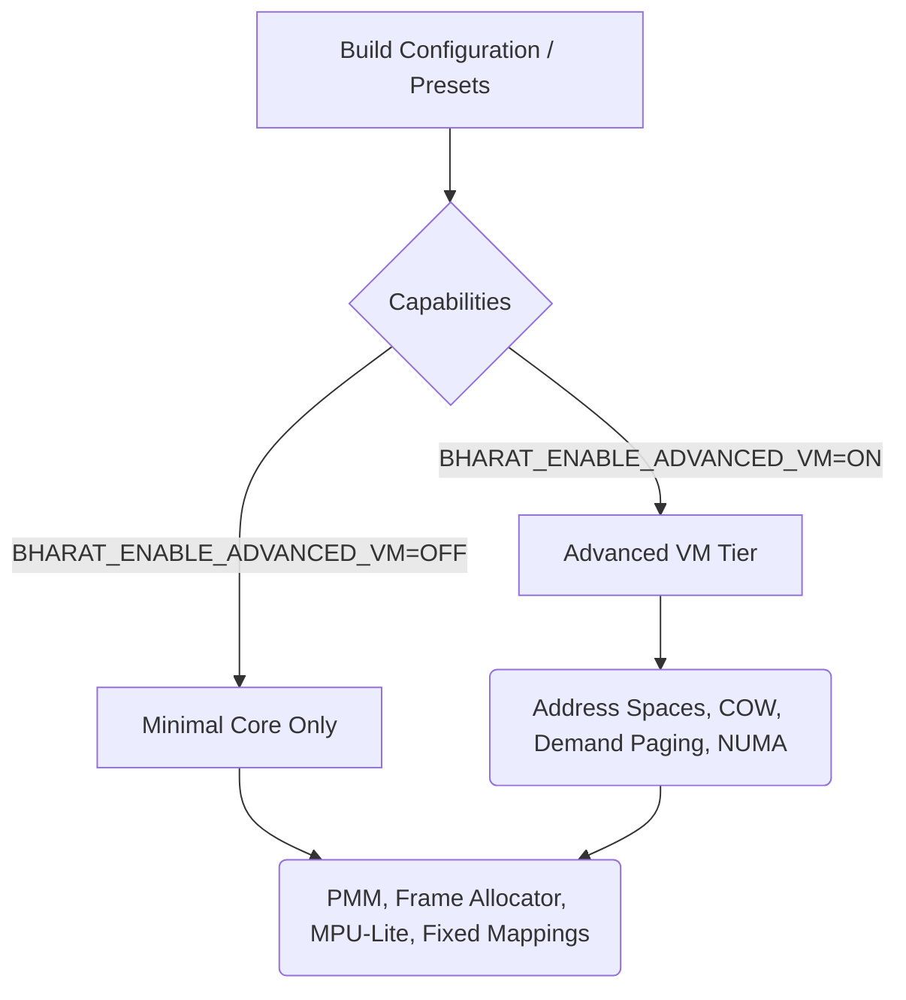
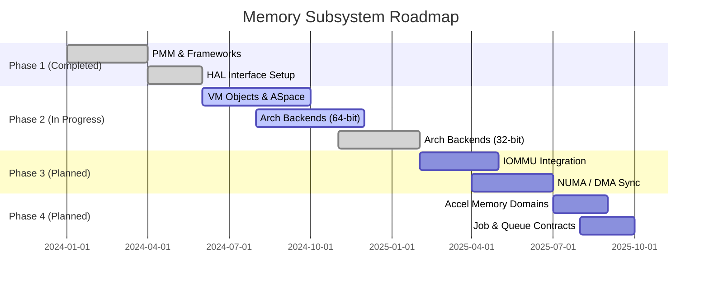

# Memory Architecture Roadmap

This roadmap tracks the convergence of the memory management subsystem in Bharat-OS toward a production-grade multikernel architecture. The focus is to evolve from basic physical memory allocation and scaffolding to full virtual memory management, hardware isolation, and DMA coherency.

## Phase 1: Core Physical Memory and Interfaces (Completed)

| Item | Status | Description |
| --- | --- | --- |
| **PMM Allocator** | ✅ Done | Core buddy allocator with zoned memory, refcounts, and contiguous memory APIs (`kernel/src/mm/pmm/`). |
| **HAL Contracts** | ✅ Done | Neutral architecture capability contracts (`hal_pt_caps`, `hal_tlb_caps`) for PT, TLB, and IOMMU (`kernel/include/hal/`). |
| **VM Base Objects** | ✅ Done | Base structure for anonymous and device objects, including lifecycle reference counting (`kernel/src/mm/vm/objects/`). |
| **ASpace Framework** | ✅ Done | Address space interval trees, lookup semantics, and region boundaries (`kernel/src/mm/vm/aspace/`). |
| **Common HAL PT** | ✅ Done | Architecture-neutral wrappers with page-by-page fallback logic (`hal/hal_pt.c`). |

## Phase 2: Architecture Backends and Paging (In Progress)

| Item | Status | Description |
| --- | --- | --- |
| **x86_64 PT & TLB** | 🚧 Active | 4-level paging, cache attributes, and local/remote shootdowns via IPI. |
| **arm64 PT & TLB** | 🚧 Active | MAIR attributes, stage-1 translation, break-before-make remap paths. |
| **riscv64 PT & TLB** | 🚧 Active | Sv39/Sv48 switching and `sfence.vma` logic. |
| **arm32/riscv32 MMU-lite** | ✅ Done (Baseline) | Functional MMU backends (ARMv7 Short-Descriptor and Sv32) implemented. Ready for hardening / advanced features. |
| **Demand Paging/COW** | 🚧 Active | Fault handlers are present (`kernel/src/mm/vm/fault/`) but require tighter alignment with hardware faults and COW breaks. |

## Phase 3: Hardware Specialization and IOMMU (Upcoming)

| Item | Status | Description |
| --- | --- | --- |
| **IOMMU Domains** | 🔜 Planned | Full device domain lifecycle management. Currently a `null` backend exists. |
| **Non-Coherent DMA** | 🔜 Planned | APIs for cache flushing/invalidation around DMA boundaries for ARM/RISC-V edge profiles. |
| **NUMA Awareness** | 🔜 Planned | Topology hooks and scheduler memory affinity hints (`kernel/src/mm/pmm/numa.c` scaffolding exists). |
| **32-Bit Context Isolation** | 🚧 Active | Safe execution separation on MPU-only devices. |

## Phase 4: Heterogeneous Compute + Accelerator Memory (Upcoming)

| Item | Status | Description |
| --- | --- | --- |
| **Accelerator Memory Contracts** | 🔜 Planned | Introduction of tags like `MEM_ACCEL_SHARED`, `MEM_ACCEL_PINNED` and lifecycle helpers. |
| **CPU ISA Capability Exposure** | 🔜 Planned | Normalized capability schema for SIMD/Vector units to guide scheduling hints. |
| **Queueing/Fence Primitives** | 🔜 Planned | Unified HAL and kernel primitives for accelerator command submission and synchronization. |
| **Buffer Teardown & Fault Containment** | 🔜 Planned | Safe job cancellation paths avoiding physical page leaks on NPU/GPU fault. |
| **Virtual Mock Backend** | 🔜 Planned | Bringup of a virtual accelerator driver to validate queue contracts and memory isolation end-to-end. |

## Phase 5: Capability-Gated Tier Split (Active)

To effectively scale from tiny MCU profiles to full datacenter VMs, the memory subsystem must transition from monolithic `#ifdef` profile checks to explicit, capability-gated tiers.

### 1. Allocation Classes (Semantic Intent)
Instead of relying solely on `PMM_ALLOC_*` flags, we are introducing `alloc_class_t` (`MEM_NORMAL`, `MEM_DMA`, `MEM_RT`, `MEM_SECURE`, `MEM_PACKET`) to capture the semantic intent of allocations. This enables small profiles to collapse allocations into a single pool while allowing advanced profiles to route them to dedicated CMA or NUMA regions.

### 2. Capability-Gated Build Features
We are replacing the reliance on `BHARAT_DEVICE_PROFILE` (e.g., `EDGE`, `DATACENTER`) with explicit memory capability flags in CMake:
*   `BHARAT_ENABLE_ADVANCED_VM`
*   `BHARAT_ENABLE_MMU`
*   `BHARAT_ENABLE_MPU`
*   `BHARAT_ENABLE_IOMMU`
*   `BHARAT_ENABLE_DMA_MAP`

### 3. Minimal Core vs. Advanced VM Split
The monolithic memory stack is being split into a **Minimal Memory Core** (always included: PMM, MPU-lite, early alloc) and an **Advanced VM** tier (conditionally included: address spaces, demand paging, COW, NUMA). This ensures embedded builds do not link or initialize complex VMM structures.

## Memory Architecture Diagram

## References

- [Memory Model](memory-model.md)
- [Memory Layering Overview](memops-layering.md)
- [Multikernel Memory Architecture](memory-architecture-multikernel.md)
- [PMM Invariants](pmm-invariants.md)
- [Memory Profile Behavior Matrix](memory-profile-behavior-matrix.md)
- [Valgrind, Sanitizers & Kernel Hardening Strategy](valgrind-sanitizer-rollout.md)
