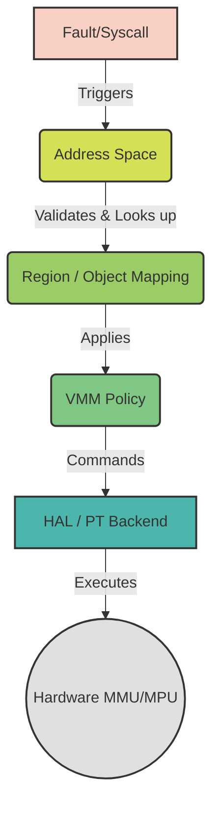

# Virtual Memory Authority Path Contract

This document defines the authoritative path for Virtual Memory (VM) management in Bharat-OS. It outlines the strict sequence of authority from page fault down to hardware execution, identifying ownership boundaries, policy versus mechanism, and the treatment of legacy mapping paths.

## 1. Single Source of Truth

The VM authority path must be a strictly linear, singular pipeline. Bypassing layers or establishing duplicate paths for memory mapping introduces security vulnerabilities, resource leaks, and architectural complexity.

The definitive, single source of truth for any virtual memory mapping is the **Address Space (aspace)** and its contained **Object/Region Mappings**, governed by VMM policy.

## 2. The Authoritative Path

Every memory mapping and page fault must strictly follow this sequence:

1. **Fault / Syscall**: A hardware page fault occurs, or a user-space application requests a memory operation (e.g., `mmap`).
2. **Address Space (aspace)**: The top-level container for a process's virtual memory. It owns the canonical layout.
3. **Region / Object Mapping**: The definition of a specific virtual address range, including what memory object backs it (e.g., physical memory, file, device).
4. **VMM Policy**: The Virtual Memory Manager applies security policies, access rights, and memory accounting rules.
5. **HAL / PT Backend**: The Hardware Abstraction Layer and Page Table backend. **It is strictly a mechanism**, executing operations commanded by the layers above.

## 3. Layer Responsibilities & Boundaries

To prevent architectural overlap, each layer is allowed to decide only specific aspects of the VM lifecycle.

> **Note on Hardware Profiles (MMU vs MPU):**
> Bharat-OS targets systems ranging from full rich-OS contexts with advanced Memory Management Units (MMUs) to constrained embedded contexts utilizing Memory Protection Units (MPUs) or MMU-lite variants.
> * On MMU systems, the Address Space and VMM policy translate to complex, hierarchical page tables.
> * On MPU systems, the mapping is flatter, and physical memory limits are statically assigned regions rather than dynamic pages.
>
> *However, the authoritative path remains exactly the same.* The HAL/PT backend abstracts these hardware differences. The VMM policy continues to enforce capability-based authorization and ownership regardless of whether it issues page-table writes or configures static MPU region registers.

### 3.1. Fault Handling (VMM)
* **Allowed:** Determine the cause of the fault (e.g., read, write, execute).
* **Allowed:** Route the fault to the corresponding Address Space.
* **Prohibited:** Directly mapping physical pages without consulting the Address Space and Object Mapping.

### 3.2. Mapping Legality (Address Space & VMM Policy)
* **Allowed:** Determine if a requested mapping is legally allowed based on the process's capabilities and memory limits.
* **Allowed:** Enforce protection flags (Read/Write/Execute).
* **Prohibited:** Bypassing Object Region validation to force a mapping.

### 3.3. Object/Region Ownership
* **Allowed:** Maintain the canonical list of virtual memory regions.
* **Allowed:** Track the physical backing (or placeholder) for a given region.
* **Allowed:** Handle page faults by resolving the required physical page for a specific offset within the object.

### 3.4. Backend Page-Table Operations (HAL/PT Backend)
* **Allowed:** Execute low-level architectural operations to update page tables (e.g., ARM64 TTBR, x86 CR3).
* **Allowed:** Perform TLB invalidation.
* **Prohibited:** Defining higher-level ownership policy. The HAL/PT backend must **never** make policy decisions about *what* should be mapped or *who* owns it. It only acts on instructions from the VMM.

## 4. Distinction Between Components

* **Policy:** Handled by the VMM and Address Space. Defines *who* can access *what*, and *when*.
* **Object Ownership:** Handled by the Region/Object Mapping. Defines *what* the memory actually is (e.g., anonymous memory, memory-mapped file, device MMIO).
* **Hardware Execution:** Handled by the HAL/PT Backend. Defines *how* the policy and object are translated into architecture-specific page table formats.

## 5. Current Gaps & Legacy Duplication

The current implementation contains areas where the authoritative path is not strictly followed. These are considered architectural debt and are targets for future cleanup:

* **Direct HAL Invocations:** Some early boot components or legacy drivers may invoke HAL/PT backend mapping functions directly, bypassing the Address Space and VMM policy layers.
* **Parallel Mapping Paths:** In certain subsystems, parallel tracking structures exist alongside the canonical Address Space regions, leading to potential state desynchronization.
* **Implicit Policy in HAL:** Some older backend implementations implicitly enforce access policies or make assumptions about memory types, blurring the line between mechanism and policy.

## 6. Future Convergence

The ultimate goal for the Bharat-OS VM architecture is absolute adherence to the authoritative path. The convergence strategy involves:

1. **Deprecating Direct Mapping:** All direct calls to HAL/PT backend mapping functions from outside the VMM will be flagged and refactored to use the proper VMM/aspace APIs.
2. **Consolidating State:** Duplicate tracking structures will be removed. The Address Space Region list will be the sole source of truth for virtual memory layout.
3. **Stripping Policy from HAL:** The HAL/PT backend will be audited to ensure it contains zero policy logic, acting purely as a dumb executor of VMM commands.
4. **Unified Capability Enforcement:** All VM operations (mapping, unmapping, protecting) will be strictly gated by the Capability Manager, integrated natively into the VMM policy layer.

*Duplicate authority paths are explicitly prohibited. Any new architecture or driver must integrate with the canonical Address Space and VMM APIs.*
