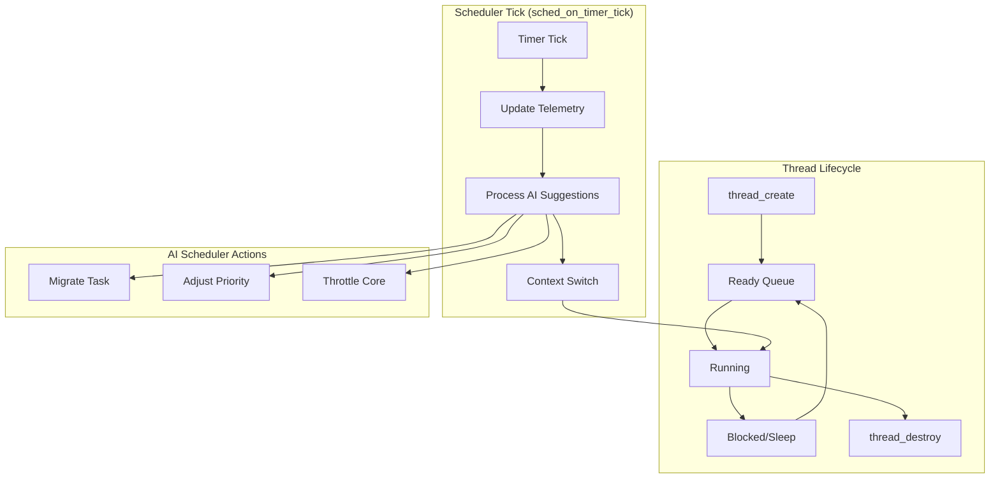

# Scheduler and Threading Baseline (v1)

This document captures the current baseline implementation for scheduler/threading in the kernel.

## Implemented in this baseline

- Static in-kernel process/thread registries.
- Thread control block (TCB) metadata including:
  - architectural context pointer,
  - priority/base priority,
  - scheduling state,
  - capability list hook pointer,
  - time-slice accounting,
  - AI scheduler context pointer (`ai_sched_context_t*`).
- Timer-tick driven dispatch (`sched_on_timer_tick`) with:
  - bounded pending AI suggestion queue processing,
  - per-thread telemetry sampling updates,
  - sleep/wakeup state transitions.
- Scheduler action handlers for AI suggestions:
  - migrate task (`sched_migrate_task`),
  - adjust priority (`sched_adjust_priority`),
  - throttle core (`sched_throttle_core`).
- Scheduler policy switch interface (`sched_set_policy`) with baseline RR/priority and EDF hooks.
- Thread lifecycle operations:
  - `thread_create`, `thread_destroy`,
  - syscall-style wrappers `sched_sys_thread_create`, `sched_sys_thread_destroy`.
- Context-switch hook integration via `fv_secure_context_switch` when available.

## Profile and architecture pluggability

The AI telemetry path is intentionally pluggable:

- Scheduler core calls profile/arch-neutral collection helpers in `advanced/ai_sched.h`.
- Architecture-specific PMCs are optional via `ai_sched_arch_sample_pmc(...)` override.
- If PMCs are unavailable, telemetry uses deterministic approximation from:
  - consumed time-slice,
  - run queue depth,
  - context-switch frequency.
- Profile-specific scaling remains bounded at compile time (`RTOS`, `EDGE`, `DESKTOP`).

This keeps scheduler mechanism portable across `x86_64`, `riscv64`, and `arm64` while allowing architecture-specific acceleration.

This pluggable design is formalized by ADR-008 (`docs/decisions/ADR-008-ai-scheduler-plugin-contract.md`), which keeps scheduler mechanism portable and testable while permitting architecture/profile overrides.

## Deferred for production

- Real per-core run queues and SMP load balancing.
- Full architecture register save/restore and user-mode transitions.
- Priority donation across lock ownership graph.
- Full EDF/RMS admission control and deadline miss accounting.
