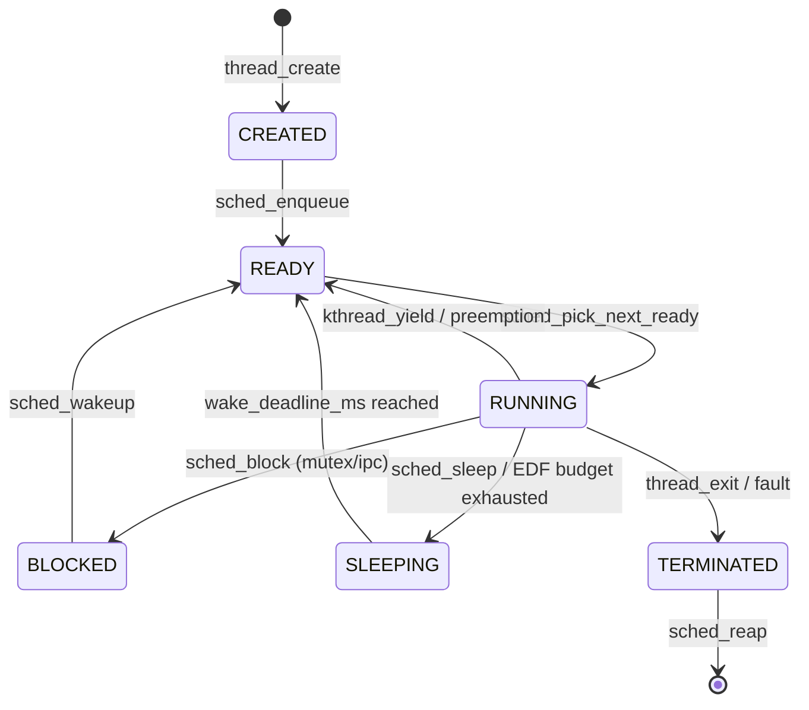
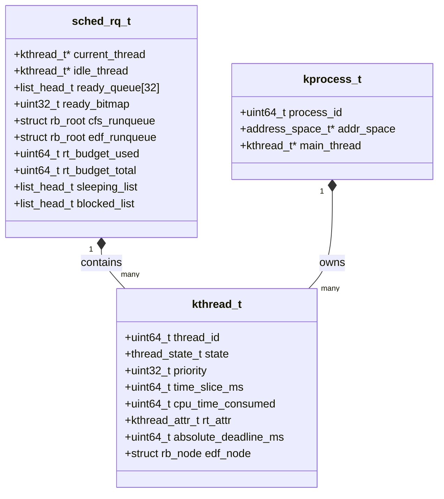

# Scheduler and Threading Baseline (v2)

This document captures the current scheduler/threading implementation status in the kernel.

## Architecture and Flow

The scheduler uses a core-local `sched_rq` (Runqueue) structure to track threads per CPU. Threads transition through various states, managed by different scheduling policies (Round-Robin, Priority, Cloud Fair (CFS), EDF, and RMS).

### Thread State Diagram

### Scheduler Data Structures

## Implemented in v2

- Architecture-neutral Thread Control Block (`kthread`) in `kernel/include/sched.h` with:
  - architecture context pointer,
  - base + effective priority,
  - scheduling state,
  - capability list hook,
  - time-slice and context-switch accounting,
  - AI scheduler context,
  - NUMA hint + CPU affinity mask.
- Per-CPU scheduler state in `kernel/src/sched.c`:
  - per-core priority run queues,
  - per-core sleeping and blocked lists,
  - per-core idle thread,
  - per-core tick/context-switch counters.
- Thread lifecycle syscall-style entry points:
  - `sched_sys_thread_create`,
  - `sched_sys_thread_destroy`,
  - `sched_sys_sleep`,
  - `sched_sys_set_priority`,
  - `sched_sys_set_affinity`.
- Scheduling behavior:
  - priority-based round-robin dispatch,
  - timer tick preemption,
  - sleep/wakeup bookkeeping by deadline,
  - CPU affinity-aware migration,
  - basic work-stealing/load balancing pass.
- Priority inheritance hooks:
  - `sched_inherit_priority`,
  - `sched_restore_priority`.
- AI scheduling hook path:
  - bounded pending AI suggestion queue,
  - suggestion actions for reprioritize/migrate/throttle/kill,
  - telemetry collection during tick handling.
- Real-Time EDF/RMS admission logic:
  - **Bandwidth Budget Tracking**: Tracked using `rt_budget_used` against `rt_budget_total`.
  - **EDF (Earliest Deadline First)**:
    - Operates on a dedicated Red-Black tree (`edf_runqueue`), sorted by `absolute_deadline_ms`.
    - **Admission Flow**: Validates that $U = \sum (WCET / Period) \le 1.0$. If valid, attributes are saved.
    - **Enforcement**: In `sched_on_timer_tick`, if a thread consumes its WCET budget (`cpu_time_consumed >= rt_attr.wcet_ms`), the scheduler calculates the thread's next period, sets its `wake_deadline_ms`, changes its state to `THREAD_STATE_SLEEPING`, and preempts it. It will be awakened when the next period begins.
  - **RMS (Rate Monotonic Scheduling)**:
    - **Admission Flow**: Validates that $U = \sum (WCET / Period) \le n(2^{1/n}-1) \approx 0.69$.
    - Assigns static priorities inversely proportional to the period length (shorter period = higher priority).
    - Threads are then dispatched through the existing strict-priority `ready_queue` mechanism.
  - Test suites verify both admission success/fail limits, and that the RB-tree insertion/dequeue correctly respects absolute deadlines.
- Portable scheduler API surface:
  - `sched_current`, `sched_enqueue`, `sched_reschedule`, and existing thread APIs.

## Architecture-specific context switching hooks

- Common interface in `kernel/include/arch/context_switch.h`:
  - `arch_context_switch(cpu_context_t* prev, cpu_context_t* next)`
  - `arch_prepare_initial_context(cpu_context_t* ctx, void (*entry)(void), uint64_t stack_top)`
- Per-architecture implementations are now split under:
  - `arch/x86/x86_64/context_switch.c`
  - `arch/arm/arm64/context_switch.c`
  - `arch/riscv/riscv64/context_switch.c`
  - `arch/shakti/context_switch.c`

These files provide a consistent call signature so scheduler code remains architecture-neutral.

## Test and host validation

- Scheduler lifecycle, priority, sleep/wakeup, and affinity tests are covered by `tests/test_scheduler.c`.
- Host-executable architecture matrix validation script:
  - `tools/ci/run_scheduler_arch_matrix.sh`
  - builds/runs scheduler-oriented tests,
  - compiles each architecture context-switch source file from host.

## Remaining hardening items for production

- Replace context-switch C placeholders with full save/restore assembly for integer/FPU/vector state.
- Add lock-graph-aware transitive priority donation for nested mutex ownership chains.
- Expand NUMA-aware migration heuristics with topology distance/cost tables.
