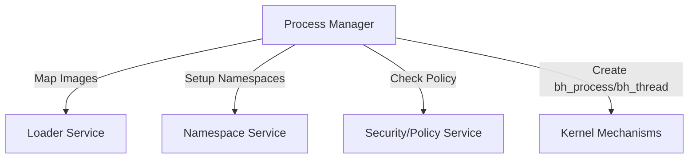

# Process Manager Service Architecture

**Version:** v1.0 (Proposed)
**Scope:** Services
**Status:** Draft → Implementation Ready

---

## 1. Executive Summary

In Bharat-OS, the `process_manager` service acts as the **lifecycle orchestrator**, moving beyond simply storing the core kernel process object. While the kernel itself handles the creation and management of the low-level `bh_process` and `bh_thread` objects, the process manager sits in user space to handle policies, compatibility workflows, and high-level process lifecycle coordination.

---

## 2. Core Responsibilities

The primary responsibilities of the `process_manager` service include:

* **Spawn Orchestration:** Overseeing the complete creation of a new process from user-space, including orchestrating interactions with other services.
* **Image Loading:** Coordinating with the loader service to map binary images into the process's address space.
* **Namespace Setup:** Setting up filesystem, network, and IPC namespaces for the new process.
* **Capability Distribution:** Providing initial capability seeds to the new process (e.g., standard input/output handles, basic access capabilities).
* **Process Tracking:** Maintaining the parent-child registration hierarchy, process groups, and session IDs.
* **Cleanup and Reaping:** Responding to kernel notifications of process death, performing cleanup, and answering `wait()` requests from parent processes.
* **Personality Runtime Handoff:** Coordinating the binding and initialization of the target personality (e.g., Linux, Android, Windows) for the new process.
* **Crash/Restart Policy:** Applying fault domains and restart policies when a process crashes, deciding whether to restart or terminate the process tree.
* **Audit Trail:** Maintaining audit logs for process lifecycle events (creation, termination, faults).

---

## 3. Architecture Context

The process manager interacts heavily with the rest of the user-space ecosystem and relies on the kernel only for raw mechanisms:

---

## 4. Lifecycle Workflow Example

When an application (via its personality runtime) requests a new process creation (e.g., posix `spawn` or `fork` equivalent), the process manager handles the orchestration:

1. **Request Reception:** `process_manager` receives the request to create a new process with specific parameters (executable path, environment, arguments).
2. **Policy Check:** It queries the security/policy service to verify the caller has permissions to spawn the requested process.
3. **Kernel Allocation:** It calls kernel syscalls (`process_create_native`) to allocate an empty `bh_process` object, an empty address space, and an empty capability table.
4. **Image Loading:** It contacts the loader service, passing the capability to the new address space, and asks the loader to parse the executable (e.g., ELF/PE) and populate the memory.
5. **Thread Creation:** It calls kernel syscalls (`thread_create_native`) to create the initial `bh_thread` pointing to the loaded entry point.
6. **Capability Seeding:** It installs the required baseline capabilities into the new process's capability table.
7. **Namespace Binding:** It coordinates with the namespace service to set up the default namespaces for the process.
8. **Personality Binding:** It calls `process_bind_personality` to inform the kernel which personality ABI this process will use.
9. **Execution:** It finally resumes the `bh_thread`, allowing the new process to start executing its user-mode code.

---

## 5. Wait and Exit Workflow Example

When a process terminates, the orchestration ensures clean teardown:

1. **Kernel Trap:** The process invokes `process_exit` or the kernel catches a fatal fault. The kernel updates the `bh_process` state to `ZOMBIE` and notifies the `process_manager`.
2. **Resource Teardown:** `process_manager` begins high-level resource teardown, releasing external capabilities, unregistering from namespaces, etc.
3. **Wait Resolution:** If a parent process is waiting on this child, the `process_manager` wakes the parent, returning the exit code and termination reason.
4. **Reaping:** Once the parent has fully consumed the exit status, the `process_manager` issues the final capability drop for the `bh_process`, prompting the kernel to fully free the underlying object.

---

## 6. Implementation Notes

Currently, `services/process_manager/main.c` is a TODO shell. The next step is to formalize this orchestrator contract using BIDL (Bharat Interface Definition Language) so other services and runtimes can depend on its interfaces for spawn, exec, kill, wait, and reap operations.