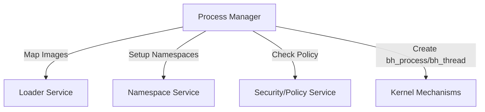

# Process Manager Service Architecture

**Version:** v1.0 (Transitional)
**Scope:** Services
**Status:** Transitional; not production-ready

---

## 1. Executive Summary

In Bharat-OS, the `process_manager` service acts as the **lifecycle orchestrator**, moving beyond simply storing the core kernel process object. While the kernel itself handles the creation and management of the low-level `bh_process` and `bh_thread` objects, the process manager sits in user space to handle policies, compatibility workflows, and high-level process lifecycle coordination.

---

## 2. Core Responsibilities

The primary responsibilities of the `process_manager` service include:

* **Spawn Orchestration:** Overseeing the complete creation of a new process from user-space, including orchestrating interactions with other services.
* **Image Loading:** Coordinating with the loader service to map binary images into the process's address space.
* **Namespace Setup:** Setting up filesystem, network, and IPC namespaces for the new process.
* **Capability Distribution:** Providing initial capability seeds to the new process (e.g., standard input/output handles, basic access capabilities).
* **Process Tracking:** Maintaining the parent-child registration hierarchy, process groups, and session IDs.
* **Cleanup and Reaping:** Responding to kernel notifications of process death, performing cleanup, and answering `wait()` requests from parent processes.
* **Personality Runtime Handoff:** Coordinating the binding and initialization of the target personality (e.g., Linux, Android, Windows) for the new process.
* **Crash/Restart Policy:** Applying fault domains and restart policies when a process crashes, deciding whether to restart or terminate the process tree.
* **Audit Trail:** Maintaining audit logs for process lifecycle events (creation, termination, faults).

---

## 3. Architecture Context

The process manager interacts heavily with the rest of the user-space ecosystem and relies on the kernel only for raw mechanisms:

```mermaid
graph TD
    PM[Process Manager]
    Loader[Loader Service]
    NS[Namespace Service]
    Sec[Security/Policy Service]
    Kern[Kernel Mechanisms]

    PM -->|Map Images| Loader
    PM -->|Setup Namespaces| NS
    PM -->|Check Policy| Sec
    PM -->|Create bh_process/bh_thread| Kern
```

---

## 4. Lifecycle Workflow Example

When an application (via its personality runtime) requests a new process creation (e.g., posix `spawn` or `fork` equivalent), the process manager handles the orchestration:

1. **Request Reception:** `process_manager` receives the request to create a new process with specific parameters (executable path, environment, arguments).
2. **Policy Check:** It queries the security/policy service to verify the caller has permissions to spawn the requested process.
3. **Kernel Allocation:** It calls kernel syscalls (`process_create_native`) to allocate an empty `bh_process` object, an empty address space, and an empty capability table.
4. **Image Loading:** It contacts the loader service, passing the capability to the new address space, and asks the loader to parse the executable (e.g., ELF/PE) and populate the memory.
5. **Thread Creation:** It calls kernel syscalls (`thread_create_native`) to create the initial `bh_thread` pointing to the loaded entry point.
6. **Capability Seeding:** It installs the required baseline capabilities into the new process's capability table.
7. **Namespace Binding:** It coordinates with the namespace service to set up the default namespaces for the process.
8. **Personality Binding:** It calls `process_bind_personality` to inform the kernel which personality ABI this process will use.
9. **Execution:** It finally resumes the `bh_thread`, allowing the new process to start executing its user-mode code.

---

## 5. Wait and Exit Workflow Example

When a process terminates, the orchestration ensures clean teardown:

1. **Kernel Trap:** The process invokes `process_exit` or the kernel catches a fatal fault. The kernel updates the `bh_process` state to `ZOMBIE` and notifies the `process_manager`.
2. **Resource Teardown:** `process_manager` begins high-level resource teardown, releasing external capabilities, unregistering from namespaces, etc.
3. **Wait Resolution:** If a parent process is waiting on this child, the `process_manager` wakes the parent, returning the exit code and termination reason.
4. **Reaping:** Once the parent has fully consumed the exit status, the `process_manager` issues the final capability drop for the `bh_process`, prompting the kernel to fully free the underlying object.

---

## 6. Current implementation contract

The v1 implementation is a bounded, single-owner service-local process table. The
service loop is the only supported mutator; the asynchronous exit notifier must be
serialized onto that same execution context. The kernel adapter is installed only
during single-threaded startup and defaults to fail closed. Spawn publishes a handle
only after process, address-space, image, and initial-thread creation have succeeded.
Failures revoke the provisional handle and request kernel reaping.

Every v1 operation validates its exact ABI version and structure size. Spawn also
requires zeroed reserved fields, non-zero executable authority, and non-zero object
identifiers returned by the kernel adapter. Query, terminate, wait, and reap reject
stale handles through generation-checked handle lookup. Termination is idempotent and
reaping is legal only for `EXITED` or explicitly `FAILED` objects. Blocking waits fail
closed as unsupported; the service does not pretend that storing waiter metadata is a
working wait implementation.

## 7. Primitive maturity and production blockers

The following mechanisms are required before this service can be described as
production-ready:

1. **Capability-authenticated v1 dispatch.** The legacy interface authorizes every
   operation, but the v1 dispatcher does not yet bind caller capabilities, parent
   scope, executable rights, or per-operation process rights to each request.
2. **Real kernel authority adapter.** Production delivery must bind capability-based
   process, address-space, loader, thread, start, terminate, and reap operations. The
   default adapter intentionally returns `ERR_UNSUPPORTED`.
3. **Serialized exit delivery.** Kernel exit events need a bounded IPC queue with
   generation/incarnation identity, replay protection, backpressure, and ordering
   relative to terminate and reap. Direct concurrent calls to the notifier are not
   safe.
4. **Deadline-aware wait continuations.** Blocking wait needs retained reply
   continuations, monotonic HAL deadlines, cancellation on caller death, bounded
   waiter storage, and wakeup race tests. Until then only non-blocking polling is
   supported.
5. **Rollback quarantine.** Adapter cleanup currently has no durable transaction
   journal. A failed reap during spawn rollback requires a quarantined lifecycle
   record and supervised retry rather than an unreachable leaked kernel object.
6. **Executable ownership.** Registered image bytes are borrowed pointers. A loader
   service must validate an executable capability and pin or copy immutable image
   data for the whole transaction; registration must also support revocation.
7. **Restart recovery and durable identity.** The in-memory table, incarnation value,
   request IDs, and PID allocation do not survive service restart. Exactly-once spawn
   replay and reconciliation with kernel-owned processes remain unimplemented.
8. **Policy orchestration.** Namespace setup, capability seeding, personality binding,
   parent/child relationships, quotas, audit records, and crash policy remain service
   work rather than kernel mechanisms.
9. **Backend evidence.** The authority adapter needs lifecycle and rollback coverage
   on MMU, MMU-Lite, and MPU targets, including exhaustion, stale generation, timeout,
   duplicate event, and partial-failure cases.

These blockers are deliberately explicit: input hardening and deterministic local
state transitions improve the current boundary, but they do not make missing kernel,
IPC, timer, loader, or recovery primitives appear implemented.
