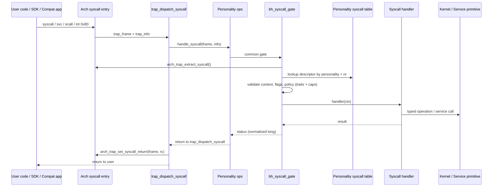
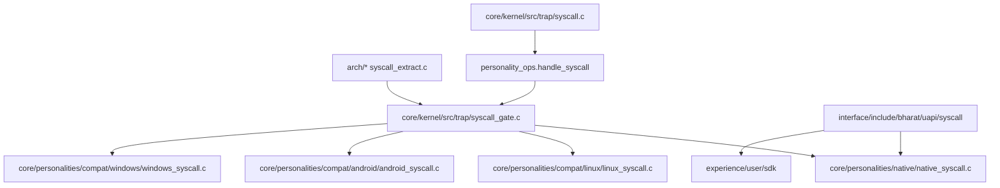

# Syscall ABI Boundary Hardening

This document explains the architecture and governance of the Bharat-OS secure syscall substrate.

## Common Syscall Substrate Flow

Bharat-OS uses a unified, high-performance secure substrate for all syscall personalities (Native, Linux, Android, Windows).

### A. Unified Syscall Flow

### B. Component Ownership

### C. Implementation Status

- **Common Syscall Gate:** Complete. Enforces profile traits and capability rights.
- **Return Register Ownership:** Always in `trap_dispatch_syscall()`.
- **Usercopy:** Stage 2A (VMA-backed) validation complete.
- **x86_64 Fast Path:** Experimental (Disabled by default). Uses `int $0x80` transitional path in production.
- **Personalities:** Native and Linux (Hardened). Android and Windows (Scaffolds).

## Profile-Aware Policy (Traits)

Syscall enforcement depends on **traits** defined in the active profile policy, not on hardcoded profile enums.

| Trait | Impact |
| :--- | :--- |
| `BH_PROFILE_TRAIT_SERVICE_RICH` | Allows `BH_SYSCALL_F_SERVICE_CALL` syscalls. |
| `BH_PROFILE_TRAIT_NO_BLOCKING_RT` | Denies `BH_SYSCALL_F_BLOCKING` syscalls for RT threads. |
| `BH_PROFILE_TRAIT_MMU_FULL` | Requires VMA-backed Stage 2A usercopy validation. |

## Usercopy Hardening (Stage 2A)

All data transfers between kernel and userspace use checked primitives that validate against the process address space (VMA/Regions).

**Hardening Rules:**
- NULL rejection if `len > 0`.
- Pointer + length overflow checks.
- Strict max copy size: `BH_USERCOPY_MAX_BYTES` (4096).
- Authoritative VMA/Region validation (Permissions + Mapping).

## Architecture Notes

### x86_64
The x86_64 ABI is currently using `int $0x80` for stability. `SYSCALL/SYSRET` is experimental and requires `BHARAT_X86_64_ENABLE_FAST_SYSCALL`.

### ARM64
ARM64 syscall detection decodes `ESR_EL1.EC` (0x15).
