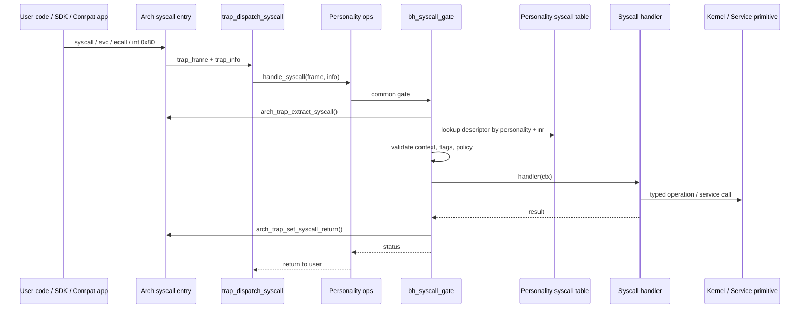
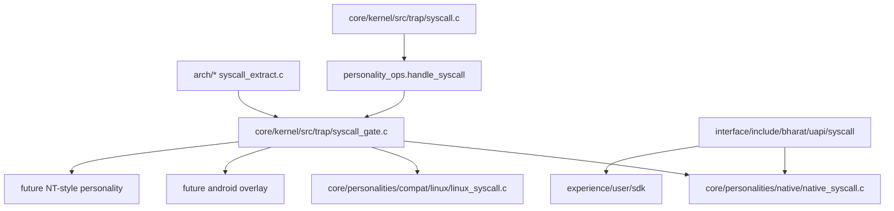
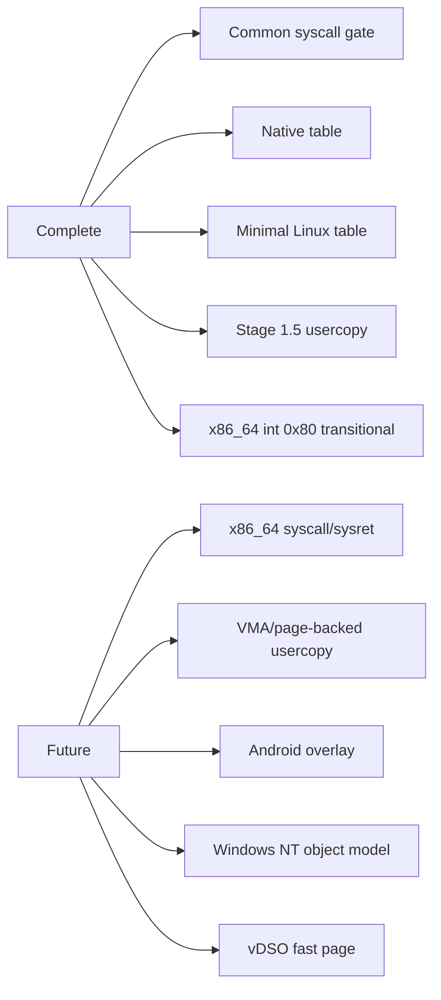

# Syscall ABI Boundary Hardening

This document explains the architecture and governance of the Bharat-OS secure syscall substrate.

## Common Syscall Substrate Flow

Bharat-OS uses a unified, high-performance secure substrate for all syscall personalities (Native, Linux, Android, Windows).

### A. Unified Syscall Flow



### B. Component Ownership



### C. Implementation Status



## Governance and ABI

The canonical source of truth for syscall numbers is `interface/include/bharat/uapi/syscall/table.def` and the manifest `interface/contracts/abi/syscalls.json`.

1.  **Append-Only:** New syscalls must be added to the end of the table.
2.  **No Renumbering:** Syscall numbers are immutable once assigned.
3.  **No Deletions:** Deprecated syscalls become stubs returning `K_ERR_UNSUPPORTED`.
4.  **No Renames:** UAPI names are part of the stable contract.

### ABI Drift Verification

The `tools/abi/check_syscalls.py` tool enforces these rules against the baseline manifest.

## Usercopy Hardening (Stage 1.5)

All data transfers between kernel and userspace must use the checked usercopy primitives:

-   `copy_from_user_checked()`
-   `copy_to_user_checked()`
-   `copy_user_string_checked()`

**Hardening Rules:**
- NULL rejection if `len > 0`.
- Pointer + length overflow checks.
- Strict max copy size: `BH_USERCOPY_MAX_BYTES` (default 4096).
- User range validation.

## Architecture Notes

### x86_64
The x86_64 ABI is temporarily using `int $0x80` for consistency. The target production ABI is `SYSCALL/SYSRET`.

### ARM64
ARM64 syscall detection decodes `ESR_EL1.EC` (0x15).
```c
/* Bharat-OS currently treats all SVC-from-EL0 exceptions as syscall entry.
 * ISS/SVC immediate is reserved for future ABI versioning/debug use.
 */
```
