# Bharat-OS Current Code Status (March 2026)

This document summarizes **what is actually implemented in code today** versus what is still a scaffold/stub.
It is intended to complement architecture roadmaps with a code-backed snapshot.

## Scope and method

- Reviewed top-level build wiring (`CMakeLists.txt`, `services/CMakeLists.txt`, `subsys/CMakeLists.txt`).
- Reviewed service entry points (`services/*/main.c`, `services/*/src/main.c`).
- Reviewed non-trivial networking control/data plane modules and selected subsystem modules.

> Note: "Implemented" here means concrete logic exists in tree (not necessarily production-complete runtime behavior on all targets).

---

### High-Level Architecture Component Status

```mermaid
%%{init: {'theme': 'base', 'themeVariables': { 'fontFamily': 'arial', 'fontSize': '14px', 'primaryColor': '#0d4f40', 'edgeLabelBackground':'#ffffff'}}}%%
graph TD
    classDef default fill:#0d4f40,stroke:#0d4f40,color:#fff,rx:10px,ry:10px;

    classDef greenNode fill:#0d4f40,stroke:#1d8c6b,stroke-width:2px,color:#fff,rx:5px,ry:5px;
    classDef orangeNode fill:#874900,stroke:#f8a619,stroke-width:2px,color:#fff,rx:5px,ry:5px;
    classDef purpleNode fill:#3f3281,stroke:#6655a6,stroke-width:2px,color:#fff,rx:5px,ry:5px;
    classDef grayNode fill:#4b4d48,stroke:#868884,stroke-width:2px,color:#fff,rx:5px,ry:5px;

    classDef invisible fill:none,stroke:none,color:#999;

    subgraph US [User-space domains<br/>Policy, drivers, subsystems — isolated by capabilities]
        direction LR
        S1["<b>Subsystems</b><br/><span style='color:#75bfa9; font-size:12px'>Console, FB, Input</span>"]:::greenNode
        S2["<b>Drivers</b><br/><span style='color:#75bfa9; font-size:12px'>Net, Storage, Display</span>"]:::greenNode
        S3["<b>AI Governor</b><br/><span style='color:#f8a619; font-size:12px'>Sched hints, telemetry</span>"]:::orangeNode
        S4["<b>Memory Policy</b><br/><span style='color:#75bfa9; font-size:12px'>RT static / Cloud NUMA</span>"]:::greenNode
    end

    subgraph MK [Microkernel ring-0<br/>Trusted compute base — capability tables, IPC, VMM, scheduler]
        direction LR
        M1["<b>Capability</b><br/><span style='color:#a89cd4; font-size:12px'>invoke/grant/revoke</span>"]:::purpleNode
        M2["<b>IPC / URPC</b><br/><span style='color:#a89cd4; font-size:12px'>Sync + lockless ring</span>"]:::purpleNode
        M3["<b>VMM / PMM</b><br/><span style='color:#a89cd4; font-size:12px'>Buddy + slab alloc</span>"]:::purpleNode
        M4["<b>Scheduler</b><br/><span style='color:#a89cd4; font-size:12px'>Tick-driven + AI hooks</span>"]:::purpleNode
    end

    subgraph HL [Hardware abstraction layer<br/>Portability contracts across architectures]
        direction LR
        H1["<b>x86_64</b>"]:::grayNode
        H2["<b>arm64 / ARMv8</b>"]:::grayNode
        H3["<b>RISC-V / Shakti</b>"]:::grayNode
    end

    US -->|syscall / IPC| MK
    MK -->|HAL call| HL

    style US fill:#0d4f40,stroke:#0d4f40,color:#fff,rx:10px,ry:10px
    style MK fill:#3f3281,stroke:#3f3281,color:#fff,rx:10px,ry:10px
    style HL fill:#4b4d48,stroke:#4b4d48,color:#fff,rx:10px,ry:10px

    subgraph Legend [ ]
        direction LR
        L1["<div style='background-color:#1d8c6b; width:15px; height:15px; border-radius:3px; display:inline-block; vertical-align:middle;'></div> <span style='color:#999;'>Baseline implemented</span>"]:::invisible
        L2["<div style='background-color:#f8a619; width:15px; height:15px; border-radius:3px; display:inline-block; vertical-align:middle;'></div> <span style='color:#999;'>Partial / scaffolding</span>"]:::invisible
        L3["<div style='background-color:#999999; width:15px; height:15px; border-radius:3px; display:inline-block; vertical-align:middle;'></div> <span style='color:#999;'>Deferred / roadmap</span>"]:::invisible
    end
    style Legend fill:none,stroke:none

    HL ~~~ Legend

    linkStyle 0 stroke:#999,stroke-width:2px,color:#999
    linkStyle 1 stroke:#999,stroke-width:2px,color:#999
```

## 1) Build composition status

### Kernel + libraries
- Kernel, lib, drivers, subsystems, and services are all part of default top-level CMake build.
- Host tests are optional through `BHARAT_BUILD_HOST_TESTS`.

### Service composition
- Always built: `process_manager`, `vm_manager`, `file_system`, `drivers`, `crypto`, `console`, `boot_displayd`, legacy `net`.
- Default-on option groups:
  - `BHARAT_BUILD_USER_SERVICES_STUBS=ON`: `init`, `namesvc`, `servicemgr`.
  - `BHARAT_BUILD_CORE_SERVICES=ON`: `coremgr`, `memmgr`, `schedmgr`, `devmgr`, `accelmgr`, `storagemgr`, `faultmgr`, `telemetrymgr`.
  - `BHARAT_BUILD_NETWORK_STUBS=ON`: `netmgr`, `netstack`, `netfast`.

---

## 2) Service implementation matrix

| Service | Current code status | Evidence highlights |
| --- | --- | --- |
| `init` | Stub supervisor loop | Runtime bootstrap logs and TODO startup graph actions. |
| `namesvc` | Implemented | Registry loop implemented to handle endpoint addition/lookup/removal via mapped IPC operations over bounded endpoints. |
| `servicemgr` | Stub | Prints init message and exits event loop placeholder. |
| `coremgr` | Stub | Topology/control responsibilities documented, logic TODO. |
| `memmgr` | Stub | Placeholder for page-fault/policy loop. |
| `schedmgr` | Stub | Placeholder policy service loop only. |
| `devmgr` | Stub | Placeholder for enumeration/hotplug. |
| `accelmgr` | Stub | Placeholder accelerator orchestration loop. |
| `storagemgr` | Stub | Placeholder storage policy loop. |
| `faultmgr` | Stub | Placeholder crash containment loop. |
| `telemetrymgr` | Stub | Placeholder metrics aggregation loop. |
| `process_manager` | Stub | TODO-only main. |
| `vm_manager` | Stub | TODO-only main. |
| `drivers` | Stub | TODO-only main. |
| `console` | Stub | Infinite loop with TODO URPC routing comments. |
| `boot_displayd` | Partial demo implementation | Includes framebuffer rectangle drawing helper and mocked early UI flow. |
| `file_system` | Partial scaffold | Calls `vfs_init()` and contains TODO mount/URPC flow. Roadmap includes FAT/littlefs support, persistent storage for IoT/edge, and OTA recovery. |
| `crypto` | Partial implementation | Initializes DRBG/keystore and validates/dispatches protocol requests via service modules; IPC transport path is currently stubbed. |
| `net` (legacy monolith) | Transitional + smoke-test logic | Control/data plane init and loopback smoke-test remain for compatibility. |
| `netmgr` | Partial implementation | Initializes interface/address/route/neighbor/driver-health state and handles multiple IPC opcodes with capability checks. |
| `netstack` | Partial implementation | Socket table + virtio adapter init plus protocol modules (IPv4, ARP, ICMP, UDP, loopback, Ethernet helpers). |
| `netfast` | Stub | Placeholder fast-path main. |

---

## 3) Networking implementation details (current)

## `services/netmgr` (control plane)
Implemented modules include:
- Interface table lifecycle (create/delete/get/admin-state).
- Address table add/remove/get.
- Route table add/remove/lookup (best prefix + metric tie-break).
- Neighbor cache add/remove/flush/lookup.
- Driver health registry/report/restart-intent bookkeeping.
- IPC opcode dispatcher that maps request types to those modules and fills response structures.

Current limitations:
- Main event loop intentionally breaks immediately (daemon runtime not fully wired).
- Capability checks currently allow all requests (`netmgr_cap_check_rights` returns true).
- Restart behavior records intent only; no process-manager integration yet.

## `services/netstack` (data plane)
Implemented modules include:
- Net buffer manipulation and checksum helpers.
- IPv4 RX/TX parsing + checksum validation + local/loopback/broadcast handling.
- UDP RX/TX with pseudo-header checksum and socket callback delivery.
- ICMP/ARP/Ethernet/loopback modules and socket table support.

Current limitations:
- Main loop is scaffolded and not yet driving timers/driver polling end-to-end.
- `driver_virtio_adapter` is an adapter stub path for future integration depth.

---

## 4) Subsystem layer snapshot

- `subsys_manager` static library includes Linux/Windows compatibility shims, Android personality modules, automotive module, and SKB/test-runner wiring.
- Optional `ai_governor` demo executable is buildable and linked against scheduler-related kernel sources plus URPC/POSIX stub libraries.
- `subsys/network` defines the contract/types/uAPI surface for network manager and stack integration.

---

## 5) Practical takeaway for contributors

- Treat most non-network service daemons as **API/lifecycle scaffolding** at this stage.
- For concrete feature work, current depth is strongest in:
  1. networking split (`netmgr`, `netstack`),
  2. crypto service protocol/dispatch internals,
  3. subsystem contract surfaces and build/profile plumbing.
- If you are documenting capabilities externally, avoid calling all services "implemented"; classify many as "compiled stubs with defined responsibilities".
