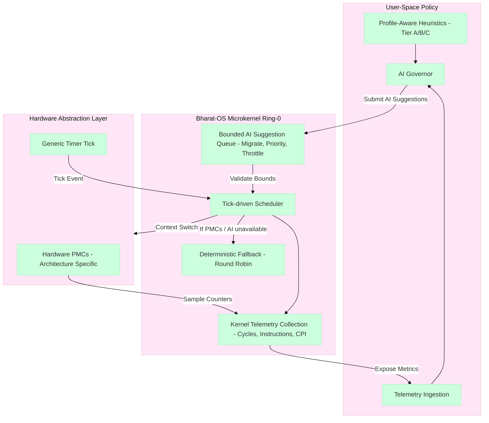

## 🧠 AI-Driven Resource Management

Detailed mapping is documented in [`docs/architecture/device-profiles-and-use-cases.md`](docs/architecture/device-profiles-and-use-cases.md).

## AI Features & Roadmap

Bharat-OS keeps AI policy outside ring-0 while exposing bounded kernel mechanisms:

### Implemented baseline

- Kernel-side telemetry collection hooks and bounded AI suggestion queueing.
- Scheduler action handling for migrate/priority/throttle suggestion types.
- Capability-guarded governor control-plane endpoint.
- Architecture/profile-neutral telemetry plugin contract (with fallback behavior when PMCs are unavailable).

#### Scheduler & AI Hooks Architecture

### Roadmap

- Better telemetry quality (hardware PMC integrations per architecture).
- Per-core runqueues + richer migration policy under SMP load.
- Safety/verification hardening for AI-driven scheduling decisions.
- Clearer user-space governor lifecycle, observability, and audit reporting.

See [`docs/architecture/ai-scheduler-status-and-roadmap.md`](docs/architecture/ai-scheduler-status-and-roadmap.md) and [`docs/adr/ADR-008-ai-scheduler-plugin-contract.md`](docs/adr/ADR-008-ai-scheduler-plugin-contract.md).
