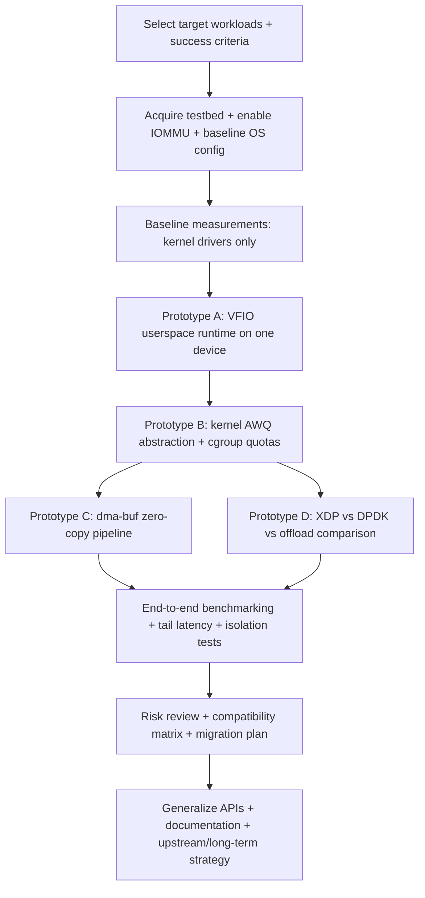

# Kernel and OS-Level Integration Across Hardware Architectures and Accelerators

## Executive summary

Kernel/OS integration across diverse compute and accelerator hardware is ultimately a problem of **consistency boundaries**: which agents can access which memory, with what ordering guarantees, under what privilege/virtualization model, and how events (interrupts/completions) are delivered. CPU ISAs differ meaningfully in memory ordering, privilege levels, and interrupt controller architecture (e.g., x86 TSO vs Arm/RISC-V weaker models; APIC vs GIC vs PLIC). These differences shape the kernel’s synchronization primitives, scheduler assumptions, and low-level boot/firmware interfaces. citeturn2search30turn2search25turn1search0turn1search5

Accelerators (GPUs, NPUs/TPUs, FPGAs, SmartNICs/DPUs, crypto/compression engines, storage offloads) introduce a second axis: **asynchronous, DMA-heavy execution** with strict isolation needs. The dominant kernel/OS engineering challenge is very often not compute, but **data movement + isolation**: DMA mapping, IOMMU protection, queueing, completion signaling, buffer sharing/zero-copy, and multi-tenant virtualization (SR-IOV, VFIO-based assignment, paravirtual devices). citeturn15search0turn3search6turn3search1turn4search2turn4search3

Three integration “modes” consistently emerge in practice:

1. **Kernel-native drivers** for generality, safety, and unified resource management (power, security hooks, scheduler integration), using standard DMA APIs and interrupt paths. citeturn15search0turn15search2turn16search1turn16search5  
2. **User-space (kernel-bypass) drivers** for ultra-high throughput/low jitter in networking and storage (poll-mode, hugepages/pinned memory, direct BAR mapping via VFIO/UIO), with the kernel reduced to isolation and minimal control-plane. citeturn4search2turn4search3turn12search3turn4search26  
3. **Virtualized/paravirtualized I/O** for multi-tenant clouds: virtio device models and/or assignable devices (SR-IOV, VFIO), backed by IOMMUs and well-defined device discovery via ACPI/device tree. citeturn11search0turn3search1turn18view0turn5view1  

A forward-leaning OS strategy is to treat accelerators as **first-class schedulable, quota-managed asynchronous engines** (queues + completions + memory domains), and to provide **stable, capability-based isolation** (IOMMU groups, mediated devices, SR-IOV VFs) rather than per-accelerator “snowflake” policies. citeturn3search6turn3search1turn11search3turn21search11

## Scope, assumptions, and cross-cutting kernel concepts

This report assumes **no specific OS, hypervisor, or hardware platform** was chosen. Where concrete mechanisms are needed, examples use widely deployed interfaces and (often) Linux kernel primitives because they are extensively documented and broadly applicable as reference designs; equivalent concepts exist in other kernels (e.g., NT-style KMDF/UMDF, BSD driver frameworks), but names and code paths differ. Key unspecified items that materially affect design include: target OS ABI and driver model, page size(s) and hugepage policy, IOMMU availability and default mode, NUMA topology, interrupt routing policy, and whether the deployment is bare metal vs VM/container.

Cross-cutting concepts (apply to every architecture/accelerator):

- **Hardware description and discovery**  
  - **ACPI** is the dominant discovery/management interface in PC/server ecosystems and evolves via the ACPI specification published by the entity["organization","UEFI Forum","firmware standards body"]. citeturn18view0  
  - **Devicetree** provides a data structure describing hardware passed to the OS at boot, standardized by the Devicetree project. citeturn5view1turn6view0  

- **DMA + IOMMU are the security and correctness substrate for accelerators**  
  - Kernel DMA mapping APIs define how drivers map/unmap memory for device DMA safely and portably across cache-coherent and non-coherent systems. citeturn15search0turn15search14  
  - IOMMUs (e.g., Intel VT-d, Arm SMMU) enforce DMA isolation and are foundational for secure device assignment and user-space drivers. citeturn3search2turn3search26turn3search6  

- **Queue-based, asynchronous device interfaces dominate**  
  High-performance devices typically expose submission/completion rings (or equivalent), use MSI/MSI-X style interrupts or polling, and rely on DMA for data movement. Kernel-bypass frameworks formalize this by mapping device BARs to user space and polling for completions (networking: DPDK; storage: SPDK). citeturn4search2turn4search3turn4search26turn4search7  

- **Virtualization is now part of “normal” driver requirements**  
  - **virtio** is a standardized paravirtual device family specified by entity["organization","OASIS Open","standards organization"]. citeturn11search0turn11search20  
  - SR-IOV and VFIO-style assignment, together with IOMMU protection, are common patterns for exposing devices to guests and/or untrusted user-space. citeturn3search1turn3search6  

- **Coherency and memory expansion are increasingly “fabric-native”**  
  - **CXL** (Compute Express Link) defines cache-coherent protocols over a PCIe PHY and is specified by the entity["organization","Compute Express Link Consortium","cxl standards body"], reshaping OS memory management expectations (memory pooling/expansion, coherent accelerators). citeturn13search0turn13search4  
  - Arm SoC coherency fabrics commonly reference AMBA CHI concepts for coherent clusters. citeturn13search1turn13search5  
  - **CCIX** provides another coherent interconnect specification direction, published by the entity["organization","CCIX Consortium","coherent interconnect org"]. citeturn13search6turn13search2  

## Taxonomy of hardware architectures and key attributes

The taxonomy below focuses on architectural attributes that have direct kernel/OS implications: **memory model**, **interrupt model**, **privilege levels**, **coherency**, and **virtualization support**.

### Comparison table of architecture attributes

| Architecture class | Representative examples | Memory model and consistency | Interrupt model | Privilege levels and isolation | Coherency and memory topology | Virtualization and device assignment |
|---|---|---|---|---|---|---|
| General-purpose CPUs: x86-64 | Server/PC CPUs from entity["company","Intel","semiconductor company"] and entity["company","AMD","semiconductor company"] | x86 is commonly characterized as TSO-like relative to weaker ISAs, which simplifies some lock-free reasoning but still requires fences for some patterns. citeturn2search30turn2search32 | APIC/x2APIC style interrupt routing; MSI/MSI-X for PCIe devices (OS-managed). citeturn0search5turn1search23 | Ring-based protection (architecturally defined privilege levels) with paging-based isolation; system programming semantics documented in vendor manuals. citeturn0search1turn0search7turn0search0 | Cache-coherent multi-core; NUMA is common in servers; coherency is typically implicit for CPU cores, but devices require DMA/IOMMU discipline. citeturn15search0turn3search2 | Hardware virtualization extensions (VT-x/AMD-V) and second-level translation (EPT/NPT) are standard patterns; VT-d/IOMMU underpins safe assignment. citeturn0search1turn0search7turn3search2turn3search6 |
| General-purpose CPUs: Armv8-A/AArch64 | Systems designed around entity["company","Arm","semiconductor ip company"] architecture | Weaker memory ordering than x86; explicit barriers (DMB/DSB/ISB) are central to correct low-level concurrency. citeturn2search13turn2search21turn2search37 | GIC family (GICv3/v4 etc.) widely used; virtualization-aware interrupt delivery is a key server requirement. citeturn1search0turn1search20 | Exception levels EL0–EL3 define privilege partitions (user/kernel/hypervisor/secure monitor). citeturn0search26turn0search24 | SoCs vary: coherent interconnects (ACE/CHI-class) are common; some devices may be non-coherent, requiring explicit cache maintenance + DMA APIs. citeturn13search5turn15search0turn5view1 | EL2 provides architectural virtualization; SMMU provides IOMMU-style DMA isolation in many platforms. citeturn0search26turn3search26turn3search6 |
| General-purpose CPUs: RISC-V (RV64/RV32) | Designs standardized by entity["organization","RISC-V International","open isa standards body"] | RISC-V defines a formal weak memory model (RVWMO) and relies on explicit fences/atomics. citeturn2search25turn2search10 | Common platform interrupt controller model uses PLIC (platform-level) and timer/software interrupt mechanisms in platform specs. citeturn1search5turn1search8 | Privilege modes (M/S/U) and optional hypervisor extensions define isolation boundaries. citeturn0search11turn0search11 | Coherency is platform-dependent (SoC design choice); many embedded-class devices are non-coherent → DMA discipline matters. citeturn15search0turn5view1 | Hypervisor extensions and IOMMU support exist but are less uniform across the ecosystem than mature x86 server platforms; secure DMA isolation remains a design focus. citeturn0search11turn3search6 |
| GPUs (discrete and integrated) | CUDA/HIP/Level Zero-class devices; kernel arbitration often via DRM-like subsystems | Typically distinct device memory spaces; coherence between CPU and GPU can be explicit and policy-driven (e.g., HIP coherence controls; CUDA unified memory semantics). citeturn21search1turn21search4turn21search5 | Usually PCIe MSI/MSI-X or platform interrupts; many stacks prefer polling in user space for throughput. citeturn4search2turn1search23 | GPU command submission is mediated by kernel/user-space driver stacks; OS must enforce per-process contexts and memory isolation. citeturn21search7turn21search11 | Buffer managers (e.g., GEM/TTM concepts) and cross-device buffer sharing (dma-buf) are core to zero-copy pipelines. citeturn21search7turn21search11 | Virtualization via mediated devices, SR-IOV (where supported), and IOMMU-backed pass-through; isolation requires strict DMA mapping and context separation. citeturn3search6turn21search11 |
| NPUs / TPUs (ML ASICs) | Cloud-scale TPU pods from entity["company","Google","technology company"] and similar | Often optimize matrix ops with specialized memory hierarchies; host/device memory semantics vary by programming model and platform. citeturn17search5turn17search0turn21search5 | Platform-specific; completions can be interrupt-driven or polled, depending on the runtime. citeturn17search0turn21search2 | Typically exposed through high-level runtimes; OS-level concerns focus on isolation, scheduling quotas, and data-path efficiency in the presence of large DMA. citeturn17search0turn3search6 | May use coherent fabrics within pods/boards, but host memory coherency is not guaranteed—buffer ownership and synchronization are critical. citeturn17search5turn21search4 | Multi-tenant exposure is often mediated at the runtime/VM layer; device assignment still depends on IOMMU and virtualization layers. citeturn11search0turn3search6 |
| FPGAs | Data-center accelerator cards (e.g., Alveo-class) | State depends on bitstream; memory is typically DMA-accessed via PCIe; ordering depends on PCIe + driver fences. citeturn8search3turn15search0 | PCIe MSI/MSI-X, or polling depending on framework. citeturn1search23turn4search2 | OS must treat reconfiguration as privilege-sensitive (bitstream authenticity, tenancy, and reset semantics). citeturn8search3turn3search6 | Often used as streaming accelerators (PCIe DMA) rather than cache-coherent peers; zero-copy pipelines are valuable. citeturn8search3turn21search11 | Commonly assigned via VFIO; SR-IOV is less typical (depends on the card design); IOMMU is essential for user-space frameworks. citeturn3search6turn4search7 |
| SmartNICs / DPUs | ConnectX-7/BlueField-class devices, Pensando-class DPUs | Put compute in the I/O path: NIC-local memory + DMA into host; coherence with host is generally explicit. citeturn8search4turn7search3turn15search0 | High-rate event streams: interrupts can overwhelm → polling, adaptive interrupt moderation, and queue steering matter. citeturn4search2turn20search26 | Contain their own cores/firmware; OS must reason about trust boundaries (host vs DPU) and secure provisioning. citeturn7search3turn8search2 | Integrate flow tables/offload engines; host sees queues + DMA; often benefits from pinned hugepages and careful NUMA placement. citeturn4search26turn20search26 | Strong SR-IOV usage patterns; can offload/partition networking/security/storage functions per tenant. citeturn8search4turn7search3turn3search1 |
| Heterogeneous SoCs (CPU+GPU+NPU+DSP) | Mobile/edge SoCs; APUs and coherent SoC interconnects | Mixed coherency: some agents fully coherent, others non-coherent; OS must understand per-device coherency attributes. citeturn13search5turn15search0turn6view0 | Often multiple interrupt controllers and interrupt domains; GIC is common on Arm SoCs. citeturn1search0turn5view1 | May include secure worlds/monitors; strict partitioning is common in embedded. citeturn0search26turn16search2 | Fabric coherency protocols (e.g., CHI-class) and emerging coherent attach (CXL-type thinking) influence OS memory mgmt assumptions. citeturn13search5turn13search0 | Virtualization support varies; embedded deployments often depend on paravirtual device models and static partitioning described in DT/ACPI. citeturn11search0turn5view1turn18view0 |

image_group{"layout":"carousel","aspect_ratio":"16:9","query":["heterogeneous SoC block diagram CPU GPU NPU","PCIe accelerator card in server chassis","SmartNIC DPU card on PCIe"],"num_per_query":1}

## Kernel and OS design implications by architecture class

The practical kernel/OS implications are best understood as **how each architecture forces choices** in: drivers, scheduling, memory management, interrupt handling, power management, and security/isolation.

**x86-64 CPUs (server/PC)**  
Driver writers benefit from mature PCIe ecosystem norms (ACPI enumeration, MSI/MSI-X, widespread IOMMU availability), but must still correctly use DMA mapping APIs and IOMMU scoping for security and correctness. citeturn18view0turn15search0turn3search6  
**Scheduling:** multi-socket NUMA is common; OS schedulers must treat locality and cache affinity as first-class to avoid remote-memory penalties. Linux’s CFS documentation illustrates the fairness model and run-queue design trade-offs. citeturn16search0  
**Memory management:** hugepages/pinning are frequently necessary for user-space IO stacks (DPDK/SPDK) and GPU/accelerator DMA, but increase fragmentation risk; OS policies must balance long-lived pinned regions with general-purpose needs. citeturn4search26turn4search3turn15search0  
**Interrupts:** MSI/MSI-X scaling is good, but high-rate devices (100–400GbE NICs) often require interrupt moderation or polling to avoid interrupt storms. citeturn4search2turn20search26  
**Power management:** ACPI states and OS CPUfreq/CPUidle governors interact with the scheduler; performance-sensitive accelerator pipelines may need “performance” governors or CPU partitioning/isolation to stabilize tail latency. citeturn16search1turn16search5turn16search13  
**Security best practices:** enforce DMA isolation (VT-d/IOMMU), minimize kernel attack surface (especially for third-party drivers), and prefer VFIO for controlled user-space access when kernel bypass is required. citeturn3search2turn3search6turn12search3  

**Armv8-A/AArch64 CPUs (servers and SoCs)**  
Arm’s weaker memory ordering requires discipline: kernel primitives, driver MMIO ordering, and lock-free algorithms must rely on explicit barriers and correct atomic usage, not “accidental” ordering. citeturn2search13turn2search21  
**Drivers:** in SoCs, devicetree is common for describing integrated peripherals; in servers, ACPI is increasingly standard. A portable driver strategy must support both discovery paths or define a platform policy boundary. citeturn5view1turn18view0  
**Interrupt handling:** Arm systems typically build around GIC; understanding interrupt domains and virtualization-aware routing affects latency and determinism. citeturn1search0turn1search20  
**Power management:** DVFS and deep idle states are essential in embedded; kernel cpufreq/cpuidle frameworks illustrate how governors and drivers interlock. citeturn16search1turn16search5turn16search29  
**Security:** EL3/secure monitor (and TrustZone-like splits) create strong “world” boundaries; OS integration must treat secure firmware interfaces as part of the threat model, especially for key material and accelerator firmware. citeturn0search26turn16search2  

**RISC-V CPUs (emerging general-purpose + embedded)**  
RISC-V’s explicit memory model (RVWMO) means kernels and runtimes must be careful with fences and atomics when porting code originally “validated” on x86’s stronger ordering. citeturn2search25turn2search32  
**Interrupt model:** PLIC-style interrupt controllers and platform timer mechanisms require kernel interrupt abstractions that are less “fixed” than PC APIC assumptions. citeturn1search5turn1search8  
**Privilege and virtualization:** M/S/U mode separation and optional hypervisor extensions mean virtualization capability is platform-specific; OS designs should modularize hypervisor hooks and device assignment (IOMMU availability is not uniform). citeturn0search11turn3search6  
**Security and memory protection:** PMP/SPMP-like mechanisms and other platform security options can matter in embedded/secure deployments, influencing what must be in kernel vs firmware vs trusted monitor. citeturn16search3turn16search35  

**GPUs (general-purpose parallel accelerators)**  
GPU integration is primarily about **context isolation + memory/buffer management + synchronization semantics**. OS stacks typically arbitrate GPU command submission and memory objects; DRM’s memory managers (GEM/TTM) and dma-buf buffer sharing illustrate the kernel’s role as resource arbiter and synchronizer. citeturn21search7turn21search11  
**Scheduling:** GPUs have their own execution/scheduling model; OS-level scheduling is more about **which process/context gets GPU time**, how preemption is handled, and how to avoid CPU-side jitter (thread pinning, reducing syscalls, batching submissions) than about instruction-level scheduling. citeturn21search2turn21search6  
**Memory management:** programming models explicitly surface host vs device memory and coherence choices (HIP coherence control; CUDA unified memory atomics/synchronization semantics). These semantics directly affect whether a kernel can safely provide “shared memory” abstractions across CPU/GPU without undefined behaviour. citeturn21search1turn21search4turn21search5  
**Interrupts:** high-throughput GPU pipelines often avoid frequent interrupts; they batch work, use events, and sometimes rely on polling to reduce latency variance. citeturn4search2turn21search2  
**Security:** GPU attack surface includes command submission interfaces and shared buffers—dma-buf provides a structured sharing + synchronization framework, but the OS must still enforce per-tenant isolation and deny unsafe mappings. citeturn21search11turn3search6  

**NPUs / TPUs (ML-specific accelerators)**  
These devices tend to be consumed via high-level runtimes, but OS concerns remain: isolation, quota/scheduling, and efficient host↔device data movement. Cloud TPU documentation highlights that the service exposes TPU configurations for training/inference, implying a control-plane that coordinates multi-host topologies and workload modes. citeturn17search0turn17search1  
Best practice is to model the device as a **job queue engine** with explicit buffer ownership and (when available) use system-level features (IOMMU isolation, page pinning controls) for multi-tenant safety. citeturn3search6turn15search0  

**FPGAs (reconfigurable accelerators)**  
FPGAs behave like “mutable devices”: the functional hardware changes with the bitstream. This has OS implications beyond “just another PCIe accelerator”:  
- **Driver model:** split “shell” (PCIe DMA, queues, reset, telemetry) from “role” (bitstream-defined function), so that reconfiguration does not require reloading an entire driver stack. FPGA accelerator card datasheets emphasize PCIe-based deployment shells and reconfiguration via onboard memory/PCIe. citeturn8search3  
- **Security:** bitstream authentication and tenancy controls are mandatory in shared environments; integrate attestation and signed updates into platform policy. citeturn3search6turn8search3  
- **Memory/interrupts:** typical performance comes from streaming DMA; polling-based completions are common in user-space stacks. citeturn15search0turn4search2turn4search7  

**SmartNICs / DPUs (programmable I/O processors)**  
These devices offload networking/security/storage functions and can isolate infrastructure services from application tenants. BlueField-3 datasheets explicitly position the DPU as an offload/isolation point for networking, storage, and security functions. citeturn7search3  
**OS best practices:**  
- Treat as **two systems**: (a) the host sees queues and offload capabilities; (b) the DPU has its own firmware/OS. Secure provisioning, update policy, and telemetry must be part of the platform design. citeturn7search3turn8search2  
- For packet I/O, enable queue steering + hugepage pinning + NUMA-aware placement; DPDK describes direct DMA into application address space and polling to avoid interrupt overhead. citeturn4search26turn4search2  
- For multi-tenant virtualization, SR-IOV VFs are a primary mechanism; many NIC/DPU datasheets and ecosystem practices assume SR-IOV-style partitioning. citeturn8search4turn3search1  

## Hardware accelerator catalog and programming models

This section catalogs accelerator domains and shows the **dominant OS-facing programming models**: MMIO registers (BAR-mapped), DMA (descriptor rings), PCIe transport, VFIO for user-space mapping, SR-IOV for virtualization, and DT/ACPI for discovery.

### Comparison table of accelerators and programming models

| Accelerator domain | Representative hardware (examples) | Primary “official” references | Typical OS-facing programming model | Notes for kernel/OS integration |
|---|---|---|---|---|
| Crypto + compression offload | Intel QuickAssist Adapter 8960/8970; inline crypto in high-end NICs; crypto-enabled DPUs | QAT adapter product brief (up to 100Gbps, SR-IOV support). citeturn9search3turn7search2; ConnectX-7 datasheet (inline TLS/IPsec/MACsec claims). citeturn8search4; BlueField-3 datasheet. citeturn7search3 | PCIe device with MMIO + DMA queues; completions via interrupts or polling; virtualization via SR-IOV; user-space via VFIO is common for high throughput. citeturn3search6turn3search1turn4search7 | Key trade-off: offload saves CPU but can add PCIe latency and introduces key-material handling/attestation considerations. QAT materials show TLS handshake gains in examples. citeturn9search30 |
| ML training/inference accelerators | NVIDIA H100; AMD MI300X; Cloud TPU v4/v5e; Gaudi-class accelerators | H100 PCIe product brief. citeturn7search0; MI300X datasheet. citeturn7search5; TPU v4/v5e architecture docs. citeturn17search1turn17search0; MLPerf results pages. citeturn9search32turn9search12 | Often: PCIe or module fabrics + user-space runtime; memory mgmt via pinned buffers / unified memory abstractions; multi-tenant exposure via VM assignment or mediated runtimes. citeturn21search4turn3search6turn11search0 | OS focus: massive DMA + topology awareness (NUMA / HBM locality), stable job scheduling with quotas, and isolation (IOMMU, cgroups, virtualization). citeturn3search6turn11search3 |
| Video encode/decode engines | NVENC-class encode engines; Intel VPL/Quick Sync path; AMD VCN-class media engines | NVENC programming guide. citeturn10search0; Intel VPL overview and hardware access docs. citeturn10search1turn10search9; kernel hardware list includes VCE/UVD/VCN info. citeturn10search14 | Often mediated via GPU/media driver stacks; buffer sharing via dma-buf enables zero-copy decode→process→encode pipelines. citeturn21search11turn21search7 | OS must enforce per-process contexts/isolation, and manage bandwidth/latency (real-time pipelines hate jitter). |
| Networking offload | ConnectX-7 SmartNIC; Intel E810 controller; DPUs (Pensando/BlueField) | ConnectX-7 Ethernet datasheet. citeturn8search4; Intel E810 datasheet. citeturn8search1; Pensando Salina product brief. citeturn8search2; DPDK PMD docs. citeturn4search2turn4search26 | Kernel driver mode (standard network stack) vs kernel-bypass (DPDK) vs in-kernel fast path (XDP/eBPF); virtualization via SR-IOV VFs and/or vhost/virtio. citeturn4search2turn15search19turn11search0turn3search1 | When line-rate is required, polling + queue pinning are common; DPDK explicitly describes avoiding interrupts and mapping registers to user space. citeturn4search2turn4search26 |
| Storage acceleration + NVMe offload | NVMe SSDs, NVMe-oF targets, user-space storage stacks (SPDK), NIC offload for NVMe-oF | NVMe Base Spec 2.0d by entity["organization","NVM Express","nvme standards org"]. citeturn19search4; NVMe-oF spec. citeturn19search12; SPDK NVMe driver docs (BAR mapping, zero-copy). citeturn4search3 | Kernel block layer vs user-space polling stacks (SPDK); DMA with pinned memory; device assignment via VFIO/vfio-user in some deployments. citeturn4search3turn4search7turn3search6 | Research and vendor docs show SPDK can bypass kernel layers (block layer/page cache) for very high IOPS, but CPU budgeting and polling trade power for latency. citeturn20search35turn20search23 |
| In-CPU analytics/data-movement engines | Intel IAA / DSA class engines (compression, analytics, memcpy-like offloads) | Intel IAA architecture spec (Feb 2026). citeturn19search2; Linux IAA crypto driver docs. citeturn19search3; IAA plugin results for RocksDB-type workloads. citeturn19search13 | On-die queues exposed via kernel drivers; often integrated into kernel subsystems (crypto API, DMAEngine) rather than standalone device nodes. citeturn19search3turn19search14 | Attractive because it reduces PCIe hop latency vs discrete cards, but still requires scheduling, accounting, and contention handling. |

### Programming model notes that matter to OS design

**MMIO + PCIe BAR mapping:** user-space frameworks often map PCIe BARs to user space (via VFIO/UIO) and perform MMIO directly; SPDK explicitly describes mapping the PCI BAR and performing MMIO. citeturn4search3turn4search7  

**DMA and descriptor rings:** kernel DMA APIs standardize how drivers map memory and deal with cache coherency differences; drivers must use these APIs correctly for correctness and portability. citeturn15search0turn15search14  

**VFIO for isolation-preserving user-space access:** VFIO’s design centers on IOMMU-protected groups for safe assignment, allowing user processes to drive devices while the kernel enforces DMA isolation. citeturn3search6turn3search13  

**SR-IOV for scalable multi-tenant partitioning:** SR-IOV exposes multiple virtual functions backed by hardware so that guests/containers can get quasi-dedicated queues; the ecosystem treats SR-IOV as a default for NIC/DPU multi-tenancy. citeturn3search1turn8search4  

**Devicetree vs ACPI:** SoCs frequently rely on devicetree to describe integrated accelerators and coherency attributes; servers and PCs rely heavily on ACPI. citeturn5view1turn18view0  

image_group{"layout":"carousel","aspect_ratio":"16:9","query":["Intel QuickAssist Adapter 8970 card photo","NVIDIA BlueField-3 DPU card","NVIDIA ConnectX-7 400G Ethernet adapter"],"num_per_query":1}

## Algorithm-to-accelerator mapping and performance trade-offs

Accelerators only help when the workload’s **kernel** (in the algorithmic sense) matches the device’s strengths **and** the OS-level data path avoids turning PCIe/DMA overhead into the bottleneck. The mapping below emphasizes expected benefit envelopes and the trade-offs that kernel/OS integration must manage: latency vs throughput, power, and isolation.

### Comparison table of algorithms, expected benefits, and trade-offs

| Algorithm family | Best-fit accelerator types | Expected benefit envelope (order-of-magnitude guidance) | Trade-offs (latency, throughput, power, isolation) | OS/kernel integration “must-haves” |
|---|---|---|---|---|
| ML inference | GPUs/NPUs/TPUs; sometimes SmartNIC/DPU for pre/post; CPU SIMD for small models | Industry benchmarking via entity["organization","MLCommons","ml benchmarking consortium"] shows wide variance by model/system; published MLPerf Inference results provide comparative throughput/latency constraints across systems. citeturn9search32turn9search5turn9search9 | Great throughput, but small-batch latency can be dominated by queueing, kernel launch overhead, and host↔device transfers; isolation is complex (shared device contention). citeturn21search2turn3search6 | Mandatory: pinned memory policy; topology-aware placement; quotas (cgroups); secure DMA isolation; telemetry for per-tenant fairness. citeturn11search3turn3search6turn15search0 |
| ML training | GPUs/TPUs and scaling fabrics | MLPerf Training reports demonstrate scaling/time-to-train improvements across generations and large systems; MLCommons summaries quantify multi-round gains. citeturn9search12turn9search24 | Power draw and thermal constraints are first-order; network topology and collective latency dominate at scale; “noisy neighbor” interference hurts. citeturn9search12turn13search4 | Mandatory: NUMA+I/O affinity, stable CPU frequency policy during training, high-throughput storage/network stack with predictable jitter. citeturn16search1turn16search5turn4search26 |
| Symmetric crypto (AES-GCM, ChaCha20-Poly1305, SHA) | CPU ISA extensions; QAT-class offload; NIC/DPU inline crypto | CPU crypto engines (e.g., AES-NI) provide “fast hardware encryption” as documented in OS vendor security guides; QAT adapters advertise up to 100Gbps class acceleration. citeturn9search33turn9search3 | Offload can reduce CPU consumption but adds device-hop latency and key handling complexity; inline crypto improves throughput but pushes trust boundary into the device. citeturn9search30turn7search3 | Mandatory: kernel crypto API integration where possible; careful buffer ownership; secure key storage/attestation strategy (e.g., TEEs/enclaves for sensitive keys). citeturn19search3turn16search2turn16search26 |
| Compression (zstd/deflate/lz4) | QAT/IAA; FPGA compression; CPU vector | QAT/IAA ecosystems provide explicit compression engines; Intel IAA docs and kernel drivers describe DEFLATE-compatible support; workload papers report large throughput and tail-latency improvements in storage engines using IAA. citeturn19search3turn19search13turn9search3 | Compression ratio vs speed trade-off remains; offload helps throughput/CPU, but can add queueing latency and increases control-plane complexity. citeturn10search7turn10search3turn19search6 | Mandatory: async job submission API; batching; per-tenant fairness; fallback paths; observability (queue depth, retries, saturation). citeturn11search2turn11search3turn19search14 |
| Packet processing (L2–L4 forwarding, firewalling, telemetry) | SmartNIC/DPU/NIC offloads; DPDK user-space; XDP/eBPF in-kernel; CPU SIMD | DPDK PMDs describe polling + direct descriptor access to avoid interrupt overhead; DPDK performance reports publish Mpps-scale results for modern NICs/DPUs. citeturn4search2turn20search26turn20search14 | Kernel-bypass yields high throughput but can reduce sharing/fairness and complicate observability; in-kernel XDP provides early hook speed but still must meet safety/verifier constraints. citeturn15search19turn4search2turn20search10 | Mandatory: clear choice of datapath (kernel vs bypass); safe DMA (VFIO + IOMMU) if bypass; flow steering; cgroup-based CPU isolation and rate limiting. citeturn12search3turn3search6turn11search3 |
| Storage I/O (NVMe local and NVMe-oF) | SPDK user-space NVMe; NIC RDMA offload; CXL memory tiers (emerging) | SPDK documentation claims direct, zero-copy transfers and BAR-mapped control; research characterizes kernel bypass (block layer/page cache) and very high IOPS potential. citeturn4search3turn20search35 | Polling increases CPU and power; integrating with filesystems/page cache is harder; virtualization choices (vhost, vfio-user) change trust boundaries. citeturn4search27turn20search23 | Mandatory: core pinning strategy, queue depth tuning, explicit CPU budget, and an isolation story for multi-tenant storage targets. citeturn4search3turn11search3turn20search19 |
| Deduplication (fingerprinting + content-defined chunking) | GPU acceleration for hashes; FPGA for chunking/compression; CPU SIMD | Papers report significant dedup performance improvements by offloading fingerprint computation to GPU; vector/SIMD approaches can yield large throughput gains for chunking. citeturn20search4turn20search12 | Data movement can dominate; accelerating one stage (hashing) can shift bottleneck to chunking/index I/O; isolation is tricky if using shared GPUs. citeturn20search25turn3search6 | Mandatory: pipelined async execution, zero-copy staging buffers, and careful backpressure to avoid queue buildup and tail latency spikes. citeturn21search11turn11search2 |

## Integration patterns and isolation models

### Kernel module drivers vs user-space drivers

**Kernel module approach** (monolithic kernel driver controlling the device) remains the default when you need: unified power management, standardized permission checks, shared filesystem/network stack integration, and compatibility across many applications. It also enables security frameworks (e.g., LSM hooks) to enforce platform policy at critical kernel decision points. citeturn15search2turn16search1

**User-space driver approach** (kernel bypass) is chosen when you need extreme throughput and low jitter, and you can accept (or explicitly engineer) dedicated cores and explicit memory management. DPDK describes poll mode drivers that access descriptors directly and avoid per-packet interrupts; SPDK describes mapping the PCI BAR into the process and performing MMIO, enabling zero-copy transfers. citeturn4search2turn4search3turn4search26  
A key operational security nuance: DPDK documentation explicitly warns that with UEFI secure boot enabled, UIO may be disallowed and VFIO should be used instead (reflecting the shift toward IOMMU-backed isolation for user-space drivers). citeturn12search3

### Virtualization patterns: paravirtualization, SR-IOV, and pass-through

- **Paravirtualization (virtio):** provides standardized virtual devices that look like physical devices to guests while being optimized for virtualization environments. citeturn11search0turn11search20  
- **PV drivers in Xen-like systems:** PV techniques reduce overhead by using hypervisor-aware interfaces; the entity["organization","Xen Project","virtualization project"] ecosystem documents PV concepts and PV drivers. citeturn11search5turn11search1  
- **Pass-through with VFIO:** assigns real devices to guests/processes under IOMMU protection; modern VFIO evolution (e.g., iommufd work) reflects the continued importance of robust DMA isolation. citeturn3search6turn3search13  
- **SR-IOV:** scales device sharing by providing hardware virtual functions; essential for modern NIC/DPU multi-tenant deployments. citeturn3search1turn8search4  

### Microkernel and unikernel considerations for accelerator-rich systems

Microkernels and unikernels become attractive when you want **strong fault isolation** and smaller trusted computing bases, especially for security- and safety-critical accelerator pipelines.

- seL4’s formal verification work is a canonical example of a high-assurance microkernel approach, emphasizing that kernel minimalism can make strong verification and isolation claims tractable. citeturn12search0turn12search20  
- Unikernels (e.g., MirageOS line) propose specialist “library OS” images with reduced size and attack surface; the foundational unikernel paper frames the model as single-purpose appliances that can improve efficiency and security characteristics in cloud deployment contexts. citeturn12search1  

In accelerator contexts, the trade-off is that driver support and evolving device ecosystems can drag complexity back into the TCB unless you strictly compartmentalize: a minimal trusted “IOMMU + scheduling + IPC” core plus user-mode driver servers.

### Security and isolation models to treat as “non-negotiable”

- **DMA isolation:** IOMMU-backed containment is the baseline for any untrusted device or user-space driver model. citeturn3search6turn3search2turn3search26  
- **Buffer sharing with synchronization:** dma-buf provides a kernel framework for sharing DMA-capable buffers across drivers/subsystems with synchronization semantics. citeturn21search11  
- **Policy hooks:** LSM demonstrates how kernels can enforce consistent policy decisions around object access, which is relevant to accelerator device files, ioctls, and memory pinning controls. citeturn15search2turn15search5  

### Data-path diagram: kernel vs user-space driver integration

```mermaid
flowchart LR
  subgraph K[Kernel-native driver path]
    A[Application] -->|syscalls/ioctl| KDRV[Kernel driver]
    KDRV -->|MMIO config| DEV[(Accelerator/NIC/GPU)]
    KDRV -->|DMA map/unmap| DMAAPI[DMA API]
    DMAAPI --> IOMMU[IOMMU]
    DEV -->|MSI/MSI-X interrupt| IRQ[IRQ subsystem]
    IRQ --> KDRV
    KDRV -->|copy/zero-copy buffers| A
  end

  subgraph U[User-space (kernel-bypass) path]
    A2[Application + runtime] -->|VFIO map BARs| VFIO[VFIO]
    VFIO --> IOMMU2[IOMMU]
    A2 -->|poll rings| DEV2[(Device queues)]
    DEV2 -->|DMA to pinned buffers| A2
  end

  BUF[dma-buf shared buffer] -.-> KDRV
  BUF -.-> A2
```

## Prototyping roadmap, benchmarking methodology, and migration risks

### Concrete OS/kernel-level implementation prototypes

The prototypes below are intentionally OS-agnostic at the concept level, but provide Linux-flavoured API sketches because Linux has established building blocks (DMA API, VFIO, cgroups, io_uring-style rings) that cleanly map to the abstractions required.

**Prototype A: “Secure userspace accelerator runtime” (VFIO-first)**  
Goal: fastest path to measurable results, while enforcing DMA isolation.

- **Core idea:** bind a PCIe accelerator (crypto/compression card, FPGA, or NIC VF) to VFIO; map BARs in user space; allocate pinned DMA buffers; implement a userspace submission/completion library. SPDK’s documentation is a concrete model for BAR mapping and zero-copy data movement. citeturn4search3turn4search7turn3search6  
- **API sketch:** `accel_submit(job_desc*, iovecs, fence_fd)` returning a completion handle; optionally integrate with an async completion ring (io_uring-like). io_uring’s ring concept illustrates the kernel/userspace shared-queue pattern. citeturn11search2turn11search10  
- **Data path:** userspace builds descriptors → device DMA reads/writes buffers → poll or eventfd for completion → userspace callback.

**Prototype B: “Kernel Accelerator Work Queue” (AWQ) subsystem**  
Goal: unify heterogeneous accelerators under a stable kernel abstraction that supports fairness, accounting, and policy.

- **Core idea:** model accelerators as **work-queue engines** with (a) submission queues, (b) completion queues, (c) memory domains, (d) per-tenant quotas.  
- **Kernel hooks:**  
  - Use kernel DMA APIs for buffer mapping and portability. citeturn15search0turn15search14  
  - Enforce cgroup-based resource control for accelerator queue depth, pinned memory budget, and CPU time for polling threads. cgroup v2 provides a unified hierarchical control model. citeturn11search3  
  - Optionally export a “submit via ring” interface similar in spirit to io_uring’s shared submission/completion queues. citeturn11search2turn11search6  

**Prototype C: “Zero-copy media pipeline” (dma-buf centric)**  
Goal: exercise cross-subsystem buffer sharing (camera/video decode → GPU/NPU processing → encode → network).

- **Core idea:** use dma-buf as the buffer interchange format between media and compute stacks; enforce explicit synchronization primitives rather than implicit copies. dma-buf is documented as a kernel framework for sharing DMA buffers across drivers and synchronizing asynchronous access. citeturn21search11  
- **Why it matters:** this prototype flushes out kernel memory ownership bugs, cache-coherency issues, and cross-device synchronization costs early—exactly the issues that cause “mysterious” tail latency and data corruption.

**Prototype D: “Dual-path packet processing stack” (XDP + DPDK + SmartNIC)**  
Goal: quantify the break-even points between in-kernel fast paths, kernel-bypass, and hardware offload.

- **Core idea:** implement the same function (L4 firewall + telemetry + simple NAT) in:  
  1) XDP/eBPF,  
  2) DPDK,  
  3) optional SmartNIC/DPU offload pipeline.  
- **Grounding:** XDP attaches at the earliest ingress point and is designed for very fast packet handling; DPDK PMDs describe polling and “no interrupts” fast paths. citeturn15search19turn4search2turn4search26  

### Benchmarking methodology (benchmarks, metrics, testbed)

**Principles**  
1) benchmark end-to-end data paths, 2) separate compute time from transfer time, 3) measure tail latency and isolation, not just mean throughput, 4) include power/energy where possible.

**Benchmark suites and workload anchors**  
- **ML:** MLPerf Inference/Training as the cross-vendor baseline for model-level performance reporting and comparative system results. citeturn9search5turn9search32turn9search12  
- **Crypto:** OpenSSL `speed` for algorithm microbenchmarks, plus TLS handshake throughput/latency where relevant; QAT materials show concrete handshake-per-second comparisons in example scenarios. citeturn9search29turn9search30  
- **Compression:** zstd throughput vs ratio evaluation (zstd project documents tunable trade-offs); benchmark both software and hardware offload (QAT/IAA). citeturn10search7turn10search3turn19search3  
- **Networking:** DPDK testpmd-style pipelines + published NIC performance reports for target rates (Mpps at 100–400GbE). citeturn20search26turn20search14  
- **Storage:** fio (kernel path) vs SPDK bdevperf (userspace path); SPDK performance reports provide reproducible methodology scaffolding. citeturn20search3turn4search3  

**Metrics to report (minimum set)**  
- Throughput (ops/s, GB/s, packets/s), latency distribution (p50/p95/p99/p99.9), CPU utilization (user/system/softirq), memory footprint (pinned vs pageable), and error/retry rates.  
- Power/energy: correlate CPUfreq/CPUidle states and governor settings with workload outcomes (especially for polling-based stacks) because power management decisions interact with scheduler behaviour. citeturn16search1turn16search5turn16search13  

**Testbed outline (architecture-diverse but realistic)**  
- One x86-64 server with IOMMU enabled + at least one PCIe accelerator (crypto/compression or SmartNIC)  
- One Arm server/SoC target (ACPI or DT-based) to validate weak-memory correctness and interrupt model differences citeturn2search13turn1search0  
- Optional RISC-V dev platform for portability testing (focus on RVWMO + interrupt/controller assumptions) citeturn2search25turn1search5  

### Prototype timeline flowchart



### Risks, compatibility, and migration strategies

**Key risks (technical and operational)**  
- **Memory ordering portability bugs:** code that “worked on x86” can break on Arm/RISC-V without correct barriers and DMA ordering discipline. citeturn2search30turn2search13turn2search25  
- **IOMMU performance vs safety:** enabling strict DMA isolation can add overhead; turning it off breaks multi-tenant safety. This is a non-negotiable security trade-off in shared environments. citeturn3search6turn3search2  
- **Polling vs interrupts:** polling improves throughput and latency determinism but increases CPU and power draw; power management governors can amplify or mitigate this unpredictably if not pinned/configured. citeturn4search2turn16search1turn16search5  
- **Driver ABI/API fragmentation:** accelerators often ship with vendor runtimes; without a stable OS abstraction layer, each accelerator becomes an integration silo. (This is precisely why standardized models like virtio and dma-buf are valuable.) citeturn11search0turn21search11  
- **Firmware and trust boundary sprawl:** DPUs/SmartNICs introduce a second OS/firmware stack into the data path; lifecycle management (patching, attestation, rollback) becomes part of the platform SRE story. citeturn7search3turn8search2  

**Migration strategies that reduce lock-in and downtime**  
- **Start VFIO-first for discrete PCIe accelerators**, because it gives measurable gains while keeping isolation enforceable; then “pull” hot paths into the kernel only where kernel mediation is essential (power, sharing, platform policy). citeturn3search6turn4search3turn12search3  
- **Standardize buffer handling early** (dma-buf or an equivalent cross-subsystem sharing model) so that adding a new accelerator is mostly a matter of adding a new “engine backend”, not rewriting the data path. citeturn21search11  
- **Build a compatibility matrix around discovery + virtualization**: ACPI vs DT, SR-IOV availability, IOMMU presence/mode, and per-arch memory model assumptions. Use published specs as the contract surface, not vendor app notes. citeturn18view0turn5view1turn3search1turn2search25  
- **Treat ML workloads as the forcing function for topology-awareness** (NUMA/HBM/network fabrics), and use MLPerf-style reporting to prevent regressions and benchmark gaming. citeturn9search5turn9search12  

**Unspecified items to decide before productionization**  
- Target OS and kernel version constraints (impacts VFIO/iommufd availability, io_uring maturity, cgroup semantics). citeturn3search13turn11search2turn11search3  
- Required isolation level (single-tenant bare metal vs multi-tenant VM/container) which determines whether kernel-bypass is acceptable and how strict IOMMU policy must be. citeturn3search6turn11search0  
- Whether coherent attach (CXL-class or SoC coherency) is in scope; if yes, memory management and RAS/security requirements change materially. citeturn13search0turn13search4